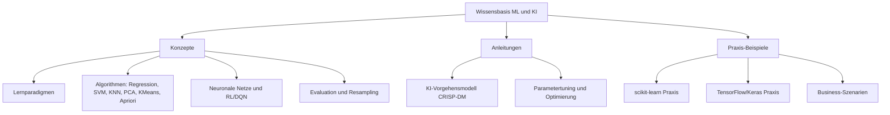

# Wissensbasis: Machine Learning und KI-Algorithmen

*Kontext: Kurzbeschreibung dieser Wissensbasis und ihres Einsatzzwecks für einen Agenten.*

> Diese Wissensbasis enthält strukturierte, embedding-optimierte Fachdokumentation auf
> Deutsch zu Machine-Learning- und KI-Algorithmen, zum KI-Vorgehensmodell (Modellwahl,
> Evaluation, Training, Tuning) sowie zu praktischen Business-Szenarien und lauffähigen
> Codebeispielen mit Scikit-Learn und TensorFlow. Technische Originalbegriffe (API-Namen,
> Parameter, Methoden) sind im englischen Original erhalten.
> Suche hier bei Fragen zu Lernparadigmen, einzelnen Algorithmen (Regression, Entscheidungsbaum,
> Random Forest, SVM, KNN, PCA, K-Means, Apriori, Neuronale Netze, Reinforcement Learning/DQN),
> zum ML-Vorgehensmodell und zur praktischen Umsetzung in Python.
> Nicht enthalten: produktspezifische Cloud-Preise, Marketinginhalte, Login-geschützte Tutorials,
> mathematische Vollbeweise.

Das folgende Diagramm gibt einen Überblick über die Themengruppen dieser Wissensbasis und ihre Zusammenhänge.

*Kontext: Übersichtsgraph der Wissensbasis-Struktur mit Themengruppen und Verknüpfungen.*

---

## Dateiübersicht

*Kontext: Tabelle aller Dateien der Wissensbasis mit Typ, Themen und Primärquelle zur schnellen Auswahl.*

| Dateiname | Typ | Themen | Primärquelle |
|-----------|-----|--------|--------------|
| `lernparadigmen-konzepte.md` | konzepte | Überwachtes, unüberwachtes, bestärkendes Lernen, Abgrenzung, Aufgabentypen | scikit-learn.org / wikipedia.org |
| `regression-algorithmen-konzepte.md` | konzepte | Lineare/Logistische/Polynomiale Regression, Ridge, Lasso, Kostenfunktion | scikit-learn.org |
| `entscheidungsbaum-randomforest-konzepte.md` | konzepte | Decision Tree, Gini/Entropy, Random Forest, Bagging, Feature-Importance | scikit-learn.org |
| `svm-knn-konzepte.md` | konzepte | Support Vector Machines, Kernel-Trick, C/gamma, K-Nearest Neighbors, Distanzmetriken | scikit-learn.org |
| `pca-dimensionsreduktion-konzepte.md` | konzepte | PCA, Varianzmaximierung, Eigenwerte, explained_variance_ratio_, n_components | scikit-learn.org |
| `kmeans-clustering-konzepte.md` | konzepte | K-Means, Centroids, Lloyd, Elbow, Silhouette, k-means++, Inertia | scikit-learn.org |
| `apriori-assoziationsregeln-konzepte.md` | konzepte | Apriori, Support, Confidence, Lift, Frequent Itemsets, Warenkorbanalyse | docs.oracle.com / socr.umich.edu |
| `neuronale-netze-konzepte.md` | konzepte | Neuron, Aktivierungsfunktionen, Layer, Backpropagation, Optimizer, CNN/RNN | tensorflow.org / keras.io |
| `reinforcement-learning-dqn-konzepte.md` | konzepte | RL, Agent/Reward/Policy, Q-Learning, Bellman, epsilon-greedy, DQN, Experience Replay | tensorflow.org / wikipedia.org |
| `ki-vorgehensmodell-anleitung.md` | anleitung | CRISP-DM-Phasen, ML-Pipeline, Modellwahl, Use-Case-Eignung | datascience-pm.com |
| `modell-evaluation-konzepte.md` | konzepte | Overfitting, Underfitting, Bias-Variance, Validierung, Metriken, Confusion Matrix | scikit-learn.org |
| `modell-training-resampling-konzepte.md` | konzepte | Stichprobenbildung, Cross-Validation, Bootstrap, SMOTE, Datenleckage | scikit-learn.org |
| `parametertuning-optimierung-anleitung.md` | anleitung | GridSearchCV, RandomizedSearchCV, Bayesian Optimization, Early Stopping, Pipelines | scikit-learn.org |
| `business-szenarien-beispiele.md` | beispiele | Umsatzprognose, Churn/Kreditrisiko, Kundensegmentierung, Recommender, Dynamic Pricing | scikit-learn.org / Use-Case-Quellen |
| `scikit-learn-praxis-beispiele.md` | beispiele | train_test_split, StandardScaler, Modelle, Pipeline, GridSearchCV, Metriken | scikit-learn.org |
| `tensorflow-praxis-beispiele.md` | beispiele | Sequential, Dense, compile/fit/evaluate, MNIST, Regression, Optimizer | tensorflow.org / keras.io |

## Wegweiser: Welche Datei bei welcher Frage?

*Kontext: Zuordnung typischer Fragestellungen zu den passenden Dateien der Wissensbasis.*

- **Grundverständnis / Welche Lernart?** → `lernparadigmen-konzepte.md`
- **Wie funktioniert Algorithmus X?** → jeweilige `*-konzepte.md`-Datei (z. B. `svm-knn-konzepte.md`,
  `pca-dimensionsreduktion-konzepte.md`, `neuronale-netze-konzepte.md`)
- **Welcher Algorithmus für welches Business-Problem?** → `business-szenarien-beispiele.md`,
  ergänzend `lernparadigmen-konzepte.md`
- **Wie gehe ich ein ML-Projekt methodisch an?** → `ki-vorgehensmodell-anleitung.md`
- **Modellgüte, Overfitting, Metriken?** → `modell-evaluation-konzepte.md`
- **Datenaufteilung, Cross-Validation, unbalancierte Daten?** → `modell-training-resampling-konzepte.md`
- **Hyperparameter optimieren?** → `parametertuning-optimierung-anleitung.md`
- **Konkreter Python-Code (klassisches ML)?** → `scikit-learn-praxis-beispiele.md`
- **Konkreter Python-Code (Deep Learning)?** → `tensorflow-praxis-beispiele.md`
- **Empfehlungssysteme / Dynamic Pricing?** → `business-szenarien-beispiele.md`,
  `reinforcement-learning-dqn-konzepte.md`
