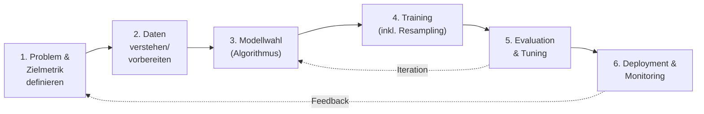

# Machine Learning & KI-Algorithmen für Software-Entwickler
## Ein praxisorientiertes Lernbuch

> Zielgruppe: Software-Entwickler ohne tiefes ML-Vorwissen, die Algorithmen verstehen, fundiert auswählen und produktiv in Python (scikit-learn, TensorFlow) anwenden wollen.

---

## Inhaltsverzeichnis

**Teil 1 – Grundlagen**
1. Einführung & Lernziele
2. Die drei Lernparadigmen: Supervised, Unsupervised, Reinforcement
3. Algorithmen-Katalog mit Business-Bezug

**Teil 2 – KI-Vorgehensmodell**
4. Überblick: Ein KI-Vorgehensmodell für Entwickler
5. Modellwahl
6. Modell-Training: Stichprobenbildung & Resampling
7. Modell-Evaluation: Overfitting, Underfitting, Validierung
8. Parametertuning & Optimierung

**Teil 3 – Business-Szenarien**
9. Regression zur Kennzahlenschätzung
10. Klassifikation für Entscheidungsprozesse
11. Clustering zur Kundensegmentierung
12. Empfehlungsmaschinen für Cross-Selling
13. Reinforcement Learning für Dynamic Pricing

**Teil 4 – Praxis**
14. Setup: Python, scikit-learn, TensorFlow
15. Geführte Übungen entlang des KI-Vorgehensmodells
16. Bewertungs-Checkliste & Diskussion eigener Ergebnisse

---

# Teil 1 – Grundlagen

## 1. Einführung & Lernziele

Nach diesem Buch kannst du:

- die drei ML-Paradigmen (überwacht, unüberwacht, bestärkend) unterscheiden und Use Cases korrekt zuordnen,
- für ein gegebenes Geschäftsproblem einen geeigneten Algorithmus auswählen und begründen,
- ein Modell systematisch entlang eines Vorgehensmodells entwickeln (Daten → Training → Evaluation → Tuning),
- Overfitting/Underfitting erkennen und mit Validierungsstrategien gegensteuern,
- die fünf klassischen Business-Szenarien (Regression, Klassifikation, Clustering, Recommender, RL) selbst in Python umsetzen.

**Mentales Modell für Entwickler:** ML ist im Kern eine Funktion `f(x) → y`, die nicht von Hand programmiert, sondern aus Daten *gelernt* wird. Statt `if/else`-Regeln schreibst du eine Lernprozedur, die Parameter so anpasst, dass ein Fehlermaß minimal wird. Das Vorgehensmodell in Teil 2 ist dabei dein "Software Development Lifecycle" für Modelle.

---

## 2. Die drei Lernparadigmen

### 2.1 Überwachtes Lernen (Supervised Learning)

**Idee:** Du hast Trainingsdaten mit bekannten "richtigen Antworten" (Labels): `(x₁, y₁), (x₂, y₂), …`. Das Modell lernt die Abbildung `x → y`.

- **Regression**: `y` ist eine kontinuierliche Zahl (z. B. Umsatzprognose).
- **Klassifikation**: `y` ist eine Kategorie (z. B. "Kunde kündigt: ja/nein").

Analogie für Entwickler: Wie Unit-Tests mit erwarteten Outputs – nur dass der "Code" (die Gewichte) aus den Testfällen generiert wird, statt vorher geschrieben zu sein.

### 2.2 Unüberwachtes Lernen (Unsupervised Learning)

**Idee:** Keine Labels vorhanden. Das Modell sucht Struktur in den Daten selbst.

- **Clustering**: Gruppen ähnlicher Datenpunkte finden (z. B. Kundensegmente).
- **Dimensionsreduktion**: Komplexität reduzieren, ohne Informationsverlust zu groß werden zu lassen (z. B. PCA).
- **Assoziationsregeln**: Muster wie "wer A kauft, kauft oft auch B" (z. B. Apriori).

### 2.3 Bestärkendes Lernen (Reinforcement Learning, RL)

**Idee:** Ein *Agent* interagiert mit einer *Umgebung*, trifft *Aktionen* und erhält *Rewards* (Belohnungen). Ziel: eine *Policy* lernen, die langfristigen Reward maximiert – nicht den Fehler auf festen Daten minimiert.

Kernbegriffe:

| Begriff | Bedeutung |
|---|---|
| State (Zustand) | aktuelle Situation, z. B. aktueller Preis, Lagerbestand |
| Action (Aktion) | mögliche Entscheidung, z. B. Preis erhöhen/senken |
| Reward (Belohnung) | Feedback-Signal, z. B. erzielter Gewinn |
| Policy (Strategie) | Regel, die State → Action abbildet |
| Episode | eine vollständige Interaktionssequenz |

Analogie: Während Supervised Learning wie "Lernen mit Lösungsblatt" ist, ist RL wie "Lernen durch Ausprobieren mit Punktzahl am Ende" – näher an echtem Trial-and-Error.

---

## 3. Algorithmen-Katalog mit Business-Bezug

Übersichtstabelle zur schnellen Einordnung (Details inkl. Code folgen in Teil 3):

| Algorithmus | Paradigma | Typischer Use Case | Stärken | Schwächen |
|---|---|---|---|---|
| Lineare/Logistische Regression | Supervised | KPI-Schätzung, einfache Klassifikation | interpretierbar, schnell, guter Baseline | nur (annähernd) lineare Zusammenhänge |
| Entscheidungsbaum | Supervised | Regel-basierte Entscheidungen | sehr interpretierbar, kein Scaling nötig | overfittet leicht |
| Random Forest | Supervised | robuste Klassifikation/Regression | robust, wenig Tuning nötig | weniger interpretierbar, langsamer |
| Support Vector Machine (SVM) | Supervised | Klassifikation mit klarer Trennung | stark bei hochdimensionalen Daten | schwer skalierbar, Tuning nötig |
| K-Nearest Neighbors (KNN) | Supervised | einfache Klassifikation/Regression | simpel, kein Training nötig | langsam bei Vorhersage, skaliert schlecht |
| Principal Component Analysis (PCA) | Unsupervised | Dimensionsreduktion, Visualisierung | reduziert Rauschen/Redundanz | Komponenten schwer interpretierbar |
| K-Means | Unsupervised | Kundensegmentierung | einfach, schnell | Clusteranzahl muss vorgegeben werden |
| Apriori | Unsupervised | Cross-Selling, Warenkorbanalyse | liefert verständliche Regeln | rechenintensiv bei vielen Items |
| Neuronale Netze | Supervised (i. d. R.) | komplexe Muster (Bild, Text, Zeitreihen) | sehr flexibel, hohe Genauigkeit möglich | viele Daten/Rechenleistung nötig, "Black Box" |
| Deep Q-Network (DQN) | Reinforcement | Dynamic Pricing, Steuerung | lernt Strategien ohne Label-Daten | instabil, aufwändiges Training |

**Faustregel für die Algorithmenwahl:**

1. Habe ich Labels? → Nein: unsupervised. Ja: supervised.
2. Ist die Zielgröße eine Zahl oder eine Kategorie? → Regression vs. Klassifikation.
3. Geht es um sequenzielle Entscheidungen mit verzögertem Feedback (z. B. Preisanpassung über Zeit)? → RL.
4. Brauche ich Interpretierbarkeit (Compliance, Erklärbarkeit gegenüber Fachbereich)? → Entscheidungsbaum/Regression bevorzugen vor Random Forest/Neuronalen Netzen.
5. Wie viele Daten habe ich? → Wenig Daten: einfache Modelle (Regression, KNN, Decision Tree). Viele Daten: Random Forest, neuronale Netze.

Diese Heuristik wird in Kapitel 5 ("Modellwahl") systematisiert.
# Teil 2 – KI-Vorgehensmodell

## 4. Überblick: Ein KI-Vorgehensmodell für Entwickler

Analog zu einem Software-Lifecycle nutzen wir ein iteratives Vorgehensmodell (angelehnt an CRISP-DM, vereinfacht für die Entwickler-Praxis):



Wichtig: Das ist **kein** linearer Wasserfall. Schritte 3–5 werden typischerweise mehrfach durchlaufen (Iteration), bis die Zielmetrik aus Schritt 1 erreicht ist.

Die Schritte 1–2 (Problem/Daten) sind fachlich getrieben und werden hier nur kurz behandelt – der Fokus liegt auf 3–5, da dort die in der Aufgabenstellung genannten Themen (Modellwahl, Training, Evaluation, Tuning) verortet sind.

---

## 5. Modellwahl

### 5.1 Entscheidungskriterien

| Kriterium | Fragen, die du dir stellst |
|---|---|
| Datentyp der Zielgröße | Numerisch (Regression) oder kategorial (Klassifikation) oder gar keine Zielgröße (unsupervised)? |
| Datenmenge | Wenige hundert Zeilen → einfache Modelle. Zehntausende+ → Random Forest/Neuronale Netze möglich. |
| Dimensionalität | Viele Features (>100)? → PCA vorab erwägen, SVM/Regularisierung. |
| Interpretierbarkeit | Muss ein Fachbereich/Auditor die Entscheidung nachvollziehen? → Decision Tree/Regression. |
| Trainingszeit/Infrastruktur | Echtzeit-Training nötig? → einfache Modelle. Offline-Training akzeptabel? → komplexere Modelle. |
| Nichtlinearität | Sind Zusammenhänge klar nichtlinear (z. B. Sättigungseffekte)? → Tree-basierte Modelle, Neuronale Netze. |
| Sequenzielle Entscheidung mit Feedback-Schleife | → Reinforcement Learning statt klassisches Supervised Learning. |

### 5.2 Entscheidungsbaum für die Algorithmenwahl (vereinfacht)

```
Gibt es Labels (y bekannt)?
├── Nein → Unsupervised
│   ├── Gruppen finden? → K-Means
│   ├── Dimension reduzieren? → PCA
│   └── Zusammenhänge/Regeln finden? → Apriori
├── Ja → Supervised
│   ├── y ist Zahl? → Regression (linear / Tree-basiert / NN)
│   └── y ist Kategorie? → Klassifikation
│       ├── Wenige Daten, Interpretierbarkeit wichtig → Decision Tree, Logistic Regression
│       ├── Robustheit wichtig, mittel-viele Daten → Random Forest
│       ├── Klare Trennbarkeit, hochdimensional → SVM
│       └── Einfacher Baseline, lokale Muster → KNN
└── Sequenzielle Entscheidung mit verzögertem Reward → Reinforcement Learning (z. B. DQN)
```

> **Praxistipp:** Starte immer mit einem einfachen Baseline-Modell (z. B. lineare/logistische Regression). Erst wenn dessen Performance nicht reicht, wechsle zu komplexeren Modellen. So vermeidest du unnötige Komplexität ("Overengineering" – ein Prinzip, das dir aus der Software-Entwicklung bekannt ist).

---

## 6. Modell-Training: Stichprobenbildung & Resampling

### 6.1 Train/Validation/Test-Split

Grundprinzip: Du darfst ein Modell **nie** auf den Daten bewerten, mit denen es trainiert wurde – sonst misst du nur, wie gut es sich die Trainingsdaten "merken" konnte (vgl. Overfitting, Kapitel 7).

Klassische Aufteilung:

- **Trainingsdaten** (z. B. 60–70 %): zum Lernen der Modellparameter.
- **Validierungsdaten** (z. B. 15–20 %): zur Modellauswahl/Tuning der Hyperparameter.
- **Testdaten** (z. B. 15–20 %): finale, unabhängige Bewertung – wird erst am Ende einmal verwendet.

```python
from sklearn.model_selection import train_test_split

# Schritt 1: Test-Set abtrennen (wird bis zum Schluss nicht angefasst)
X_train_val, X_test, y_train_val, y_test = train_test_split(
    X, y, test_size=0.15, random_state=42
)

# Schritt 2: Restliche Daten in Training/Validation aufteilen
X_train, X_val, y_train, y_val = train_test_split(
    X_train_val, y_train_val, test_size=0.20, random_state=42
)
```

### 6.2 Cross-Validation (Kreuzvalidierung)

Bei kleineren Datensätzen verschwendet ein fixer Validation-Split wertvolle Daten. **k-fold Cross-Validation** löst das: Die Trainingsdaten werden in *k* Teile (Folds) zerlegt, das Modell wird *k* mal trainiert (jeweils auf k-1 Folds) und auf dem verbleibenden Fold validiert. Das Ergebnis ist der Mittelwert über alle *k* Durchläufe – robuster als ein einzelner Split.

```python
from sklearn.model_selection import cross_val_score
from sklearn.ensemble import RandomForestClassifier

model = RandomForestClassifier(random_state=42)
scores = cross_val_score(model, X_train_val, y_train_val, cv=5, scoring="f1")
print(f"F1-Score (5-fold CV): {scores.mean():.3f} ± {scores.std():.3f}")
```

### 6.3 Resampling bei unausgewogenen Daten (Imbalanced Data)

Business-Realität: Bei Klassifikationsproblemen wie "Kunde kündigt" sind die positiven Fälle (Kündiger) oft selten (z. B. 5 %). Ein naives Modell lernt dann "sag immer: kündigt nicht" und hat trotzdem 95 % Accuracy – aber keinen Business-Nutzen.

Resampling-Strategien:

| Strategie | Beschreibung |
|---|---|
| **Undersampling** | Mehrheitsklasse wird reduziert (Datenverlust, aber schnell) |
| **Oversampling** | Minderheitsklasse wird vervielfacht/dupliziert |
| **SMOTE** | synthetische neue Minderheits-Beispiele werden interpoliert |
| **Class Weights** | Algorithmus wird intern stärker für Fehler an der Minderheitsklasse bestraft (kein Datenresampling nötig) |

```python
from sklearn.utils import resample
import pandas as pd

df_majority = df[df.label == 0]
df_minority = df[df.label == 1]

df_minority_upsampled = resample(
    df_minority, replace=True, n_samples=len(df_majority), random_state=42
)
df_balanced = pd.concat([df_majority, df_minority_upsampled])

# Alternative ohne Resampling: class_weight Parameter nutzen
from sklearn.linear_model import LogisticRegression
model = LogisticRegression(class_weight="balanced")
```

---

## 7. Modell-Evaluation: Overfitting, Underfitting, Validierung

### 7.1 Die Bias-Variance-Falle

| Phänomen | Beschreibung | Symptom |
|---|---|---|
| **Underfitting** | Modell zu einfach für die Datenstruktur (hoher Bias) | schlechte Performance auf Training **und** Test |
| **Overfitting** | Modell merkt sich Trainingsdaten inkl. Rauschen (hohe Varianz) | sehr gute Performance auf Training, schlechte auf Test |
| **Gute Generalisierung** | Modell erfasst die zugrunde liegende Struktur | ähnlich gute Performance auf Training und Test |

```
Fehler
  │
  │  Trainingsfehler ──────╮
  │                         ╰──────────────
  │  Testfehler  ╲                 ╭────── (Overfitting-Bereich)
  │                ╲_______╱
  │                (Optimum)
  └──────────────────────────────────────→ Modellkomplexität
```

Analogie für Entwickler: Underfitting ist wie ein zu generischer Algorithmus, der Spezialfälle ignoriert. Overfitting ist wie Code, der hart auf Testdaten zugeschnitten ist ("hardcoded für die Unit-Tests") und in Produktion versagt.

### 7.2 Diagnose in der Praxis

```python
from sklearn.model_selection import learning_curve
import numpy as np

train_sizes, train_scores, val_scores = learning_curve(
    model, X_train_val, y_train_val, cv=5,
    train_sizes=np.linspace(0.1, 1.0, 10), scoring="accuracy"
)

# Faustregel:
# train_scores hoch, val_scores deutlich niedriger -> Overfitting
# beide Scores niedrig und ähnlich -> Underfitting
# beide Scores hoch und ähnlich -> gute Generalisierung
```

### 7.3 Gegenmaßnahmen

| Problem | Gegenmaßnahmen |
|---|---|
| Overfitting | mehr Trainingsdaten, Regularisierung (L1/L2), einfacheres Modell, Dropout (bei NN), Early Stopping, Feature-Reduktion (PCA), Pruning (bei Decision Trees) |
| Underfitting | komplexeres Modell, mehr/bessere Features, weniger Regularisierung, längeres Training |

### 7.4 Wahl der richtigen Metrik

| Aufgabe | Sinnvolle Metriken |
|---|---|
| Regression | MAE, RMSE, R² |
| Klassifikation (balanciert) | Accuracy, F1-Score |
| Klassifikation (unbalanciert) | Precision, Recall, F1, ROC-AUC, PR-AUC |
| Clustering | Silhouette Score, Inertia (Ellbogenmethode) |
| Recommender | Precision@k, Recall@k |
| Reinforcement Learning | kumulativer Reward, durchschnittlicher Episode-Reward |

> **Wichtig:** Accuracy ist bei unbalancierten Daten (z. B. Betrugserkennung, Kündigerprognose) **irreführend**. Hier zählen Precision/Recall/F1 bzw. die Business-Kosten von False Positives vs. False Negatives.

---

## 8. Parametertuning & Optimierung

### 8.1 Hyperparameter vs. Modellparameter

- **Modellparameter** werden während des Trainings automatisch gelernt (z. B. Gewichte in einem neuronalen Netz, Koeffizienten in der Regression).
- **Hyperparameter** werden *vor* dem Training festgelegt und steuern den Lernprozess selbst (z. B. Anzahl Bäume im Random Forest, `k` bei KNN, Lernrate bei neuronalen Netzen).

### 8.2 Grid Search

Systematisches Durchprobieren aller Kombinationen aus einem vordefinierten Suchraum.

```python
from sklearn.model_selection import GridSearchCV
from sklearn.ensemble import RandomForestClassifier

param_grid = {
    "n_estimators": [100, 200, 300],
    "max_depth": [None, 5, 10, 20],
    "min_samples_split": [2, 5, 10],
}

grid_search = GridSearchCV(
    RandomForestClassifier(random_state=42),
    param_grid, cv=5, scoring="f1", n_jobs=-1
)
grid_search.fit(X_train_val, y_train_val)

print("Beste Parameter:", grid_search.best_params_)
print("Bester CV-Score:", grid_search.best_score_)
best_model = grid_search.best_estimator_
```

Nachteil: Kombinatorische Explosion bei vielen Hyperparametern (`n_estimators × max_depth × min_samples_split × …`).

### 8.3 Random Search

Statt aller Kombinationen werden zufällige Kombinationen aus dem Suchraum gezogen – bei vielen Hyperparametern oft effizienter als Grid Search bei ähnlicher Ergebnisqualität.

```python
from sklearn.model_selection import RandomizedSearchCV
from scipy.stats import randint

param_dist = {
    "n_estimators": randint(50, 500),
    "max_depth": randint(3, 30),
}

random_search = RandomizedSearchCV(
    RandomForestClassifier(random_state=42),
    param_distributions=param_dist, n_iter=30, cv=5,
    scoring="f1", random_state=42, n_jobs=-1
)
random_search.fit(X_train_val, y_train_val)
```

### 8.4 Bayessche Optimierung (Ausblick)

Für teure Trainingsläufe (z. B. tiefe neuronale Netze) lohnt sich Bayessche Optimierung (z. B. mit `Optuna` oder `scikit-optimize`): Sie wählt den nächsten zu testenden Parametersatz basierend auf den bisherigen Ergebnissen – deutlich effizienter als Grid/Random Search bei hochdimensionalen Suchräumen.

```python
import optuna

def objective(trial):
    n_estimators = trial.suggest_int("n_estimators", 50, 500)
    max_depth = trial.suggest_int("max_depth", 3, 30)
    model = RandomForestClassifier(
        n_estimators=n_estimators, max_depth=max_depth, random_state=42
    )
    scores = cross_val_score(model, X_train_val, y_train_val, cv=5, scoring="f1")
    return scores.mean()

study = optuna.create_study(direction="maximize")
study.optimize(objective, n_trials=50)
print(study.best_params)
```

### 8.5 Optimierung bei neuronalen Netzen: Lernrate & Co.

Bei neuronalen Netzen (Kapitel 9–13 zeigen Anwendungsfälle) sind die wichtigsten "Stellschrauben":

| Hyperparameter | Effekt |
|---|---|
| Lernrate (`learning_rate`) | zu hoch → Training divergiert; zu niedrig → Training sehr langsam |
| Batch-Größe | beeinflusst Trainingsstabilität & -geschwindigkeit |
| Anzahl Schichten/Neuronen | Modellkapazität – zu hoch begünstigt Overfitting |
| Epochen + Early Stopping | verhindert Overfitting durch zu langes Training |
| Dropout-Rate | Regularisierungstechnik gegen Overfitting |

```python
import tensorflow as tf

early_stopping = tf.keras.callbacks.EarlyStopping(
    monitor="val_loss", patience=5, restore_best_weights=True
)

history = model.fit(
    X_train, y_train,
    validation_data=(X_val, y_val),
    epochs=100, batch_size=32,
    callbacks=[early_stopping]
)
```

Damit ist das KI-Vorgehensmodell vollständig durchlaufen. Teil 3 zeigt es konkret an fünf Business-Szenarien.
# Teil 3 – Anwendung & Demonstration typischer Business-Szenarien

Jedes Szenario folgt dem Vorgehensmodell aus Teil 2: Problem → Daten → Modellwahl → Training → Evaluation → Tuning.

---

## 9. Regression zur Schätzung von Kennzahlen

**Business-Szenario:** Ein Versandhändler will den voraussichtlichen Monatsumsatz pro Kunde anhand von Merkmalen wie Anzahl Bestellungen, durchschnittlichem Bestellwert, Kundenalter (in Monaten) etc. schätzen.

**Modellwahl:** Lineare Regression als Baseline; Random-Forest-Regressor, falls Zusammenhänge nichtlinear sind.

```python
import pandas as pd
import numpy as np
from sklearn.model_selection import train_test_split
from sklearn.linear_model import LinearRegression
from sklearn.ensemble import RandomForestRegressor
from sklearn.metrics import mean_absolute_error, r2_score

# 1. Daten (Beispiel-Struktur)
# Spalten: anzahl_bestellungen, avg_bestellwert, kundenalter_monate, monatsumsatz
df = pd.read_csv("kunden_umsatz.csv")

X = df.drop(columns=["monatsumsatz"])
y = df["monatsumsatz"]

X_train, X_test, y_train, y_test = train_test_split(
    X, y, test_size=0.2, random_state=42
)

# 2. Baseline: Lineare Regression
lin_model = LinearRegression()
lin_model.fit(X_train, y_train)
y_pred_lin = lin_model.predict(X_test)

print("Linear Regression:")
print(f"  MAE: {mean_absolute_error(y_test, y_pred_lin):.2f}")
print(f"  R²:  {r2_score(y_test, y_pred_lin):.3f}")

# 3. Alternative: Random Forest Regressor (für nichtlineare Effekte)
rf_model = RandomForestRegressor(n_estimators=200, random_state=42)
rf_model.fit(X_train, y_train)
y_pred_rf = rf_model.predict(X_test)

print("Random Forest:")
print(f"  MAE: {mean_absolute_error(y_test, y_pred_rf):.2f}")
print(f"  R²:  {r2_score(y_test, y_pred_rf):.3f}")

# 4. Feature Importance (Erklärbarkeit für den Fachbereich)
importances = pd.Series(rf_model.feature_importances_, index=X.columns)
print(importances.sort_values(ascending=False))
```

**Interpretation der Metriken:**
- **MAE** (Mean Absolute Error): durchschnittliche Abweichung in der Originaleinheit (€) – leicht kommunizierbar an Fachbereiche.
- **R²**: Anteil der erklärten Varianz (0–1). R² = 0,8 bedeutet: 80 % der Schwankung im Umsatz wird durch das Modell erklärt.

**Business-Einordnung:** Wenn Random Forest deutlich besser performt als die lineare Regression, deutet das auf nichtlineare Zusammenhänge hin (z. B. Sättigungseffekte bei sehr aktiven Kunden) – ein wertvoller fachlicher Insight, nicht nur ein technisches Ergebnis.

---

## 10. Klassifikation für Entscheidungsprozesse

**Business-Szenario:** Ein Telekommunikationsanbieter will vorhersagen, welche Kunden in den nächsten 30 Tagen kündigen werden (Churn Prediction), um gezielt Retention-Maßnahmen einzuleiten.

**Modellwahl:** Logistische Regression als Baseline, Random Forest für höhere Genauigkeit, SVM als Alternative bei klar trennbaren Klassen.

```python
from sklearn.model_selection import train_test_split
from sklearn.linear_model import LogisticRegression
from sklearn.ensemble import RandomForestClassifier
from sklearn.svm import SVC
from sklearn.preprocessing import StandardScaler
from sklearn.metrics import classification_report, roc_auc_score, confusion_matrix

# Annahme: df enthält Feature-Spalten + Spalte "churn" (0/1)
X = df.drop(columns=["churn"])
y = df["churn"]

X_train, X_test, y_train, y_test = train_test_split(
    X, y, test_size=0.2, stratify=y, random_state=42
)

# Skalierung ist wichtig für Logistic Regression und SVM (nicht für Random Forest)
scaler = StandardScaler()
X_train_scaled = scaler.fit_transform(X_train)
X_test_scaled = scaler.transform(X_test)

# Modell 1: Logistic Regression (interpretierbar, mit class_weight wegen Imbalance)
log_model = LogisticRegression(class_weight="balanced", max_iter=1000)
log_model.fit(X_train_scaled, y_train)
y_pred_log = log_model.predict(X_test_scaled)

print("Logistic Regression:")
print(classification_report(y_test, y_pred_log))
print(f"ROC-AUC: {roc_auc_score(y_test, log_model.predict_proba(X_test_scaled)[:, 1]):.3f}")

# Modell 2: Random Forest (robuster, erfasst nichtlineare Interaktionen)
rf_model = RandomForestClassifier(
    n_estimators=300, class_weight="balanced", random_state=42
)
rf_model.fit(X_train, y_train)  # kein Scaling nötig
y_pred_rf = rf_model.predict(X_test)

print("Random Forest:")
print(classification_report(y_test, y_pred_rf))
print(f"ROC-AUC: {roc_auc_score(y_test, rf_model.predict_proba(X_test)[:, 1]):.3f}")

# Confusion Matrix zur Business-Diskussion (Kosten von False Negatives = entgangene Kunden)
print(confusion_matrix(y_test, y_pred_rf))
```

**Business-Einordnung der Metriken:**
- **Recall** (Sensitivität) ist hier oft wichtiger als Precision: Ein übersehener Kündiger (False Negative) kostet mehr als eine unnötige Retention-Maßnahme bei einem treuen Kunden (False Positive).
- **ROC-AUC** erlaubt einen schwellenwert-unabhängigen Vergleich der Modelle.
- Die **Entscheidungsschwelle** (Standard: 0,5) kann je nach Kostenverhältnis von False Positives/Negatives verschoben werden – ein Hebel, den reine Accuracy-Betrachtung verschleiert.

**Alternative: K-Nearest Neighbors** als einfacher Vergleichsmaßstab:

```python
from sklearn.neighbors import KNeighborsClassifier

knn_model = KNeighborsClassifier(n_neighbors=15)
knn_model.fit(X_train_scaled, y_train)  # Skalierung ist bei KNN essenziell (Distanzmaß!)
y_pred_knn = knn_model.predict(X_test_scaled)
print(classification_report(y_test, y_pred_knn))
```

---

## 11. Clustering zur Kundensegmentierung

**Business-Szenario:** Ein Einzelhändler will Kunden ohne vorgegebene Kategorien in homogene Segmente einteilen (z. B. für zielgruppenspezifisches Marketing), basierend auf Kaufhäufigkeit, Warenkorbgröße und Kategorienvielfalt.

**Modellwahl:** K-Means (Standard für Segmentierung); PCA vorab zur Visualisierung/Rauschreduktion bei vielen Features.

```python
from sklearn.preprocessing import StandardScaler
from sklearn.decomposition import PCA
from sklearn.cluster import KMeans
from sklearn.metrics import silhouette_score
import matplotlib.pyplot as plt

# 1. Skalierung ist bei K-Means zwingend (basiert auf euklidischer Distanz)
features = ["kaufhaeufigkeit", "avg_warenkorb", "kategorienvielfalt", "tage_seit_letztem_kauf"]
X = df[features]
X_scaled = StandardScaler().fit_transform(X)

# 2. Optimale Clusteranzahl: Ellbogenmethode + Silhouette Score
inertias = []
silhouette_scores = []
k_range = range(2, 10)

for k in k_range:
    km = KMeans(n_clusters=k, random_state=42, n_init=10)
    labels = km.fit_predict(X_scaled)
    inertias.append(km.inertia_)
    silhouette_scores.append(silhouette_score(X_scaled, labels))

# Ellbogendiagramm: Stelle, an der sich die Kurve abflacht ("Ellbogen") = guter Kompromiss
plt.plot(k_range, inertias, marker="o")
plt.xlabel("Anzahl Cluster (k)")
plt.ylabel("Inertia (Summe quadrierter Abstände)")
plt.title("Ellbogenmethode")

# 3. Finales Modell mit gewählter Clusteranzahl (z. B. k=4 anhand der Diagramme)
final_k = 4
kmeans = KMeans(n_clusters=final_k, random_state=42, n_init=10)
df["segment"] = kmeans.fit_predict(X_scaled)

# 4. Segment-Profile für den Fachbereich verständlich machen
segment_profile = df.groupby("segment")[features].mean()
print(segment_profile)

# 5. Optional: PCA zur 2D-Visualisierung der Cluster
pca = PCA(n_components=2)
X_pca = pca.fit_transform(X_scaled)
plt.figure()
plt.scatter(X_pca[:, 0], X_pca[:, 1], c=df["segment"], cmap="tab10")
plt.title("Kundensegmente (PCA-Projektion)")
```

**Interpretation:**
- **Inertia** sinkt mit steigendem *k* immer weiter – relevant ist nicht der niedrigste Wert, sondern der Punkt, ab dem zusätzliche Cluster kaum noch Verbesserung bringen ("Ellbogen").
- **Silhouette Score** (Bereich -1 bis 1): misst, wie gut Datenpunkte zu ihrem eigenen Cluster passen im Vergleich zu benachbarten Clustern. Werte nahe 1 = klar abgegrenzte Cluster.
- Die fachliche Benennung der Segmente (z. B. "Schnäppchenjäger", "Stammkunden", "Gelegenheitskäufer") erfolgt erst *nach* der technischen Analyse, anhand der `segment_profile`-Tabelle.

---

## 12. Empfehlungsmaschinen für Cross-Selling

**Business-Szenario:** Ein Online-Shop will im Warenkorb passende Zusatzprodukte vorschlagen ("Kunden, die X kauften, kauften auch Y").

**Modellwahl:** Apriori-Algorithmus für Assoziationsregeln (klassischer Ansatz für Warenkorbanalyse, sehr gut interpretierbar für den Fachbereich).

```python
# pip install mlxtend
from mlxtend.frequent_patterns import apriori, association_rules
import pandas as pd

# 1. Daten im "One-Hot"-Format: Zeile = Transaktion, Spalte = Produkt, Wert = gekauft (1/0)
# Beispiel-Transformation aus Transaktionsliste:
transactions = df.groupby("transaktions_id")["produkt"].apply(list).tolist()

from mlxtend.preprocessing import TransactionEncoder
te = TransactionEncoder()
te_array = te.fit(transactions).transform(transactions)
basket_df = pd.DataFrame(te_array, columns=te.columns_)

# 2. Häufige Produktkombinationen finden (min_support = Mindesthäufigkeit im Datensatz)
frequent_itemsets = apriori(basket_df, min_support=0.02, use_colnames=True)

# 3. Assoziationsregeln ableiten
rules = association_rules(frequent_itemsets, metric="lift", min_threshold=1.0)
rules = rules.sort_values("lift", ascending=False)

print(rules[["antecedents", "consequents", "support", "confidence", "lift"]].head(10))
```

**Kennzahlen-Interpretation (zentral für Business-Kommunikation):**

| Kennzahl | Bedeutung |
|---|---|
| **Support** | Wie häufig kommt diese Kombination überhaupt im Datensatz vor? |
| **Confidence** | Wenn A gekauft wurde, mit welcher Wahrscheinlichkeit auch B? `P(B\|A)` |
| **Lift** | Wie viel wahrscheinlicher ist B bei Kauf von A, *verglichen mit dem Zufall*? Lift > 1 = positive Assoziation. |

**Alternative für personalisierte Empfehlungen:** Collaborative Filtering via K-Nearest Neighbors auf einer Nutzer-Produkt-Matrix (statt regelbasiertem Apriori), wenn individuelle statt aggregierte Empfehlungen benötigt werden:

```python
from sklearn.neighbors import NearestNeighbors
from scipy.sparse import csr_matrix

# user_item_matrix: Zeilen = Kunden, Spalten = Produkte, Werte = Kaufhäufigkeit/Rating
sparse_matrix = csr_matrix(user_item_matrix.values)

knn_recommender = NearestNeighbors(metric="cosine", algorithm="brute")
knn_recommender.fit(sparse_matrix)

# Ähnlichste Kunden zu Kunde mit Index 0 finden -> deren Käufe als Empfehlung nutzen
distances, indices = knn_recommender.kneighbors(sparse_matrix[0], n_neighbors=5)
```

---

## 13. Reinforcement Learning für Dynamic Pricing

**Business-Szenario:** Ein E-Commerce-Anbieter will den Preis eines Produkts dynamisch anpassen, um über die Zeit den kumulierten Gewinn zu maximieren – abhängig von Nachfragereaktionen, die sich erst durch Beobachtung zeigen (kein fester Trainingsdatensatz mit "richtigen" Preisen vorhanden).

**Warum RL statt Supervised Learning?** Es gibt keine "korrekte Antwort" pro Datenpunkt – nur eine Belohnung (Gewinn), die von der gewählten Aktion (Preis) *und* nachfolgendem Kundenverhalten abhängt. Genau dafür ist RL gemacht.

### 13.1 Das Problem als RL-Umgebung modellieren

| RL-Konzept | Konkretisierung im Dynamic-Pricing-Beispiel |
|---|---|
| State | z. B. aktueller Lagerbestand, Wochentag, verbleibende Verkaufstage |
| Action | Preisstufe wählen (z. B. 5 diskrete Preispunkte) |
| Reward | erzielter Gewinn nach der Preisentscheidung |
| Episode | ein Verkaufszyklus (z. B. eine Saison) |

### 13.2 Vereinfachte Simulationsumgebung

```python
import numpy as np

class PricingEnv:
    """Vereinfachte Simulationsumgebung für Dynamic Pricing."""

    def __init__(self, price_levels=(8, 10, 12, 14, 16), base_demand=100):
        self.price_levels = price_levels
        self.base_demand = base_demand
        self.n_actions = len(price_levels)
        self.n_states = 10  # z. B. diskretisierter Lagerbestand 0-9
        self.reset()

    def reset(self):
        self.inventory = self.n_states - 1
        self.day = 0
        return self.inventory

    def step(self, action):
        price = self.price_levels[action]
        # Nachfrage sinkt mit steigendem Preis (vereinfachtes lineares Modell + Rauschen)
        demand = max(0, self.base_demand - 6 * price + np.random.normal(0, 5))
        sold = min(demand, self.inventory * 10)
        revenue = sold * price
        self.inventory = max(0, self.inventory - int(sold / 10))
        self.day += 1
        done = self.day >= 30 or self.inventory == 0
        reward = revenue
        return self.inventory, reward, done
```

### 13.3 Deep Q-Network (DQN) – Aufbau in TensorFlow

```python
import tensorflow as tf
from tensorflow.keras import layers
import random
from collections import deque

def build_q_network(n_states, n_actions):
    model = tf.keras.Sequential([
        layers.Input(shape=(n_states,)),
        layers.Dense(64, activation="relu"),
        layers.Dense(64, activation="relu"),
        layers.Dense(n_actions, activation="linear"),  # ein Q-Wert pro Aktion
    ])
    model.compile(optimizer="adam", loss="mse")
    return model

env = PricingEnv()
q_network = build_q_network(env.n_states, env.n_actions)
target_network = build_q_network(env.n_states, env.n_actions)
target_network.set_weights(q_network.get_weights())

replay_buffer = deque(maxlen=5000)
gamma = 0.95          # Diskontierungsfaktor zukünftiger Rewards
epsilon = 1.0         # Explorationsrate (Epsilon-Greedy)
epsilon_min = 0.05
epsilon_decay = 0.995
batch_size = 32

def state_to_input(state, n_states):
    """One-Hot-Encoding des diskreten Lagerbestands."""
    vec = np.zeros(n_states)
    vec[state] = 1.0
    return vec

def choose_action(state_vec, epsilon):
    if np.random.rand() < epsilon:
        return np.random.randint(env.n_actions)  # Exploration
    q_values = q_network.predict(state_vec[np.newaxis, :], verbose=0)
    return np.argmax(q_values[0])  # Exploitation

# 13.4 Trainingsschleife
n_episodes = 200
for episode in range(n_episodes):
    state = env.reset()
    state_vec = state_to_input(state, env.n_states)
    total_reward = 0
    done = False

    while not done:
        action = choose_action(state_vec, epsilon)
        next_state, reward, done = env.step(action)
        next_state_vec = state_to_input(next_state, env.n_states)

        replay_buffer.append((state_vec, action, reward, next_state_vec, done))
        state_vec = next_state_vec
        total_reward += reward

        # Lernschritt (Experience Replay)
        if len(replay_buffer) >= batch_size:
            batch = random.sample(replay_buffer, batch_size)
            states_b = np.array([b[0] for b in batch])
            actions_b = np.array([b[1] for b in batch])
            rewards_b = np.array([b[2] for b in batch])
            next_states_b = np.array([b[3] for b in batch])
            dones_b = np.array([b[4] for b in batch])

            q_current = q_network.predict(states_b, verbose=0)
            q_next = target_network.predict(next_states_b, verbose=0)

            for i in range(batch_size):
                target = rewards_b[i]
                if not dones_b[i]:
                    target += gamma * np.max(q_next[i])
                q_current[i][actions_b[i]] = target

            q_network.fit(states_b, q_current, epochs=1, verbose=0)

    epsilon = max(epsilon_min, epsilon * epsilon_decay)

    if episode % 20 == 0:
        target_network.set_weights(q_network.get_weights())
        print(f"Episode {episode}: Total Reward = {total_reward:.0f}, Epsilon = {epsilon:.3f}")
```

**Wichtige Konzepte im Code:**

- **Epsilon-Greedy-Strategie**: zu Beginn viel Exploration (zufällige Preise ausprobieren), mit der Zeit mehr Exploitation (gelernte beste Preise nutzen).
- **Experience Replay** (`replay_buffer`): vergangene Erfahrungen werden gespeichert und in zufälligen Batches wiederverwendet – stabilisiert das Training erheblich (im Gegensatz zu reinem "online"-Lernen Schritt für Schritt).
- **Target Network**: ein zweites, nur periodisch aktualisiertes Netzwerk zur Berechnung der Zielwerte – verhindert, dass sich das Modell "selbst hinterherjagt" und divergiert.

**Evaluation von RL-Agenten:** Statt Accuracy/F1 wird der **durchschnittliche kumulierte Reward pro Episode** über die Zeit betrachtet (sollte steigen und sich stabilisieren). Ein Vergleich gegen eine einfache Baseline-Policy (z. B. "immer mittlerer Preis") macht den gelernten Mehrwert sichtbar.
# Teil 4 – Praxisübungen: Eigene Modellentwicklung

## 14. Setup: Python, scikit-learn, TensorFlow

### 14.1 Umgebung einrichten

```bash
# Virtuelle Umgebung anlegen (empfohlen, analog zu node_modules-Isolation)
python3 -m venv venv
source venv/bin/activate   # Windows: venv\Scripts\activate

# Kernbibliotheken installieren
pip install numpy pandas scikit-learn matplotlib seaborn
pip install tensorflow
pip install mlxtend          # für Apriori / Assoziationsregeln
pip install optuna           # für fortgeschrittenes Hyperparameter-Tuning
pip install jupyterlab        # interaktive Notebooks zum Explorieren
```

### 14.2 Empfohlene Projektstruktur

```
projekt/
├── data/
│   ├── raw/              # Rohdaten, nie verändern
│   └── processed/        # bereinigte/transformierte Daten
├── notebooks/             # explorative Analyse (Jupyter)
├── src/
│   ├── data_prep.py
│   ├── train.py
│   ├── evaluate.py
│   └── tune.py
├── models/                 # gespeicherte, trainierte Modelle (.pkl / .h5)
└── requirements.txt
```

### 14.3 Modelle persistieren (wichtig für Deployment)

```python
import joblib

# scikit-learn Modell speichern/laden
joblib.dump(rf_model, "models/random_forest_churn.pkl")
loaded_model = joblib.load("models/random_forest_churn.pkl")

# TensorFlow/Keras Modell speichern/laden
q_network.save("models/dqn_pricing.keras")
loaded_nn = tf.keras.models.load_model("models/dqn_pricing.keras")
```

---

## 15. Geführte Übungen entlang des KI-Vorgehensmodells

Jede Übung folgt demselben Muster: Problem → Daten vorbereiten → Modellwahl begründen → Trainieren → Evaluieren → Tunen. Bearbeite sie idealerweise in dieser Reihenfolge – die Übungen bauen konzeptionell aufeinander auf.

### Übung 1 – Regression (Kennzahlenschätzung)

**Aufgabe:** Nutze einen öffentlichen Datensatz (z. B. `sklearn.datasets.fetch_california_housing()`) oder einen eigenen CSV-Datensatz mit numerischer Zielgröße.

1. Lade die Daten und führe eine kurze explorative Analyse durch (`df.describe()`, Korrelationen, fehlende Werte).
2. Teile die Daten in Train/Validation/Test (vgl. Kapitel 6).
3. Trainiere drei Modelle: `LinearRegression`, `DecisionTreeRegressor`, `RandomForestRegressor`.
4. Vergleiche MAE und R² aller drei Modelle auf dem Validation-Set.
5. Führe für das beste Modell ein `GridSearchCV` durch (z. B. `max_depth`, `n_estimators`).
6. Bewerte das finale, getunte Modell **einmalig** auf dem Test-Set.
7. **Reflexionsfragen:** Welches Modell war am besten – und warum (Blick auf Kapitel 3, Tabelle)? Gab es Hinweise auf Overfitting (Vergleich Trainings- vs. Validierungsfehler)?

### Übung 2 – Klassifikation (Entscheidungsprozess)

**Aufgabe:** Nutze z. B. `sklearn.datasets.load_breast_cancer()` (binäre Klassifikation) oder einen eigenen Churn-/Fraud-Datensatz.

1. Prüfe die Klassenverteilung (`y.value_counts()`) – ist das Problem unbalanciert?
2. Falls ja: wende eine Resampling-Strategie **oder** `class_weight="balanced"` an (Kapitel 6.3).
3. Trainiere `LogisticRegression`, `RandomForestClassifier` und `SVC` (mit Skalierung!).
4. Erstelle für jedes Modell einen `classification_report` und eine Confusion Matrix.
5. Diskutiere: Welche Metrik (Precision/Recall/F1/ROC-AUC) ist für dieses Business-Problem am wichtigsten – und warum?
6. Tune das beste Modell mit `RandomizedSearchCV`.
7. **Reflexionsfrage:** Wie würde sich eine Verschiebung der Entscheidungsschwelle (statt 0,5 z. B. 0,3) auf Precision/Recall auswirken? Probiere es mit `predict_proba` aus.

### Übung 3 – Clustering (Kundensegmentierung)

**Aufgabe:** Nutze einen Kundendatensatz mit mehreren numerischen Merkmalen (z. B. RFM-Daten: Recency, Frequency, Monetary) oder den `sklearn.datasets.make_blobs()`-Datensatz zum Üben.

1. Skaliere die Daten (`StandardScaler`).
2. Bestimme die optimale Clusteranzahl mittels Ellbogenmethode **und** Silhouette Score (Kapitel 11).
3. Trainiere `KMeans` mit der gewählten Clusteranzahl.
4. Erstelle Segment-Profile (Mittelwerte je Cluster) und gib jedem Segment einen sprechenden Namen.
5. Visualisiere die Cluster nach PCA-Reduktion auf 2 Dimensionen.
6. **Reflexionsfrage:** Was würde sich ändern, wenn du die Clusteranzahl bewusst zu hoch oder zu niedrig wählst? Beobachte den Effekt auf den Silhouette Score.

### Übung 4 – Empfehlungsmaschine (Cross-Selling)

**Aufgabe:** Nutze einen Transaktionsdatensatz (z. B. das öffentliche "Online Retail" Dataset von UCI/Kaggle) oder simuliere eigene Warenkorbdaten.

1. Transformiere die Transaktionsliste in das One-Hot-codierte Basket-Format.
2. Führe `apriori()` mit verschiedenen `min_support`-Werten aus – beobachte, wie sich die Anzahl gefundener Itemsets ändert.
3. Leite Assoziationsregeln ab (`association_rules`) und sortiere nach Lift.
4. Wähle die 5 aussagekräftigsten Regeln aus und formuliere daraus konkrete Cross-Selling-Vorschläge in Geschäftssprache.
5. **Reflexionsfrage:** Was bedeutet eine Regel mit hoher Confidence, aber Lift ≈ 1? Ist sie business-relevant?

### Übung 5 – Reinforcement Learning (Dynamic Pricing)

**Aufgabe:** Nutze die `PricingEnv`-Simulationsumgebung aus Kapitel 13 (oder erweitere sie um eigene Annahmen, z. B. saisonale Nachfrage).

1. Implementiere zunächst eine **Baseline-Policy** (z. B. zufällige Preiswahl oder immer mittlerer Preis) und messe den durchschnittlichen Reward über 50 Episoden.
2. Trainiere den DQN-Agenten aus Kapitel 13.3 über mindestens 200 Episoden.
3. Plotte den Verlauf des Episode-Rewards über die Zeit – wird die Lernkurve stabiler/besser?
4. Vergleiche den gelernten Agenten gegen die Baseline-Policy (gleiche Anzahl Episoden, kein weiteres Training/`epsilon=0`).
5. **Reflexionsfrage:** Welche Rolle spielt die Explorationsrate (`epsilon`)? Was passiert, wenn du sie konstant niedrig hältst (wenig Exploration von Anfang an)?

---

## 16. Bewertungs-Checkliste & Diskussion eigener Ergebnisse

Nutze diese Checkliste für jedes selbst entwickelte Modell – sie ist bewusst an Code-Review-Checklisten angelehnt:

### Daten & Problem
- [ ] Ist die Zielmetrik (Business-KPI) klar definiert – *bevor* mit der Modellierung begonnen wurde?
- [ ] Wurden fehlende Werte/Ausreißer geprüft und bewusst behandelt?
- [ ] Ist die Datenverteilung der Zielgröße bekannt (z. B. Klassenungleichgewicht)?

### Modellwahl
- [ ] Wurde die Modellwahl explizit begründet (vgl. Entscheidungsbaum aus Kapitel 5.2)?
- [ ] Wurde mit einem einfachen Baseline-Modell verglichen?

### Training & Validierung
- [ ] Wurden Trainings-, Validierungs- und Testdaten strikt getrennt?
- [ ] Wurde Cross-Validation verwendet (insbesondere bei kleinen Datensätzen)?
- [ ] Wurde bei unbalancierten Daten ein Resampling/Class-Weighting angewendet?

### Evaluation
- [ ] Wurde auf Overfitting/Underfitting geprüft (Trainings- vs. Validierungsfehler verglichen)?
- [ ] Wurde die *fachlich* richtige Metrik gewählt (nicht "nur" Accuracy)?
- [ ] Wurde das finale Modell nur **einmal** auf dem Test-Set evaluiert (keine "Testdaten-Leckage" durch wiederholtes Anpassen)?

### Tuning
- [ ] Wurden Hyperparameter systematisch (Grid/Random/Bayes) statt manuell getuned?
- [ ] Wurde die Tuning-Validierung getrennt von der finalen Testbewertung durchgeführt?

### Business-Einordnung
- [ ] Lässt sich das Ergebnis in eine konkrete, umsetzbare Business-Aussage übersetzen (nicht nur in eine technische Kennzahl)?
- [ ] Wurden die Kosten von Fehlentscheidungen (False Positives/Negatives) explizit diskutiert?
- [ ] Ist das Modell ausreichend interpretierbar für die Zielgruppe (Fachbereich, Compliance, Endnutzer)?

### Diskussionsleitfaden für die Ergebnispräsentation

Beim Vorstellen eigener Modellergebnisse (z. B. im Team oder Workshop-Kontext) empfiehlt sich folgende Struktur:

1. **Problem & Zielmetrik** (1 Satz)
2. **Datengrundlage** (Umfang, Besonderheiten wie Imbalance)
3. **Gewählte Modelle & Begründung** (Baseline vs. finales Modell)
4. **Ergebnisse** (Tabelle mit Metriken, Vergleich zur Baseline)
5. **Validität der Ergebnisse** (Hinweise auf Overfitting? Stabilität über CV-Folds?)
6. **Business-Implikation** (Was bedeutet das Ergebnis konkret – z. B. "X % der Kündiger werden korrekt erkannt, bei Y % falschem Alarm")
7. **Grenzen & nächste Schritte** (Was würde mit mehr Daten/Zeit verbessert werden?)

---

## Zusammenfassung: Der rote Faden des Buches

```
Paradigma wählen (Teil 1)
        │
        ▼
KI-Vorgehensmodell anwenden (Teil 2):
  Modellwahl → Training/Resampling → Evaluation → Tuning
        │
        ▼
Auf Business-Szenario anwenden (Teil 3):
  Regression │ Klassifikation │ Clustering │ Recommender │ RL
        │
        ▼
Selbst durchführen & kritisch bewerten (Teil 4)
```

Dieses Lernbuch ist als Referenz gedacht: Kapitel 3 (Algorithmen-Katalog) und Kapitel 5.2 (Entscheidungsbaum zur Modellwahl) eignen sich als Quick-Reference für künftige eigene Projekte; Teil 3 als Code-Vorlagen-Sammlung für die fünf häufigsten Business-Szenarien.
