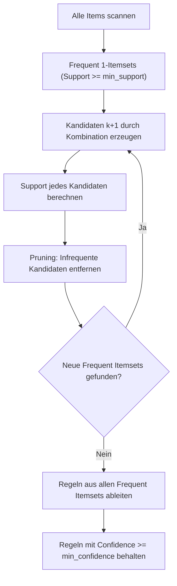
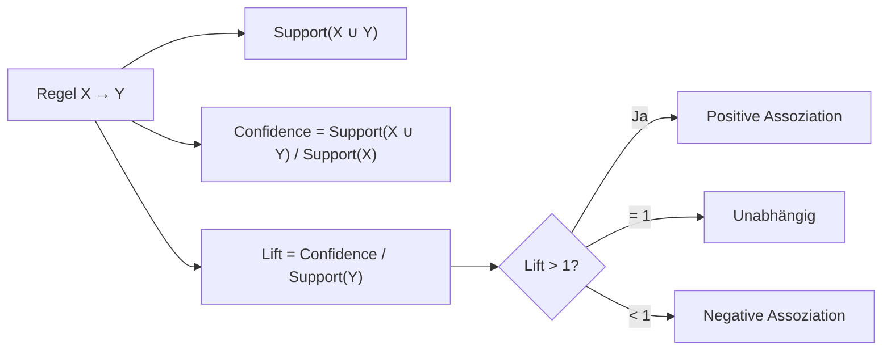

## Grundprinzip des Apriori-Algorithmus

*Kontext: Apriori ist ein klassischer Algorithmus zur Entdeckung häufiger Itemsets und daraus abgeleiteter Assoziationsregeln in Transaktionsdatenbanken.*

Der Apriori-Algorithmus (Agrawal & Srikant, 1994) identifiziert Frequent Itemsets – Mengen von Items, die gemeinsam in mindestens einem Mindestanteil (min_support) aller Transaktionen vorkommen. Aus diesen Frequent Itemsets werden anschließend Assoziationsregeln abgeleitet. Der Algorithmus nutzt das Apriori-Prinzip: Ist ein Itemset selten (unter min_support), so sind alle seine Obermengen ebenfalls selten. Dies ermöglicht ein effizientes Pruning des Suchraums, indem Kandidaten-Itemsets bottom-up (von Einzel-Items zu größeren Mengen) generiert und geprüft werden.

### Algorithmischer Ablauf

*Kontext: Apriori arbeitet level-weise und generiert Kandidaten steigender Größe durch Kombination bereits validierter Frequent Itemsets.*

1. **Schritt 1**: Bestimme alle einzelnen Items mit Support >= min_support (Frequent 1-Itemsets).
2. **Schritt 2**: Generiere Kandidaten-2-Itemsets durch Kombination der Frequent 1-Itemsets.
3. **Schritt 3**: Prüfe den Support jedes Kandidaten. Behalte nur Frequent 2-Itemsets.
4. **Iteration**: Wiederhole mit steigender Itemset-Größe, bis keine neuen Frequent Itemsets mehr gefunden werden.
5. **Regelgenerierung**: Leite aus den Frequent Itemsets Regeln ab, die min_confidence erfüllen.

Das folgende Diagramm veranschaulicht die iterative Kandidatengenerierung und das Pruning des Apriori-Algorithmus.

*Kontext: Flowchart des Apriori-Algorithmus – level-weise Kandidatengenerierung mit Support-Pruning bis keine neuen Frequent Itemsets mehr entstehen.*



## Kennzahlen der Assoziationsregeln

*Kontext: Support, Confidence und Lift sind die drei zentralen Metriken zur Bewertung der Stärke und Relevanz von Assoziationsregeln.*

### Support

*Kontext: Support misst die Häufigkeit eines Itemsets in der Gesamtheit aller Transaktionen.*

Support(X) = Anzahl Transaktionen mit X / Gesamtanzahl Transaktionen

Für eine Regel X → Y gilt: Support(X → Y) = Support(X ∪ Y). Ein Support von 0.05 bedeutet, dass das Itemset in 5 % aller Transaktionen vorkommt. Der min_support-Schwellenwert filtert seltene Kombinationen heraus und bestimmt maßgeblich die Rechenzeit des Algorithmus.

### Confidence

*Kontext: Confidence misst die bedingte Wahrscheinlichkeit, dass Y gekauft wird, gegeben dass X gekauft wurde.*

Confidence(X → Y) = Support(X ∪ Y) / Support(X)

Confidence gibt an, in welchem Anteil der Transaktionen, die X enthalten, auch Y enthalten ist. Eine Confidence von 0.8 bedeutet: In 80 % der Fälle, in denen X gekauft wird, wird auch Y gekauft. Confidence allein kann irreführend sein, wenn Y generell häufig vorkommt.

### Lift

*Kontext: Lift korrigiert Confidence um die Basiswahrscheinlichkeit von Y und zeigt echte Abhängigkeiten.*

Lift(X → Y) = Confidence(X → Y) / Support(Y)

- **Lift > 1**: Positive Assoziation – X und Y treten häufiger zusammen auf als zufällig erwartet.
- **Lift = 1**: Unabhängigkeit – kein Zusammenhang zwischen X und Y.
- **Lift < 1**: Negative Assoziation – X und Y treten seltener zusammen auf als erwartet.

Lift ist symmetrisch: Lift(X → Y) = Lift(Y → X).

Das folgende Diagramm fasst die Bewertung einer Assoziationsregel durch die drei Kennzahlen zusammen.

*Kontext: Zusammenspiel von Support, Confidence und Lift bei der Bewertung einer Regel X → Y.*



## Frequent Itemsets

*Kontext: Frequent Itemsets sind die Grundlage aller Assoziationsregeln und werden durch den min_support-Schwellenwert definiert.*

Ein Frequent Itemset ist eine Menge von Items, deren Support den festgelegten min_support-Schwellenwert erreicht oder überschreitet. Die Anti-Monotonie-Eigenschaft (Apriori-Prinzip) besagt: Jede Teilmenge eines Frequent Itemset ist ebenfalls frequent. Umgekehrt: Enthält eine Menge ein infrequentes Item, kann die Obermenge nicht frequent sein. Diese Eigenschaft ermöglicht das effiziente Pruning im Apriori-Algorithmus.

## Warenkorbanalyse (Market Basket Analysis)

*Kontext: Die Warenkorbanalyse ist die klassische Anwendung von Assoziationsregeln im Einzelhandel.*

Die Warenkorbanalyse untersucht Kauftransaktionen, um Produkte zu identifizieren, die häufig gemeinsam gekauft werden. Typische Ergebnisse:

- Produktplatzierung: Häufig gemeinsam gekaufte Artikel nebeneinander platzieren.
- Cross-Selling: Empfehlungen basierend auf dem aktuellen Warenkorb.
- Promotions: Bundle-Angebote für assoziierte Produkte.

Beispiel mit der mlxtend-Bibliothek:

```python
from mlxtend.frequent_patterns import apriori, association_rules
import pandas as pd

# Transaktionsdaten als One-Hot-Encoded DataFrame
data = {'Brot': [1,1,0,1,1], 'Butter': [0,1,1,1,1],
        'Milch': [1,0,1,1,0], 'Käse': [0,1,0,1,0]}
df = pd.DataFrame(data).astype(bool)

frequent_items = apriori(df, min_support=0.4, use_colnames=True)
rules = association_rules(frequent_items, metric="lift", min_threshold=1.0)
print(rules[['antecedents','consequents','support','confidence','lift']])
# Quelle: https://www.socr.umich.edu/people/dinov/courses/DSPA_notes/11_Apriory_AssocRuleLearning.html
```

## Einschränkungen

*Kontext: Apriori hat Skalierungs- und Interpretationsprobleme, die alternative Algorithmen motivieren.*

- **Rechenaufwand**: Bei niedrigem min_support explodiert die Kandidatenzahl kombinatorisch. Viele Datenbankscans erforderlich (ein Scan pro Itemset-Größe).
- **Speicherbedarf**: Große Kandidaten-Itemsets erfordern erheblichen Arbeitsspeicher.
- **Alternative FP-Growth**: Der FP-Growth-Algorithmus vermeidet die Kandidatengenerierung durch eine komprimierte Datenstruktur (FP-Tree) und ist bei großen Datenmengen effizienter.
- **Seltene, aber relevante Muster**: Hoher min_support filtert seltene, potenziell wertvolle Regeln heraus.
- **Spurious Correlations**: Viele generierte Regeln sind statistisch zufällig. Zusätzliche Tests (z. B. Chi-Quadrat) können helfen.
- **Nur binäre Daten**: Standardmäßig nur für Ja/Nein-Transaktionen geeignet. Quantitative Daten erfordern Diskretisierung.
- **Schwellenwerte manuell**: min_support und min_confidence müssen vom Nutzer festgelegt werden – es gibt keine universell optimalen Werte.
