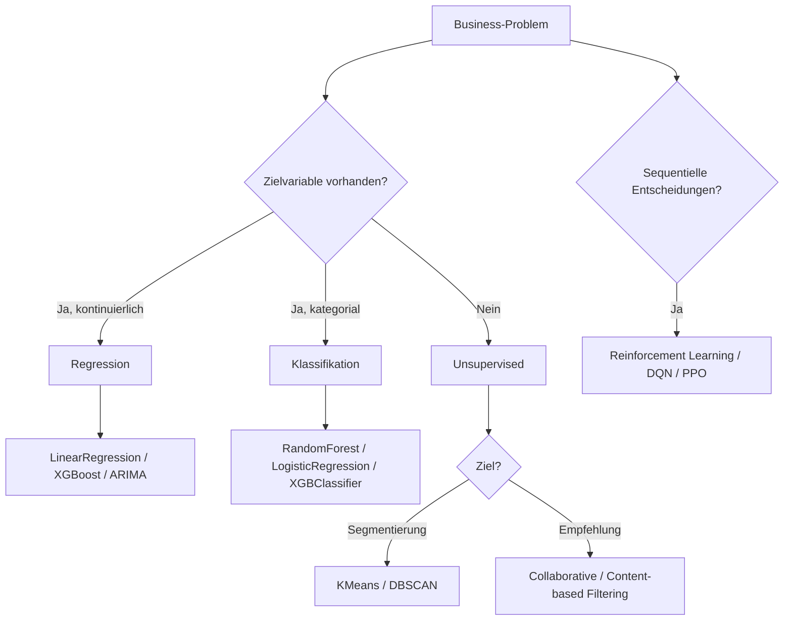
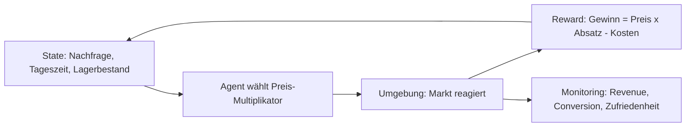

Das folgende Diagramm zeigt die Zuordnung von Business-Problemtypen zu geeigneten ML-Algorithmen als Entscheidungshilfe.

*Kontext: Flowchart Mapping Problemtyp → Algorithmus-Kategorie für typische Business-Szenarien.*

---

## Regression zur Schätzung von Kennzahlen

*Kontext: Regression ist die Standardmethode, wenn eine kontinuierliche Zielgröße (z.B. Umsatz, Kosten, Dauer) auf Basis historischer Daten vorhergesagt werden soll.*

### Problem

Ein Unternehmen möchte den monatlichen Umsatz für das kommende Quartal prognostizieren. Die Zielgröße ist eine reelle Zahl (Euro-Betrag), die von Einflussfaktoren wie Saison, Marketingbudget, Produktpreisen und wirtschaftlichen Indikatoren abhängt. Ohne Prognose fehlt die Planungsgrundlage für Einkauf, Personal und Budgetallokation.

### Geeigneter Algorithmus

- **LinearRegression** (scikit-learn): Einfacher Einstieg, interpretierbar, gut bei linearen Zusammenhängen.
- **GradientBoostingRegressor** oder **XGBRegressor**: Für komplexe, nichtlineare Zusammenhänge mit vielen Features.
- **ARIMA / Prophet**: Wenn die Zeitreihenstruktur (Trend, Saisonalität) dominiert.

### Lösungsweg

1. Historische Umsatzdaten mit relevanten Features zusammenführen (Datum, Marketingausgaben, Feiertagskalender, Wetterdaten).
2. Feature Engineering: Lag-Features, Rolling Averages, Encoding kategorialer Variablen.
3. Train/Test-Split zeitlich (kein Random-Split bei Zeitreihen).
4. Modell trainieren, Hyperparameter tunen (z.B. GridSearchCV).
5. Evaluation mit MAE (Mean Absolute Error) und R²-Score.
6. Prognose für kommende Monate generieren und in Dashboards integrieren.

---

## Klassifikation für Entscheidungsprozesse – Churn-Vorhersage

*Kontext: Klassifikation ordnet Datenpunkte diskreten Kategorien zu und eignet sich ideal für binäre Entscheidungen wie „Kunde bleibt" vs. „Kunde kündigt".*

### Problem

Ein Telekommunikationsunternehmen verliert monatlich Kunden an Wettbewerber. Die Aufgabe ist es, gefährdete Kunden frühzeitig zu identifizieren, damit das Retention-Team gezielte Maßnahmen (Rabatte, persönliche Ansprache) einleiten kann. Die Zielvariable ist binär: Churn = 1 (Kündigung) oder Churn = 0 (bleibt).

### Geeigneter Algorithmus

- **RandomForestClassifier** (scikit-learn): Robust, wenig Overfitting, Feature-Importances direkt verfügbar.
- **LogisticRegression**: Interpretierbar, liefert Wahrscheinlichkeiten.
- **XGBClassifier**: Oft höchste Accuracy bei tabellarischen Daten.

### Lösungsweg

1. Datenbasis: Vertragsdaten, Nutzungsverhalten (Anrufe, Datenvolumen), Beschwerden, Vertragslaufzeit.
2. Label definieren: Kunden, die innerhalb der letzten 30 Tage gekündigt haben.
3. Feature Engineering: Nutzungsänderungen (Differenz Monat zu Monat), Beschwerdehäufigkeit.
4. Class Imbalance behandeln: SMOTE, class_weight='balanced', oder Undersampling.
5. Modell trainieren, Threshold optimieren (Precision vs. Recall je nach Businesskosten).
6. Evaluation: AUC-ROC, Precision-Recall-Kurve, Confusion Matrix.
7. Top-N gefährdete Kunden wöchentlich an CRM-System übergeben.

---

## Klassifikation für Entscheidungsprozesse – Kreditrisiko

*Kontext: Im Finanzbereich ist die Klassifikation von Kreditanträgen in „kreditwürdig" vs. „hohes Ausfallrisiko" eine regulatorisch relevante ML-Anwendung.*

### Problem

Eine Bank muss bei jeder Kreditanfrage entscheiden, ob der Antrag bewilligt oder abgelehnt wird. Fehlentscheidungen kosten Geld: Falsch bewilligte Kredite führen zu Ausfällen, falsch abgelehnte Anträge zu entgangenem Geschäft. Die Zielvariable ist binär: Default = 1 (Ausfall) oder Default = 0 (kein Ausfall).

### Geeigneter Algorithmus

- **LogisticRegression**: Standard in der Finanzbranche wegen Interpretierbarkeit und regulatorischer Anforderungen (Erklärbarkeit).
- **GradientBoostingClassifier**: Höhere Genauigkeit, aber weniger transparent.
- **Explainable Boosting Machine (EBM)**: Kompromiss aus Genauigkeit und Interpretierbarkeit.

### Lösungsweg

1. Features: Einkommen, Beschäftigungsdauer, bestehende Verbindlichkeiten, SCHUFA-Score, Kredithistorie.
2. Regulatorische Vorgaben beachten: Geschützte Merkmale (Geschlecht, Ethnie) dürfen nicht diskriminierend wirken.
3. Modell trainieren mit stratifiziertem Split (Ausfallrate ist typisch 2–5%).
4. Evaluation: AUC-ROC, Gini-Koeffizient, KS-Statistik (Kolmogorov-Smirnov).
5. Scorecard erstellen: Wahrscheinlichkeiten in Score-Punkte umrechnen.
6. Modell-Monitoring: Performance-Drift über Zeit überwachen (PSI – Population Stability Index).

---

## Clustering zur Kundensegmentierung

*Kontext: Clustering ist eine unüberwachte Methode, die Kunden ohne vorgegebene Labels in homogene Gruppen einteilt – ideal für Marketingstrategien und Personalisierung.*

### Problem

Ein E-Commerce-Unternehmen möchte seine Kunden in sinnvolle Segmente unterteilen, um Marketingkampagnen, Preisstrategien und Produktempfehlungen zielgruppenspezifisch zu gestalten. Es gibt keine vordefinierte Zielvariable – die Struktur soll aus den Daten emergieren.

### Geeigneter Algorithmus

- **KMeans** (scikit-learn): Schnell, skalierbar, gut für kugelige Cluster.
- **DBSCAN**: Findet Cluster beliebiger Form, erkennt Outlier automatisch.
- **Gaussian Mixture Models (GMM)**: Probabilistisch, erlaubt überlappende Segmente.

### Lösungsweg

1. RFM-Analyse als Feature-Basis: Recency (letzte Bestellung), Frequency (Bestellhäufigkeit), Monetary (Umsatz).
2. Daten normalisieren (StandardScaler), da KMeans distanzbasiert arbeitet.
3. Optimale Clusteranzahl bestimmen: Elbow-Methode (Inertia), Silhouette-Score.
4. KMeans mit k=4–6 Clustern trainieren.
5. Cluster interpretieren: Durchschnittswerte pro Segment analysieren, Business-Labels vergeben (z.B. „VIP-Kunden", „Gelegenheitskäufer", „Abwandernde").
6. Segmente in CRM-System überführen, differenzierte Kampagnen aufsetzen.

---

## Empfehlungsmaschinen für Cross-Selling

*Kontext: Empfehlungssysteme steigern den Umsatz pro Kunde, indem sie relevante Produkte vorschlagen – die zwei Hauptansätze sind Collaborative Filtering und Content-based Filtering.*

### Collaborative Filtering

Basiert auf dem Verhalten ähnlicher Nutzer: „Kunden, die Produkt A gekauft haben, kauften auch Produkt B." Es werden keine Produkteigenschaften benötigt, sondern nur die User-Item-Interaktionsmatrix (Käufe, Bewertungen, Klicks).

- **Algorithmus**: Matrix Factorization (z.B. SVD, ALS), oder Neural Collaborative Filtering.
- **Vorteil**: Entdeckt unerwartete Zusammenhänge (Serendipity).
- **Nachteil**: Cold-Start-Problem bei neuen Nutzern oder Produkten.

### Content-based Filtering

Empfiehlt Produkte, die den bisherigen Präferenzen eines Nutzers ähneln, basierend auf Produktattributen (Kategorie, Preis, Beschreibung). Nutzt Cosine Similarity oder TF-IDF-Vektoren.

- **Algorithmus**: kNN auf Feature-Vektoren, oder TF-IDF + Cosine Similarity.
- **Vorteil**: Kein Cold-Start bei neuen Produkten (Features sind bekannt).
- **Nachteil**: Filterblase – empfiehlt nur Ähnliches.

### Lösungsweg (Hybrid-Ansatz)

1. User-Item-Matrix aufbauen (implizites Feedback: Klicks, Käufe, Verweildauer).
2. Collaborative Filtering für bestehende Nutzer mit ausreichend Interaktionen.
3. Content-based Fallback für neue Nutzer oder neue Produkte.
4. Evaluation: Precision@K, Recall@K, NDCG (Normalized Discounted Cumulative Gain).
5. A/B-Testing im Produktivsystem: Empfohlene vs. nicht-empfohlene Produkte vergleichen.

---

## Reinforcement Learning für Dynamic Pricing

*Kontext: Reinforcement Learning (RL) optimiert sequentielle Entscheidungen unter Unsicherheit – bei Dynamic Pricing lernt ein Agent die optimale Preisstrategie durch Interaktion mit dem Markt.*

### Problem

Ein Ride-Hailing-Dienst oder ein Online-Händler möchte Preise in Echtzeit an Nachfrage, Wettbewerb und Lagerbestand anpassen. Statische Preisregeln verpassen Umsatzpotenzial bei hoher Nachfrage und verlieren Kunden bei niedriger Nachfrage.

### Geeigneter Algorithmus

- **Q-Learning / Deep Q-Network (DQN)**: Diskrete Preisstufen als Actions.
- **Policy Gradient (PPO, A2C)**: Kontinuierliche Preisanpassungen.
- **Contextual Bandits**: Einfacherer Sonderfall, wenn keine langfristigen Abhängigkeiten bestehen.

### Lösungsweg

1. **State** definieren: Aktuelle Nachfrage, Tageszeit, Wochentag, Lagerbestand, Wettbewerbspreise.
2. **Action Space**: Preis-Multiplikatoren (z.B. 0.8x, 1.0x, 1.2x, 1.5x des Basispreises).
3. **Reward**: Gewinn = (Preis – Kosten) × Absatzmenge. Langfristiger Reward berücksichtigt Kundenbindung.
4. Simulation aufbauen: Historische Preiselastizitäten nutzen, um Umgebung zu modellieren.
5. Agent trainieren (offline auf Simulation, dann vorsichtiges Online-Learning).
6. Guardrails setzen: Maximale Preisabweichung, Fairness-Constraints, regulatorische Grenzen.
7. Monitoring: Durchschnittlicher Revenue per Session, Conversion Rate, Kundenzufriedenheit.

Das folgende Diagramm veranschaulicht den Reinforcement-Learning-Kreislauf beim Dynamic Pricing.

*Kontext: Flowchart des RL-Zyklus State → Action → Reward für Dynamic Pricing.*

> ⚠️ Unsicher: Die praktische Umsetzung von RL für Pricing ist komplex und erfordert umfangreiche Simulationsumgebungen. Viele Unternehmen starten mit einfacheren regelbasierten oder Bandit-Ansätzen, bevor sie volles RL einsetzen.
