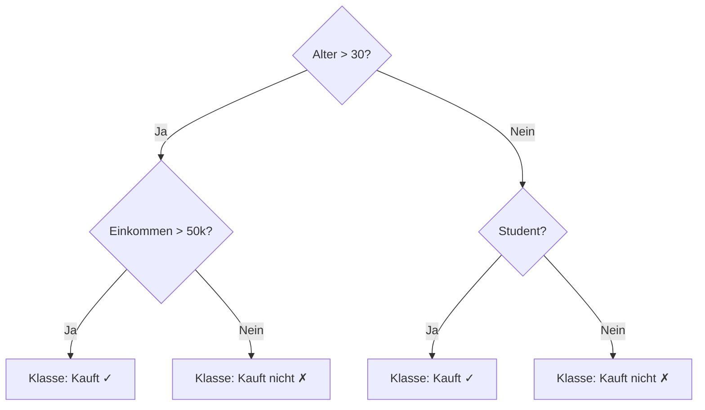
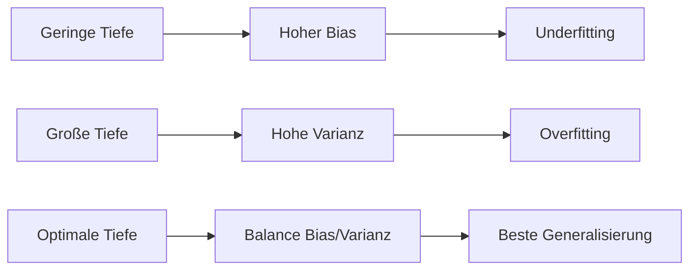
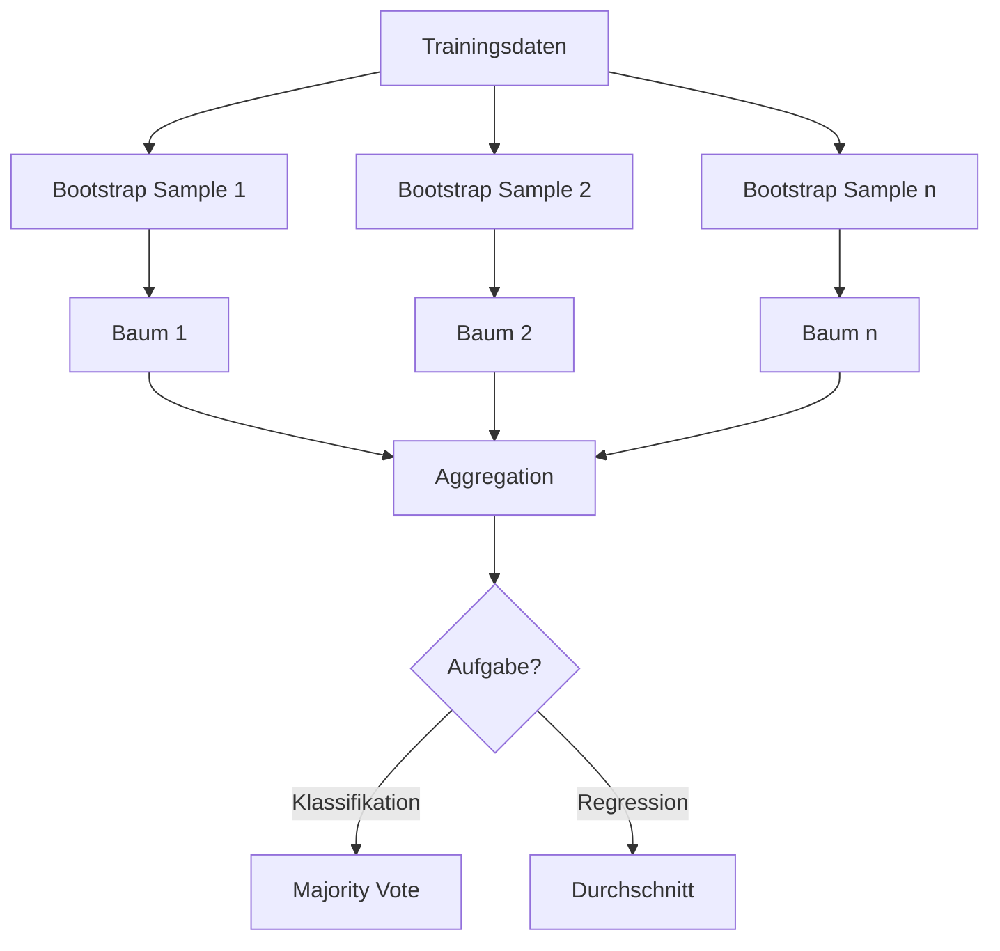

## Entscheidungsbaum: Grundprinzip

*Kontext: Funktionsweise von Entscheidungsbäumen als nicht-parametrische, regelbasierte Lernmethode für Klassifikation und Regression.*

Ein Entscheidungsbaum (Decision Tree) ist eine nicht-parametrische Methode des überwachten Lernens. Er lernt einfache Entscheidungsregeln aus den Daten und stellt diese als Baumstruktur dar. An jedem internen Knoten wird ein Feature mit einem Schwellenwert verglichen; die Daten werden rekursiv in Teilmengen aufgeteilt, bis ein Stoppkriterium erreicht ist.

### Aufbau

- **Wurzelknoten (Root)**: Erster Split auf dem informativsten Feature
- **Interne Knoten**: Weitere Splits auf Features
- **Blätter (Leaves)**: Endknoten mit der Vorhersage (Klasse oder Wert)
- **Tiefe (Depth)**: Längster Pfad von Wurzel zu Blatt

Das folgende Diagramm zeigt einen beispielhaften Entscheidungsbaum für eine binäre Klassifikation.

*Kontext: Beispiel-Decision-Tree mit Feature-Splits, Schwellenwerten und Blatt-Vorhersagen.*



### Algorithmus (CART in scikit-learn)

scikit-learn verwendet den CART-Algorithmus (Classification and Regression Trees). Für jeden Knoten wird das Feature j und der Schwellenwert t gewählt, die die Unreinheit (Impurity) am stärksten reduzieren:

θ* = argmin_θ G(Q_m, θ)

wobei G die gewichtete Summe der Impurity-Werte der resultierenden Kindknoten ist.

---

## Splitting-Kriterien: Gini-Impurity und Entropy

*Kontext: Mathematische Grundlage der Splitting-Kriterien, die bestimmen, wie ein Entscheidungsbaum seine Knoten aufteilt.*

### Gini-Impurity

Die Gini-Impurity misst die Wahrscheinlichkeit, dass ein zufällig gezogenes Sample falsch klassifiziert wird:

Gini(m) = Σₖ p_mk · (1 − p_mk)

Dabei ist p_mk der Anteil der Klasse k im Knoten m. Gini = 0 bedeutet perfekte Reinheit (nur eine Klasse), Gini = 0.5 (bei zwei Klassen) maximale Unsicherheit.

### Entropy (Informationsgewinn)

Die Entropy basiert auf der Shannon-Entropie und misst den Informationsgehalt:

Entropy(m) = − Σₖ p_mk · log₂(p_mk)

Entropy = 0 bei perfekter Reinheit, maximal bei Gleichverteilung. Die Minimierung der Entropy bei Splits entspricht der Maximierung des Information Gain.

### Vergleich Gini vs. Entropy

- Gini ist schneller zu berechnen (keine Logarithmus-Operation)
- In der Praxis liefern beide Kriterien sehr ähnliche Bäume
- Gini tendiert dazu, die häufigste Klasse in einen eigenen Zweig zu isolieren
- Entropy bevorzugt balanciertere Splits
- scikit-learn Default: `criterion='gini'`

```python
# Quelle: scikit-learn.org/stable/modules/tree.html
from sklearn.tree import DecisionTreeClassifier

# Mit Gini (Standard)
tree_gini = DecisionTreeClassifier(criterion='gini', max_depth=5)

# Mit Entropy
tree_entropy = DecisionTreeClassifier(criterion='entropy', max_depth=5)

tree_gini.fit(X_train, y_train)
```

---

## Overfitting bei Entscheidungsbäumen

*Kontext: Warum Entscheidungsbäume zu Overfitting neigen und welche Gegenmaßnahmen existieren.*

Entscheidungsbäume haben unbegrenzte Freiheit beim Splitting. Ohne Einschränkungen teilen sie die Daten so lange auf, bis jedes Blatt nur noch ein Sample enthält (Gini = 0). Dies führt zu perfekter Anpassung an die Trainingsdaten, aber schlechter Generalisierung.

### Anzeichen für Overfitting

- Sehr tiefe Bäume mit vielen Blättern
- Gini/Entropy nahe 0 in allen Blättern auf Trainingsdaten
- Große Diskrepanz zwischen Train- und Test-Accuracy

Das folgende Diagramm zeigt den Zusammenhang zwischen Baumtiefe und Modellverhalten (Underfitting ↔ Overfitting).

*Kontext: Einfluss der Baumtiefe auf Bias und Varianz – optimale Tiefe liegt zwischen den Extremen.*



### Gegenmaßnahmen (Pruning und Hyperparameter)

- **`max_depth`**: Maximale Tiefe des Baumes begrenzen
- **`min_samples_split`**: Mindestanzahl Samples für einen Split (Default: 2)
- **`min_samples_leaf`**: Mindestanzahl Samples pro Blatt (empfohlen: ≥5)
- **`max_leaf_nodes`**: Maximale Anzahl an Blättern
- **`ccp_alpha`** (Cost-Complexity Pruning): Nachträgliches Beschneiden des Baumes über den Komplexitätsparameter α
- **`max_features`**: Nur eine zufällige Teilmenge der Features pro Split betrachten

### Vorteile von Entscheidungsbäumen

- Einfach zu interpretieren und zu visualisieren (White-Box-Modell)
- Keine Feature-Skalierung nötig
- Können numerische und kategorische Daten verarbeiten
- Geringe Vorhersagezeit: O(log(n_samples))

### Nachteile

- Starke Overfitting-Neigung ohne Regularisierung
- Instabil: Kleine Datenänderungen können komplett andere Bäume erzeugen
- Stückweise konstante Vorhersagen (keine glatte Approximation)
- Lernen von XOR-ähnlichen Mustern ist schwierig

---

## Random Forest: Ensemble aus Entscheidungsbäumen

*Kontext: Wie Random Forest durch Kombination vieler Bäume die Varianz reduziert und robustere Vorhersagen liefert.*

Random Forest ist ein Ensemble-Verfahren, das viele Entscheidungsbäume kombiniert und deren Vorhersagen aggregiert. Für Klassifikation wird per Mehrheitsvotum (Majority Vote) entschieden, für Regression der Durchschnitt der Einzelvorhersagen gebildet.

### Kernprinzip: Bagging (Bootstrap Aggregating)

Jeder Baum im Forest wird auf einem Bootstrap-Sample trainiert – einer Stichprobe mit Zurücklegen aus den Trainingsdaten (gleiche Größe wie Originaldatensatz, ca. 63% unique Samples pro Baum). Zusätzlich wird bei jedem Split nur eine zufällige Teilmenge der Features betrachtet (`max_features`).

Das folgende Diagramm veranschaulicht den Bagging-Prozess und die Aggregation der Einzelvorhersagen im Random Forest.

*Kontext: Ablauf von Bootstrap-Sampling über paralleles Baumtraining bis zum Majority Vote.*



### Warum es funktioniert

- Einzelne tiefe Bäume haben hohe Varianz (Overfitting)
- Durch Randomisierung (Bootstrap + Feature-Subsampling) entstehen dekorrelierte Bäume
- Mittelung über viele dekorrelierte Vorhersagen reduziert die Varianz erheblich
- Leicht erhöhter Bias wird durch massiv reduzierte Varianz mehr als kompensiert

```python
# Quelle: scikit-learn.org/stable/modules/ensemble.html
from sklearn.ensemble import RandomForestClassifier

rf = RandomForestClassifier(
    n_estimators=100,
    max_depth=None,
    max_features='sqrt',
    min_samples_leaf=1,
    random_state=42,
    n_jobs=-1
)
rf.fit(X_train, y_train)
accuracy = rf.score(X_test, y_test)
```

---

## Random Forest: Hyperparameter

*Kontext: Die wichtigsten Hyperparameter von Random Forest und deren Einfluss auf Modellleistung und Rechenzeit.*

### n_estimators (Anzahl der Bäume)

- Gibt an, wie viele Bäume im Forest trainiert werden
- Mehr Bäume = stabilere Vorhersagen, aber längere Trainingszeit
- Typische Werte: 100–500; ab einem bestimmten Punkt verbessern sich Ergebnisse kaum noch
- Kein Overfitting-Risiko durch mehr Bäume (im Gegensatz zur Tiefe)

### max_depth (Maximale Baumtiefe)

- Begrenzt die Tiefe jedes einzelnen Baumes
- `None` (Default): Bäume wachsen bis zur maximalen Reinheit
- Für Random Forest ist `max_depth=None` oft optimal, da Bagging das Overfitting kontrolliert
- Reduzierte Tiefe spart RAM und Trainingszeit

### max_features (Features pro Split)

- Steuert, wie viele Features bei jedem Split zufällig ausgewählt werden
- Default Klassifikation: `'sqrt'` (√n_features)
- Default Regression: `1.0` (alle Features)
- Kleinere Werte → mehr Randomisierung → stärkere Varianzreduktion, aber höherer Bias

### Weitere wichtige Parameter

- **`min_samples_split`**: Mindest-Samples für Split (Default: 2)
- **`min_samples_leaf`**: Mindest-Samples pro Blatt (Default: 1)
- **`bootstrap`**: True (Default) für Bagging; False für Verwendung aller Daten
- **`oob_score`**: Out-of-Bag-Score als Schätzung der Generalisierung ohne separate Validierungsmenge
- **`n_jobs`**: Parallelisierung (−1 nutzt alle CPU-Kerne)

---

## Feature Importance im Random Forest

*Kontext: Methoden zur Bestimmung der Merkmalswichtigkeit und deren Einschränkungen.*

Random Forest bietet eingebaute Schätzungen der Feature Importance über das Attribut `feature_importances_`. Diese basiert auf dem Mean Decrease in Impurity (MDI): Je häufiger und stärker ein Feature zur Reduktion der Impurity beiträgt, desto wichtiger ist es.

### Berechnung (MDI)

Für jeden Baum wird an jedem Split die Impurity-Reduktion gemessen. Der MDI eines Features ist der gewichtete Durchschnitt dieser Reduktionen über alle Bäume und Splits, normiert auf Summe = 1.0.

### Einschränkungen der Impurity-basierten Importance

- Bevorzugt Features mit vielen einzigartigen Werten (hohe Kardinalität)
- Basiert auf Trainingsstatistiken – informiert nicht direkt über die Generalisierung
- Alternative: Permutation Feature Importance (`sklearn.inspection.permutation_importance`) – misst den Accuracy-Verlust bei zufälliger Permutation eines Features auf dem Testset

```python
# Quelle: scikit-learn.org/stable/modules/ensemble.html
import numpy as np
from sklearn.ensemble import RandomForestClassifier

rf = RandomForestClassifier(n_estimators=100, random_state=42)
rf.fit(X_train, y_train)

importances = rf.feature_importances_
indices = np.argsort(importances)[::-1]
for i in range(min(10, X_train.shape[1])):
    print(f"{feature_names[indices[i]]}: {importances[indices[i]]:.4f}")
```

---

## Vorteile und Nachteile von Random Forest

*Kontext: Zusammenfassung der Stärken und Schwächen von Random Forest im Vergleich zu einzelnen Entscheidungsbäumen und anderen Verfahren.*

### Vorteile

- Deutlich geringere Overfitting-Neigung als einzelne Bäume
- Robust gegenüber Ausreißern und verrauschten Daten
- Keine Feature-Skalierung erforderlich
- Gut geeignet für hochdimensionale Daten
- Inhärente Feature-Importance-Schätzung
- Parallelisierbar (jeder Baum unabhängig trainierbar)
- Out-of-Bag-Evaluation ohne separate Validierungsdaten

### Nachteile

- Weniger interpretierbar als ein einzelner Entscheidungsbaum (Black-Box-Charakter)
- Hoher Speicherbedarf bei vielen tiefen Bäumen: O(M · N · log(N))
- Langsamer bei Inferenz als ein einzelner Baum
- Bei sehr verrauschten Daten kann Overfitting trotzdem auftreten
- Stückweise konstante Vorhersagefläche (nicht glatt)
- Bei stark unbalancierten Klassen kann Bias auftreten → `class_weight='balanced'` setzen
