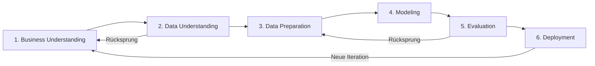
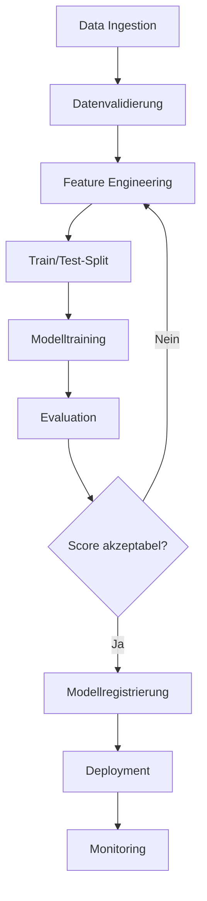

## Überblick: CRISP-DM als Standardvorgehensmodell

*Kontext: CRISP-DM ist das meistverwendete Vorgehensmodell für Data-Mining-, Analytics- und Data-Science-Projekte und gliedert den Projektablauf in sechs iterative Phasen.*

CRISP-DM (Cross-Industry Standard Process for Data Mining) wurde 1999 veröffentlicht und ist bis heute der De-facto-Standard für datengetriebene Projekte. Das Modell definiert sechs Phasen, die nicht streng linear durchlaufen werden – Rücksprünge zwischen Phasen sind ausdrücklich vorgesehen. Ein typisches ML-Projekt durchläuft mehrere Iterationen, wobei Erkenntnisse jeder Phase in die nächste einfließen.

Die sechs Phasen sind:

1. Business Understanding
2. Data Understanding
3. Data Preparation
4. Modeling
5. Evaluation
6. Deployment

CRISP-DM kann sowohl wasserfallartig (horizontal) als auch agil (vertikal in dünnen Slices) implementiert werden. In der Praxis wird eine agile Implementierung mit schnellen Iterationen empfohlen, um frühzeitig Feedback von Stakeholdern zu erhalten.

Das folgende Diagramm zeigt den iterativen Kreislauf der sechs CRISP-DM-Phasen:

*Kontext: CRISP-DM als zyklischer Prozess – die Phasen werden iterativ durchlaufen, Rücksprünge sind jederzeit möglich.*



---

## Phase 1: Business Understanding

*Kontext: In der Phase Business Understanding wird das Geschäftsproblem definiert, bevor technische Arbeiten beginnen.*

Das Ziel dieser Phase ist ein tiefes Verständnis der geschäftlichen Anforderungen und Ziele. Die Phase umfasst vier Aufgaben:

- **Geschäftsziele bestimmen:** Klären, was der Auftraggeber tatsächlich erreichen möchte, und messbare Erfolgskriterien definieren.
- **Situationsanalyse:** Ressourcen, Anforderungen, Risiken und Kosten-Nutzen-Verhältnis bewerten.
- **Data-Mining-Ziele definieren:** Technische Erfolgskriterien formulieren, z. B. „Klassifikationsgenauigkeit ≥ 85 %".
- **Projektplan erstellen:** Technologien und Werkzeuge auswählen, detaillierte Pläne für jede Phase aufstellen.

Typische Fragen in dieser Phase: Welches Problem soll gelöst werden? Welche KPI wird optimiert? Welche Entscheidungen soll das Modell unterstützen?

---

## Phase 2: Data Understanding

*Kontext: Data Understanding dient dazu, die verfügbaren Daten zu identifizieren, zu sammeln und deren Qualität sowie Eignung für das Projektziel zu prüfen.*

Diese Phase baut auf dem Business Understanding auf und umfasst:

- **Daten sammeln:** Relevante Datenquellen identifizieren und Daten in die Analyseumgebung laden.
- **Daten beschreiben:** Oberflächenmerkmale dokumentieren – Format, Anzahl Datensätze, Feldtypen, fehlende Werte.
- **Daten explorieren:** Statistische Kennzahlen berechnen, Verteilungen visualisieren, Zusammenhänge zwischen Variablen untersuchen (Exploratory Data Analysis, EDA).
- **Datenqualität prüfen:** Vollständigkeit, Konsistenz und Korrektheit bewerten. Qualitätsprobleme dokumentieren.

Werkzeuge für EDA sind unter anderem `pandas.describe()`, `matplotlib`, `seaborn` und `ydata-profiling` (ehemals pandas-profiling).

---

## Phase 3: Data Preparation

*Kontext: Data Preparation transformiert Rohdaten in ein für die Modellierung geeignetes Format und macht typischerweise 60–80 % des Projektaufwands aus.*

Aufgaben dieser Phase:

- **Daten auswählen:** Relevante Merkmale und Datensätze bestimmen; irrelevante oder redundante Variablen ausschließen.
- **Daten bereinigen:** Fehlende Werte behandeln (Imputation, Entfernung), Ausreißer identifizieren, inkonsistente Einträge korrigieren.
- **Neue Merkmale konstruieren (Feature Engineering):** Abgeleitete Variablen erzeugen, z. B. BMI aus Größe und Gewicht, oder Datums-Features wie Wochentag extrahieren.
- **Daten integrieren:** Tabellen zusammenführen (Joins), Daten aus verschiedenen Quellen harmonisieren.
- **Daten formatieren:** Typkonvertierungen durchführen, kategorische Variablen encodieren (One-Hot-Encoding, Label-Encoding), numerische Variablen skalieren (StandardScaler, MinMaxScaler).

### Beispiel: Preprocessing-Pipeline in scikit-learn

Eine typische Vorverarbeitungs-Pipeline kombiniert mehrere Schritte reproduzierbar:

```python
from sklearn.pipeline import Pipeline
from sklearn.preprocessing import StandardScaler
from sklearn.impute import SimpleImputer

preprocessing = Pipeline([
    ('imputer', SimpleImputer(strategy='median')),
    ('scaler', StandardScaler())
])
# Quelle: https://scikit-learn.org/stable/modules/compose.html
```

---

## Phase 4: Modeling

*Kontext: In der Modeling-Phase werden ein oder mehrere Algorithmen ausgewählt, trainiert und auf den vorbereiteten Daten angewendet.*

Aufgaben:

- **Modellierungstechnik auswählen:** Algorithmus basierend auf Problemtyp, Datenstruktur und Anforderungen wählen (siehe Abschnitt Modellwahl).
- **Testdesign festlegen:** Daten in Training-, Validierungs- und Testsets aufteilen; Kreuzvalidierung definieren.
- **Modell bauen:** Algorithmus auf Trainingsdaten fitten.
- **Modell bewerten:** Ergebnisse interpretieren, mehrere Modelle vergleichen, Iterationen durchführen bis ein „ausreichend gutes" Modell gefunden ist.

Die Modellierungsphase ist oft die kürzeste Phase eines ML-Projekts – die meiste Zeit wird in Data Preparation investiert.

---

## Phase 5: Evaluation

*Kontext: Evaluation prüft, ob das trainierte Modell die geschäftlichen Erfolgskriterien erfüllt, und entscheidet über den weiteren Projektverlauf.*

Im Unterschied zur technischen Modellbewertung in Phase 4 steht hier die geschäftliche Perspektive im Vordergrund:

- **Ergebnisse bewerten:** Erfüllt das Modell die in Phase 1 definierten Business-Kriterien? Ist die Vorhersagequalität für den Use Case ausreichend?
- **Prozess reviewen:** Wurden alle Schritte korrekt durchgeführt? Gibt es übersehene Aspekte?
- **Nächste Schritte bestimmen:** Deployment, weitere Iteration oder neues Projekt initiieren.

Wichtig: Ein technisch gutes Modell kann geschäftlich unbrauchbar sein, wenn es z. B. nicht interpretierbar ist oder die Latenzanforderungen nicht erfüllt.

---

## Phase 6: Deployment

*Kontext: Deployment bringt das Modell in den produktiven Einsatz und stellt sicher, dass Nutzer auf die Ergebnisse zugreifen können.*

Aufgaben:

- **Deployment planen:** Infrastruktur, API-Design, Batch- vs. Echtzeit-Inferenz festlegen.
- **Monitoring und Maintenance planen:** Datendrift-Erkennung, Performance-Monitoring, Retraining-Strategie definieren.
- **Abschlussbericht erstellen:** Projektergebnisse dokumentieren.
- **Projekt reviewen:** Retrospektive durchführen – was lief gut, was kann verbessert werden.

Nach dem Deployment endet die Arbeit nicht: Modelle in Produktion erfordern kontinuierliches Monitoring und gelegentliches Retraining bei Datendrift oder Konzeptdrift.

---

## Schritte einer ML-Pipeline

*Kontext: Eine ML-Pipeline beschreibt den technischen End-to-End-Workflow von Rohdaten bis zur Vorhersage, typischerweise als automatisierter, reproduzierbarer Prozess.*

Eine typische ML-Pipeline umfasst folgende Schritte:

1. **Datenaufnahme (Data Ingestion):** Daten aus Quellen laden (Datenbanken, APIs, Dateisysteme).
2. **Datenvalidierung:** Schema-Checks, Wertebereichsprüfungen, Vollständigkeitsprüfungen.
3. **Feature Engineering:** Merkmale erzeugen, transformieren und auswählen.
4. **Datenaufteilung:** Train/Validation/Test-Split oder Cross-Validation-Setup.
5. **Modelltraining:** Algorithmus fitten, ggf. Hyperparameter-Tuning durchführen.
6. **Modellevaluation:** Metriken auf dem Testset berechnen, Ergebnisse visualisieren.
7. **Modellregistrierung:** Versionierung des trainierten Modells (z. B. MLflow, DVC).
8. **Deployment:** Modell als REST-API, Batch-Job oder eingebettete Komponente bereitstellen.
9. **Monitoring:** Vorhersagequalität, Latenz und Datenverteilungen überwachen.

Das folgende Diagramm veranschaulicht den End-to-End-Ablauf einer ML-Pipeline:

*Kontext: Technischer Workflow einer ML-Pipeline von der Datenaufnahme bis zum Monitoring in Produktion.*



### Beispiel: scikit-learn Pipeline mit Training und Evaluation

```python
from sklearn.pipeline import Pipeline
from sklearn.preprocessing import StandardScaler
from sklearn.ensemble import RandomForestClassifier
from sklearn.model_selection import cross_val_score

pipe = Pipeline([
    ('scaler', StandardScaler()),
    ('clf', RandomForestClassifier(n_estimators=100, random_state=42))
])

scores = cross_val_score(pipe, X_train, y_train, cv=5, scoring='accuracy')
print(f"CV Accuracy: {scores.mean():.3f} ± {scores.std():.3f}")
# Quelle: https://scikit-learn.org/stable/modules/compose.html
```

---

## Modellwahl und Eignung für Use Cases

*Kontext: Die Wahl des richtigen Algorithmus hängt vom Problemtyp, der Datenmenge, den Anforderungen an Interpretierbarkeit und der verfügbaren Rechenleistung ab.*

### Entscheidungskriterien für die Modellwahl

| Kriterium | Fragen |
|-----------|--------|
| Problemtyp | Klassifikation, Regression, Clustering, Anomalieerkennung? |
| Datenmenge | Wenige hundert Samples vs. Millionen? |
| Dimensionalität | Wenige Features vs. Hochdimensional? |
| Interpretierbarkeit | Muss das Modell erklärbar sein (z. B. regulatorisch)? |
| Latenz | Echtzeit-Vorhersage nötig oder Batch ausreichend? |
| Robustheit | Wie sensitiv darf das Modell gegenüber Ausreißern sein? |

### Algorithmus-Empfehlungen nach Use Case

- **Tabellendaten, Klassifikation/Regression:** Gradient Boosting (XGBoost, LightGBM, CatBoost) oder Random Forest als Baseline. Lineare Modelle bei hoher Interpretierbarkeitsanforderung.
- **Textklassifikation:** TF-IDF + Logistic Regression als Baseline; Transformer-Modelle (BERT) für hohe Genauigkeit.
- **Bilderkennung:** Convolutional Neural Networks (CNNs), Transfer Learning mit vortrainierten Modellen (ResNet, EfficientNet).
- **Zeitreihenvorhersage:** ARIMA/SARIMA für univariate Reihen; LSTM oder Transformer für multivariate/komplexe Reihen; Prophet für Geschäftszeitreihen mit Saisonalität.
- **Anomalieerkennung:** Isolation Forest, One-Class SVM, Autoencoder.
- **Wenig gelabelte Daten:** Semi-Supervised Learning, Active Learning, Few-Shot Learning.

### Schnellstart-Heuristik (scikit-learn Flowchart)

scikit-learn bietet unter „Choosing the right estimator" eine Entscheidungshilfe:

- Datenmenge > 50 Samples? → Ja
- Vorhersage einer Kategorie? → Klassifikation
- Gelabelte Daten vorhanden? → Supervised Learning
- Datenmenge < 100k? → LinearSVC, dann KNeighborsClassifier, SVC, Ensemble-Methoden
- Datenmenge > 100k? → SGDClassifier, dann Kernel Approximation

> ⚠️ Unsicher: Die Flowchart-Empfehlungen von scikit-learn sind Heuristiken und gelten nicht universell. Für produktive Systeme sollte immer ein Benchmark mit mehreren Algorithmen durchgeführt werden.
