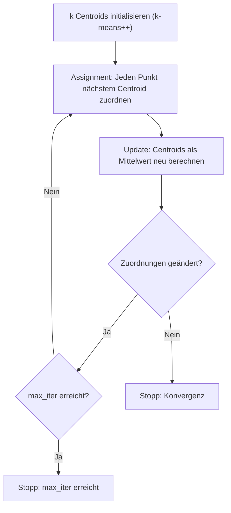
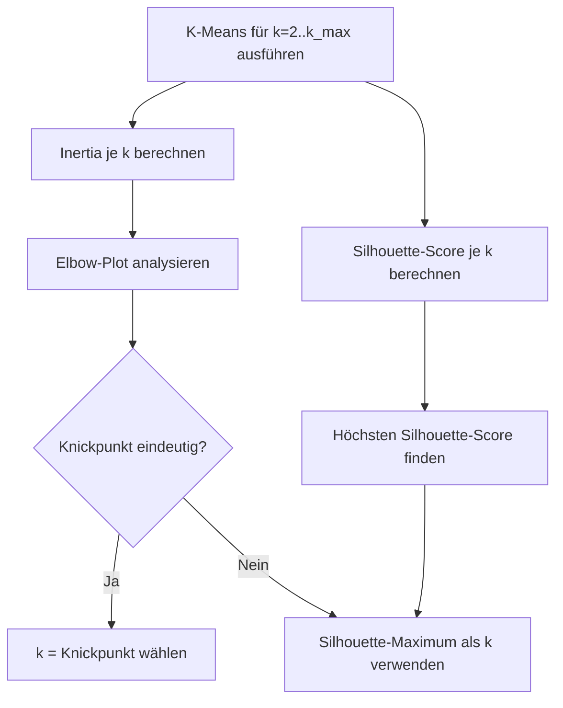

## Grundprinzip von K-Means

*Kontext: K-Means ist ein partitionierender Clustering-Algorithmus, der Datenpunkte in k Gruppen mit minimalem Abstand zum jeweiligen Clusterzentrum einteilt.*

K-Means ist ein unüberwachter Lernalgorithmus, der n Datenpunkte in k Cluster aufteilt, sodass jeder Punkt dem Cluster mit dem nächstgelegenen Zentroid (Centroid) zugeordnet wird. Das Ziel ist die Minimierung der Within-Cluster Sum of Squares (WCSS) – also der Summe der quadratischen Abstände aller Punkte zu ihrem jeweiligen Clusterzentrum.

### Centroids

*Kontext: Centroids sind die Mittelpunkte der Cluster und werden iterativ als Durchschnitt aller zugeordneten Punkte berechnet.*

Ein Centroid ist der arithmetische Mittelwert aller Datenpunkte, die einem Cluster zugeordnet sind. In scikit-learn sind die finalen Centroids über `cluster_centers_` zugänglich. Die Position der Centroids definiert die Clustergrenzen: Jeder Datenpunkt gehört zum Cluster, dessen Centroid ihm am nächsten ist (Voronoi-Zerlegung).

### Lloyd-Algorithmus

*Kontext: Der Lloyd-Algorithmus ist die Standardimplementierung von K-Means mit alternierenden Zuweisungs- und Update-Schritten.*

Der Lloyd-Algorithmus besteht aus zwei alternierenden Schritten:

1. **Assignment-Schritt**: Jeder Datenpunkt wird dem nächstgelegenen Centroid zugeordnet (euklidische Distanz).
2. **Update-Schritt**: Jeder Centroid wird als Mittelwert aller ihm zugeordneten Punkte neu berechnet.

Diese Schritte wiederholen sich bis zur Konvergenz (keine Änderung der Zuordnungen) oder bis `max_iter` (Standard: 300) erreicht ist. Der Algorithmus konvergiert garantiert, aber nicht zwingend zum globalen Optimum.

Das folgende Diagramm zeigt den Lloyd-Algorithmus als iterativen Prozess mit Abbruchbedingung.

*Kontext: Flowchart des Lloyd-Algorithmus – alternierend Assignment und Update bis zur Konvergenz.*



## Wahl von k

*Kontext: Die Bestimmung der optimalen Clusteranzahl k ist eine zentrale Herausforderung, da k vorab festgelegt werden muss.*

### Elbow-Methode

*Kontext: Die Elbow-Methode visualisiert die Inertia als Funktion von k und sucht den Knickpunkt in der Kurve.*

Die Elbow-Methode berechnet die Inertia (WCSS) für verschiedene Werte von k und plottet diese. Der „Ellbogen" – der Punkt, an dem die Kurve deutlich abflacht – zeigt an, dass zusätzliche Cluster nur noch marginalen Gewinn bringen. Die Methode ist intuitiv, aber oft subjektiv, da der Knickpunkt nicht immer eindeutig erkennbar ist.

### Silhouette-Score

*Kontext: Der Silhouette-Score misst die Qualität einer Clusterzuordnung anhand von Intra- und Inter-Cluster-Distanzen.*

Der Silhouette-Koeffizient liegt im Bereich [-1, 1]:

- **Nahe +1**: Der Punkt liegt weit entfernt von Nachbarclustern (gute Zuordnung).
- **Nahe 0**: Der Punkt liegt auf der Entscheidungsgrenze zwischen zwei Clustern.
- **Negativ**: Der Punkt ist möglicherweise falsch zugeordnet.

In scikit-learn berechnet `silhouette_score()` den Durchschnitt und `silhouette_samples()` die Werte je Punkt.

Das folgende Diagramm zeigt den Entscheidungsprozess zur Bestimmung der optimalen Clusteranzahl k.

*Kontext: Ablauf der k-Bestimmung mit Elbow-Methode und Silhouette-Score als kombinierten Kriterien.*



Beispiel zur Silhouette-Analyse:

```python
from sklearn.cluster import KMeans
from sklearn.metrics import silhouette_score
from sklearn.datasets import make_blobs

X, _ = make_blobs(n_samples=500, n_features=2, centers=4, random_state=1)

for k in range(2, 7):
    kmeans = KMeans(n_clusters=k, random_state=10, n_init=10)
    labels = kmeans.fit_predict(X)
    score = silhouette_score(X, labels)
    print(f"k={k}, Silhouette-Score: {score:.4f}")
# Quelle: https://scikit-learn.org/1.5/auto_examples/cluster/plot_kmeans_silhouette_analysis.html
```

## Initialisierung mit k-means++

*Kontext: k-means++ ist eine intelligente Initialisierungsstrategie, die die Startpositionen der Centroids weit voneinander entfernt wählt.*

Die Standard-Initialisierung `init='k-means++'` in scikit-learn wählt die initialen Centroids sequentiell: Der erste wird zufällig gewählt, jeder weitere mit Wahrscheinlichkeit proportional zur quadratischen Distanz zum nächsten bereits gewählten Centroid. Dies reduziert die Wahrscheinlichkeit, in ein schlechtes lokales Minimum zu konvergieren, und verbessert Konvergenzgeschwindigkeit und Ergebnisqualität.

## Inertia

*Kontext: Inertia ist das Optimierungsziel von K-Means und misst die Kompaktheit der Cluster.*

Inertia (WCSS) ist die Summe der quadratischen Abstände jedes Datenpunkts zu seinem zugeordneten Centroid. In scikit-learn über `kmeans.inertia_` abrufbar. Niedrigere Inertia bedeutet kompaktere Cluster, aber Inertia sinkt monoton mit steigendem k – daher allein kein ausreichendes Kriterium.

Beispiel zur Elbow-Methode:

```python
from sklearn.cluster import KMeans
from sklearn.datasets import make_blobs
import matplotlib.pyplot as plt

X, _ = make_blobs(n_samples=500, n_features=2, centers=4, random_state=1)

inertias = []
for k in range(1, 11):
    km = KMeans(n_clusters=k, random_state=42, n_init=10)
    km.fit(X)
    inertias.append(km.inertia_)

plt.plot(range(1, 11), inertias, 'bo-')
plt.xlabel('Anzahl Cluster k')
plt.ylabel('Inertia (WCSS)')
plt.title('Elbow-Methode')
plt.show()
# Quelle: https://scikit-learn.org/1.5/modules/generated/sklearn.cluster.KMeans.html
```

## Einschränkungen

*Kontext: K-Means hat systematische Limitierungen bei bestimmten Datenstrukturen.*

### Clusterform

- K-Means nimmt **konvexe, kugelförmige Cluster** gleicher Größe an. Elongierte oder ringförmige Cluster werden schlecht erfasst.
- Alternative: DBSCAN oder Gaussian Mixture Models für komplexere Geometrien.

### Skalierung

- K-Means ist **skalierungsempfindlich** (euklidische Distanz). Features mit großen Wertebereichen dominieren. Vor Anwendung standardisieren (z. B. `StandardScaler`).

### Weitere Einschränkungen

- **k muss vorab festgelegt werden**: Kein eingebautes Verfahren zur automatischen Bestimmung.
- **Lokale Minima**: Konvergiert zum lokalen Optimum. Abhilfe: Mehrfachläufe (`n_init=10`).
- **Ausreißerempfindlichkeit**: Ausreißer verzerren Centroid-Positionen (Alternative: K-Medoids).
- **Nur numerische Features**: Kategoriale Daten erfordern Sonderbehandlung (z. B. K-Modes).
- **Curse of Dimensionality**: Euklidische Distanz verliert in hochdimensionalen Räumen an Aussagekraft.
