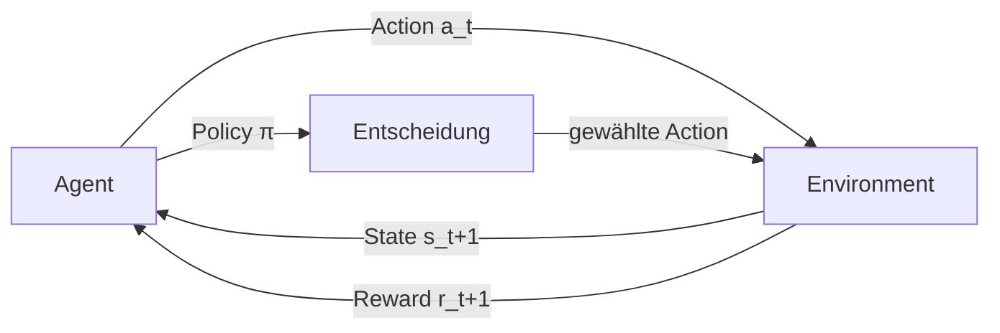
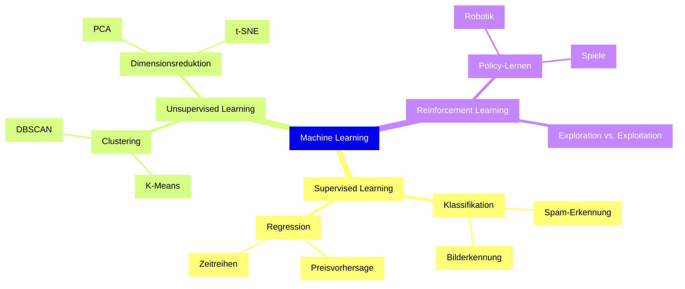

## Überwachtes Lernen (Supervised Learning)

*Kontext: Definition und Funktionsweise des überwachten Lernens als häufigstes Lernparadigma im Machine Learning.*

Beim überwachten Lernen (Supervised Learning) erhält ein Algorithmus einen Trainingsdatensatz bestehend aus Eingabe-Ausgabe-Paaren (X, y). Das Ziel ist es, eine Funktion f zu lernen, sodass f(X) die Ausgabe y möglichst genau approximiert. Die „Überwachung" kommt durch die gelabelten Daten – ein Mensch oder Prozess hat bereits die korrekten Antworten bereitgestellt.

### Typische Aufgaben

- **Klassifikation**: Zuordnung von Eingaben zu diskreten Kategorien (z. B. Spam/Nicht-Spam, Bilderkennung mit Klassen wie Hund/Katze)
- **Regression**: Vorhersage eines kontinuierlichen Wertes (z. B. Hauspreis, Temperatur, Aktienkurs)

### Beispiele und Algorithmen

- Lineare Regression, Logistische Regression
- Support Vector Machines (`sklearn.svm.SVC`)
- Entscheidungsbäume und Random Forests (`sklearn.ensemble.RandomForestClassifier`)
- K-Nearest Neighbors (`sklearn.neighbors.KNeighborsClassifier`)
- Neuronale Netze

### Voraussetzungen

Supervised Learning erfordert gelabelte Trainingsdaten. Die Qualität und Menge der Labels bestimmen maßgeblich die Modellgüte. In der Praxis dominiert dieses Paradigma, weil Unternehmen oft historische Daten mit klaren Zielwerten besitzen.

---

## Unüberwachtes Lernen (Unsupervised Learning)

*Kontext: Definition und Anwendungsbereiche des unüberwachten Lernens, bei dem keine gelabelten Zieldaten vorliegen.*

Beim unüberwachten Lernen (Unsupervised Learning) arbeitet der Algorithmus ausschließlich mit ungelabelten Daten. Es gibt keine vorgegebenen Ausgabewerte – der Algorithmus muss selbstständig Strukturen, Muster oder Gruppierungen in den Daten erkennen.

### Typische Aufgaben

- **Clustering**: Gruppierung ähnlicher Datenpunkte (z. B. Kundensegmentierung, Dokumentengruppierung). Algorithmen: K-Means, DBSCAN, hierarchisches Clustering.
- **Dimensionsreduktion**: Kompression hochdimensionaler Daten auf wenige informative Dimensionen. Algorithmen: PCA (Principal Component Analysis), t-SNE, UMAP.
- **Anomalieerkennung**: Identifikation von Ausreißern ohne explizite Anomalie-Labels.
- **Assoziationsregeln**: Entdeckung von Zusammenhängen (z. B. Warenkorbanalyse).

### Beispiele

- Kundensegmente in Marketingdaten identifizieren
- Themen in Textdokumenten automatisch gruppieren (Topic Modeling)
- Kompression von Bilddaten durch Autoencoder

### Wann einsetzen?

Unsupervised Learning wird eingesetzt, wenn Labels entweder zu teuer, nicht verfügbar oder nicht sinnvoll definierbar sind. Es dient häufig der explorativen Datenanalyse vor dem eigentlichen Modellbau.

---

## Bestärkendes Lernen (Reinforcement Learning)

*Kontext: Grundprinzipien des Reinforcement Learning als interaktives Lernparadigma mit sequenziellen Entscheidungen.*

Reinforcement Learning (RL) unterscheidet sich fundamental von den beiden anderen Paradigmen: Ein Agent interagiert mit einer Umgebung (Environment) und lernt durch Versuch und Irrtum (Trial and Error). Der Agent erhält nach jeder Aktion eine Belohnung (Reward) oder Bestrafung (Penalty) und optimiert seine Strategie (Policy), um den kumulativen Reward über die Zeit zu maximieren.

### Kernkonzepte

- **Agent**: Das lernende System, das Entscheidungen trifft
- **Environment**: Die Umgebung, mit der der Agent interagiert
- **State**: Der aktuelle Zustand der Umgebung
- **Action**: Eine Handlung, die der Agent ausführen kann
- **Reward**: Numerisches Feedback nach einer Aktion
- **Policy (π)**: Die Strategie, die States auf Actions abbildet

Das folgende Diagramm veranschaulicht den Interaktionszyklus zwischen Agent und Environment im Reinforcement Learning.

*Kontext: Kreislauf aus State, Action und Reward im RL-Paradigma.*

### Typische Aufgaben

- **Policy-Lernen**: Optimierung einer Entscheidungsstrategie (z. B. Robotersteuerung, Spielstrategie)
- **Wertfunktions-Schätzung**: Bewertung, wie gut ein bestimmter Zustand oder eine Aktion langfristig ist
- **Exploration vs. Exploitation**: Balance zwischen Erkundung neuer Aktionen und Nutzung bekannter guter Aktionen

### Beispiele

- Spielagenten (AlphaGo, Atari-Spiele)
- Autonomes Fahren (Fahrspurwechsel, Geschwindigkeitsregelung)
- Empfehlungssysteme mit sequenzieller Interaktion
- Robotik (Greifen, Laufen lernen)

---

## Abgrenzung der drei Paradigmen

*Kontext: Tabellarische Gegenüberstellung der drei Lernparadigmen hinsichtlich Datentyp, Feedback und Einsatzgebiet.*

| Kriterium | Supervised Learning | Unsupervised Learning | Reinforcement Learning |
|-----------|--------------------|-----------------------|------------------------|
| Trainingsdaten | Gelabelt (X, y) | Ungelabelt (nur X) | Interaktionsdaten (State, Action, Reward) |
| Feedback | Direkte Korrektursignale (Labels) | Kein explizites Feedback | Evaluatives Feedback (Reward) |
| Ziel | Funktion f(X) → y lernen | Strukturen/Muster entdecken | Optimale Policy π* finden |
| Typische Aufgaben | Klassifikation, Regression | Clustering, Dimensionsreduktion | Sequenzielle Entscheidungen |
| Beispiel-Domänen | Spamerkennung, medizinische Diagnose | Kundensegmentierung, Datenkompression | Robotik, Spiele, autonomes Fahren |

Das folgende Diagramm zeigt die hierarchische Einordnung der drei Lernparadigmen mit ihren jeweiligen Aufgabentypen auf einen Blick.

*Kontext: Mindmap der ML-Lernparadigmen mit zugehörigen Aufgabentypen und Beispielen.*

### Semi-Supervised und Self-Supervised Learning

Neben den drei Hauptparadigmen existieren Mischformen: Semi-Supervised Learning nutzt wenige gelabelte und viele ungelabelte Daten gemeinsam. Self-Supervised Learning generiert Labels automatisch aus den Daten selbst (z. B. durch Masked Language Modeling in NLP). Diese Ansätze kombinieren Stärken beider Welten und sind besonders bei begrenzter Label-Verfügbarkeit relevant.
