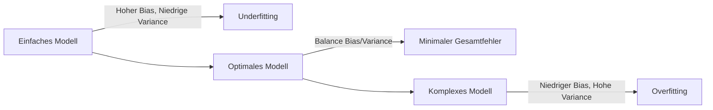
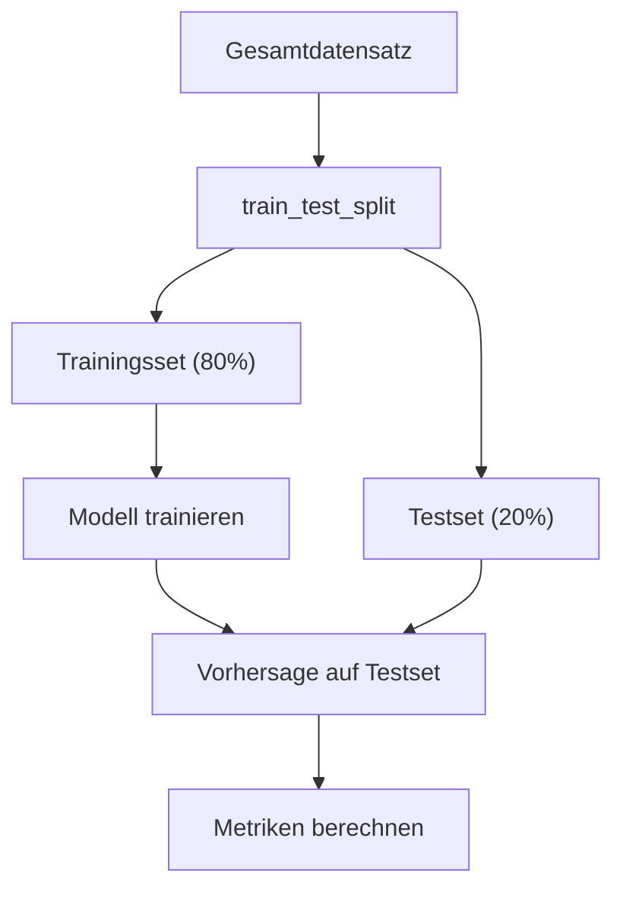
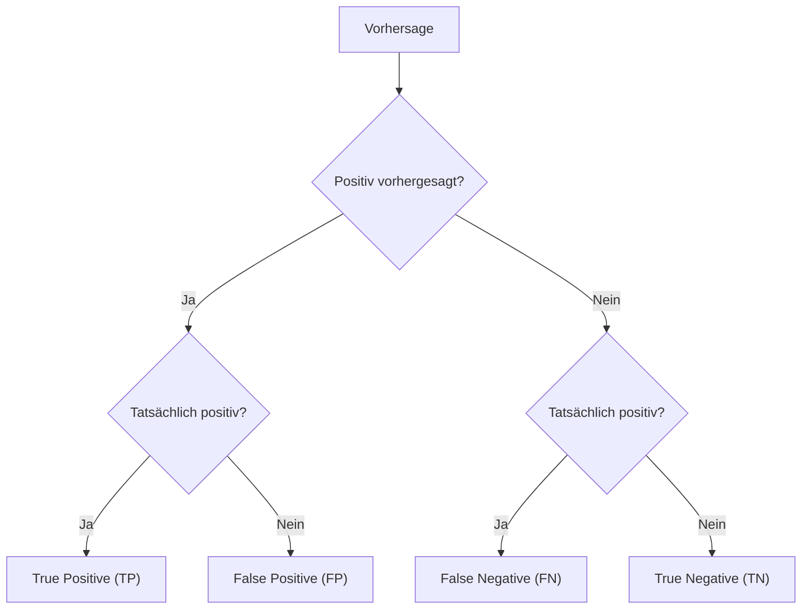

## Overfitting

*Kontext: Overfitting bedeutet, dass ein Modell die Trainingsdaten auswendig lernt, statt verallgemeinerbare Muster zu erkennen, und dadurch auf neuen Daten schlecht abschneidet.*

Overfitting tritt auf, wenn ein Modell zu komplex für die gegebene Datenmenge ist. Das Modell passt sich dem Rauschen in den Trainingsdaten an, anstatt die zugrundeliegende Struktur zu lernen. Typische Anzeichen:

- Sehr hoher Score auf Trainingsdaten (nahe 1.0)
- Deutlich niedrigerer Score auf Validierungs-/Testdaten
- Große Lücke zwischen Training-Score und Validation-Score (High Variance)

### Gegenmaßnahmen gegen Overfitting

- **Mehr Trainingsdaten sammeln:** Reduziert die Möglichkeit, Rauschen zu memorieren.
- **Modellkomplexität reduzieren:** Weniger Parameter, geringere Baumtiefe, weniger Features.
- **Regularisierung:** L1 (Lasso), L2 (Ridge) oder Elastic Net hinzufügen; Dropout bei neuronalen Netzen.
- **Early Stopping:** Training beenden, sobald der Validierungs-Loss nicht mehr sinkt.
- **Cross-Validation:** Robustere Schätzung der Generalisierungsfähigkeit als ein einzelner Split.
- **Feature Selection:** Irrelevante oder redundante Merkmale entfernen.
- **Data Augmentation:** Künstliche Vervielfachung der Trainingsdaten (besonders bei Bildern).

---

## Underfitting

*Kontext: Underfitting liegt vor, wenn ein Modell zu einfach ist, um die relevanten Muster in den Daten zu erfassen, und sowohl auf Trainings- als auch auf Testdaten schlecht performt.*

Underfitting entsteht, wenn die Modellkapazität nicht ausreicht, um die Komplexität der Daten abzubilden. Typische Anzeichen:

- Niedriger Score sowohl auf Trainings- als auch auf Testdaten
- Das Modell erfasst offensichtliche Zusammenhänge nicht (High Bias)

### Gegenmaßnahmen gegen Underfitting

- **Komplexeres Modell verwenden:** Z. B. von linearer Regression zu Polynomial Regression oder Ensemble-Methoden wechseln.
- **Mehr Features hinzufügen:** Feature Engineering, Interaktionsterme, polynomiale Features.
- **Regularisierung reduzieren:** Zu starke Regularisierung verhindert das Lernen.
- **Länger trainieren:** Bei iterativen Verfahren (neuronale Netze, Gradient Boosting) mehr Epochen/Iterationen erlauben.

---

## Bias-Variance-Tradeoff

*Kontext: Der Bias-Variance-Tradeoff beschreibt das fundamentale Spannungsfeld zwischen der Anpassungsfähigkeit eines Modells (Variance) und seiner systematischen Verzerrung (Bias).*

Jeder Vorhersagefehler lässt sich in drei Komponenten zerlegen:

**Gesamtfehler = Bias² + Variance + Irreduzibler Fehler**

- **Bias (Verzerrung):** Systematischer Fehler durch zu stark vereinfachende Annahmen des Modells. Ein Modell mit hohem Bias unterfitten die Daten.
- **Variance (Varianz):** Empfindlichkeit des Modells gegenüber Schwankungen in den Trainingsdaten. Ein Modell mit hoher Varianz überfitten die Daten.
- **Irreduzibler Fehler:** Rauschen in den Daten, das kein Modell eliminieren kann.

### Zusammenhang mit Modellkomplexität

Das folgende Diagramm zeigt den Zusammenhang zwischen Modellkomplexität, Bias und Variance:

*Kontext: Bias-Variance-Tradeoff – mit steigender Modellkomplexität sinkt Bias, aber Variance steigt, der optimale Punkt liegt dazwischen.*



- **Einfache Modelle** (z. B. lineare Regression): Hoher Bias, niedrige Varianz → Underfitting
- **Komplexe Modelle** (z. B. tiefe Entscheidungsbäume ohne Pruning): Niedriger Bias, hohe Varianz → Overfitting
- **Optimaler Punkt:** Minimaler Gesamtfehler liegt dort, wo Bias und Varianz gemeinsam am niedrigsten sind.

Das Ziel ist, ein Modell zu finden, das komplex genug ist, um die relevanten Muster zu lernen (niedriger Bias), aber nicht so komplex, dass es auf Rauschen reagiert (niedrige Varianz).

---

## Validierung: Train/Test-Split

*Kontext: Der Train/Test-Split ist die einfachste Methode zur Schätzung der Generalisierungsfähigkeit eines Modells, indem ein Teil der Daten für die Evaluation zurückgehalten wird.*

Beim Train/Test-Split werden die Daten zufällig in zwei disjunkte Mengen geteilt:

Das folgende Diagramm zeigt den Ablauf eines Train/Test-Splits mit optionalem Validierungsset:

*Kontext: Datenaufteilung in Training-, Validierungs- und Testset zur Modellbewertung.*



- **Trainingsset (typisch 70–80 %):** Wird zum Trainieren des Modells verwendet.
- **Testset (typisch 20–30 %):** Wird ausschließlich zur finalen Evaluation verwendet und darf während des Trainings nicht genutzt werden.

```python
from sklearn.model_selection import train_test_split

X_train, X_test, y_train, y_test = train_test_split(
    X, y, test_size=0.2, random_state=42, stratify=y
)
# Quelle: https://scikit-learn.org/stable/modules/cross_validation.html
```

### Wichtige Hinweise

- Bei kleinen Datensätzen ist die Schätzung instabil, da sie von der zufälligen Aufteilung abhängt.
- Der Parameter `stratify=y` stellt sicher, dass die Klassenverteilung in beiden Sets erhalten bleibt.
- Für Hyperparameter-Tuning wird zusätzlich ein Validierungsset benötigt oder Cross-Validation eingesetzt.

---

## Validierung: Cross-Validation

*Kontext: Cross-Validation liefert eine robustere Schätzung der Modellleistung als ein einzelner Train/Test-Split, indem der Datensatz mehrfach unterschiedlich aufgeteilt wird.*

### k-Fold Cross-Validation

Der Datensatz wird in k gleich große Folds aufgeteilt. In jeder Iteration dient ein Fold als Testset und die restlichen k−1 Folds als Trainingsset. Die finale Metrik ist der Durchschnitt über alle k Iterationen.

- Typischer Wert: k = 5 oder k = 10
- Vorteil: Jeder Datenpunkt wird genau einmal zum Testen verwendet
- Nachteil: k-facher Rechenaufwand gegenüber einfachem Split

### Stratified k-Fold Cross-Validation

Stratifizierte Variante, die sicherstellt, dass jeder Fold annähernd die gleiche Klassenverteilung enthält wie der Gesamtdatensatz. In scikit-learn wird `StratifiedKFold` automatisch für Klassifikationsaufgaben verwendet.

```python
from sklearn.model_selection import cross_val_score
from sklearn.svm import SVC

clf = SVC(kernel='linear', C=1, random_state=42)
scores = cross_val_score(clf, X, y, cv=5, scoring='f1_macro')
print(f"F1 (macro): {scores.mean():.3f} ± {scores.std():.3f}")
# Quelle: https://scikit-learn.org/stable/modules/cross_validation.html
```

### Weitere Varianten

- **Repeated k-Fold:** k-Fold wird n-mal mit unterschiedlicher Randomisierung wiederholt für stabilere Schätzungen.
- **Leave-One-Out (LOO):** k = n, jeder einzelne Datenpunkt wird einmal als Testset verwendet. Rechenintensiv, aber nützlich bei sehr kleinen Datensätzen.
- **Shuffle-Split:** Generiert zufällige Train/Test-Splits mit steuerbarer Anzahl und Proportionen.

---

## Confusion Matrix

*Kontext: Die Confusion Matrix ist eine Tabelle, die die Vorhersagen eines Klassifikators den tatsächlichen Klassen gegenüberstellt und die Grundlage für viele Evaluationsmetriken bildet.*

Für binäre Klassifikation hat die Confusion Matrix vier Einträge:

Das folgende Diagramm zeigt die logische Struktur der Confusion Matrix als Entscheidungsfluss:

*Kontext: Confusion-Matrix-Schema – Zuordnung von Vorhersage und tatsächlichem Label zu TP, TN, FP, FN.*



|  | Vorhergesagt: Positiv | Vorhergesagt: Negativ |
|--|--|--|
| **Tatsächlich Positiv** | True Positive (TP) | False Negative (FN) |
| **Tatsächlich Negativ** | False Positive (FP) | True Negative (TN) |

- **True Positive (TP):** Korrekt als positiv erkannt.
- **True Negative (TN):** Korrekt als negativ erkannt.
- **False Positive (FP):** Fälschlicherweise als positiv eingestuft (Typ-I-Fehler, „Falscher Alarm").
- **False Negative (FN):** Fälschlicherweise als negativ eingestuft (Typ-II-Fehler, „Übersehener Fall").

```python
from sklearn.metrics import confusion_matrix, ConfusionMatrixDisplay

cm = confusion_matrix(y_test, y_pred)
disp = ConfusionMatrixDisplay(confusion_matrix=cm)
disp.plot()
# Quelle: https://scikit-learn.org/stable/modules/model_evaluation.html
```

Bei Mehrklassen-Problemen erweitert sich die Matrix auf n×n, wobei n die Anzahl der Klassen ist.

---

## Klassifikationsmetriken: Accuracy

*Kontext: Accuracy misst den Anteil korrekt klassifizierter Datenpunkte an der Gesamtzahl und ist die einfachste, aber oft irreführende Klassifikationsmetrik.*

**Formel:** Accuracy = (TP + TN) / (TP + TN + FP + FN)

- Gut geeignet bei balancierten Klassen
- Irreführend bei unbalancierten Klassen: Bei 95 % negativen Samples erreicht ein Modell, das immer „negativ" vorhersagt, 95 % Accuracy ohne jeglichen Informationsgehalt.

Empfehlung: Bei unbalancierten Daten immer zusätzlich Precision, Recall und F1 betrachten.

---

## Klassifikationsmetriken: Precision und Recall

*Kontext: Precision und Recall betrachten die Vorhersagequalität aus zwei unterschiedlichen Blickwinkeln – der Zuverlässigkeit positiver Vorhersagen und der Vollständigkeit der Erkennung.*

### Precision (Präzision)

**Formel:** Precision = TP / (TP + FP)

Precision beantwortet: „Von allen als positiv vorhergesagten Fällen – wie viele sind tatsächlich positiv?" Hohe Precision bedeutet wenige False Positives.

**Wichtig wenn:** Falsche Alarme teuer sind (z. B. Spam-Filter: legitime E-Mail im Spam-Ordner).

### Recall (Sensitivität / True Positive Rate)

**Formel:** Recall = TP / (TP + FN)

Recall beantwortet: „Von allen tatsächlich positiven Fällen – wie viele wurden erkannt?" Hoher Recall bedeutet wenige übersehene Fälle.

**Wichtig wenn:** Übersehen gefährlich ist (z. B. medizinische Diagnose: Krankheit nicht erkennen).

### Precision-Recall-Tradeoff

Precision und Recall stehen oft in einem Spannungsverhältnis: Ein niedrigerer Schwellenwert erhöht den Recall (mehr Positive erkannt), senkt aber die Precision (mehr False Positives).

---

## Klassifikationsmetriken: F1-Score

*Kontext: Der F1-Score kombiniert Precision und Recall zu einer einzigen Metrik und ist besonders nützlich bei unbalancierten Datensätzen.*

**Formel:** F1 = 2 × (Precision × Recall) / (Precision + Recall)

Der F1-Score ist das harmonische Mittel von Precision und Recall. Er ist nur dann hoch, wenn sowohl Precision als auch Recall hoch sind.

### Varianten für Mehrklassen-Probleme

- **F1 macro:** Ungewichteter Durchschnitt der F1-Scores aller Klassen. Gewichtet jede Klasse gleich.
- **F1 weighted:** Gewichteter Durchschnitt nach Klassenfrequenz.
- **F1 micro:** Berechnet globale TP, FP, FN und daraus einen einzigen F1. Entspricht bei Mehrklassen-Problemen der Accuracy.

```python
from sklearn.metrics import classification_report

print(classification_report(y_test, y_pred))
# Gibt Precision, Recall, F1 pro Klasse sowie Macro/Weighted-Durchschnitte aus
# Quelle: https://scikit-learn.org/stable/modules/model_evaluation.html
```

---

## Klassifikationsmetriken: ROC-AUC

*Kontext: Die ROC-Kurve und der AUC-Wert bewerten die Trennfähigkeit eines Klassifikators über alle möglichen Schwellenwerte hinweg und sind schwellenwertunabhängig.*

### ROC-Kurve (Receiver Operating Characteristic)

Die ROC-Kurve stellt die True Positive Rate (Recall) gegen die False Positive Rate (FPR = FP / (FP + TN)) für verschiedene Schwellenwerte dar.

- **Perfekter Klassifikator:** Kurve verläuft durch die obere linke Ecke (TPR=1, FPR=0).
- **Zufallsklassifikator:** Diagonale von (0,0) nach (1,1).
- **Schlechter als Zufall:** Kurve unterhalb der Diagonale.

### AUC (Area Under the Curve)

AUC ist die Fläche unter der ROC-Kurve:

- AUC = 1.0: Perfekte Trennung
- AUC = 0.5: Keine Trennfähigkeit (Zufall)
- AUC < 0.5: Schlechter als Zufall (Labels vertauscht?)

AUC ist invariant gegenüber dem gewählten Schwellenwert und gegenüber der Klassenbalance. Dadurch eignet sich AUC gut zum Vergleich verschiedener Modelle.

```python
from sklearn.metrics import roc_auc_score

auc = roc_auc_score(y_test, y_pred_proba)
print(f"ROC-AUC: {auc:.3f}")
# Quelle: https://scikit-learn.org/stable/modules/model_evaluation.html
```

---

## Regressionsmetriken: RMSE, MAE und R²

*Kontext: Für Regressionsaufgaben messen RMSE, MAE und R² unterschiedliche Aspekte der Vorhersagequalität – von der durchschnittlichen Abweichung bis zur erklärten Varianz.*

### MAE (Mean Absolute Error)

**Formel:** MAE = (1/n) × Σ|yᵢ − ŷᵢ|

- Durchschnittlicher absoluter Fehler in der Einheit der Zielvariable
- Robust gegenüber Ausreißern
- Leicht interpretierbar: „Im Schnitt liegt die Vorhersage X Einheiten daneben"

### RMSE (Root Mean Squared Error)

**Formel:** RMSE = √((1/n) × Σ(yᵢ − ŷᵢ)²)

- Bestraft große Fehler stärker als kleine (quadratische Gewichtung)
- Gleiche Einheit wie die Zielvariable
- Sensibel gegenüber Ausreißern

### R² (Bestimmtheitsmaß / Coefficient of Determination)

**Formel:** R² = 1 − (Σ(yᵢ − ŷᵢ)²) / (Σ(yᵢ − ȳ)²)

- Anteil der durch das Modell erklärten Varianz
- R² = 1: Perfekte Vorhersage
- R² = 0: Modell ist nicht besser als der Mittelwert
- R² < 0: Modell ist schlechter als der Mittelwert (möglich bei Testdaten)

```python
from sklearn.metrics import mean_absolute_error, mean_squared_error, r2_score
import numpy as np

mae = mean_absolute_error(y_test, y_pred)
rmse = np.sqrt(mean_squared_error(y_test, y_pred))
r2 = r2_score(y_test, y_pred)
print(f"MAE: {mae:.3f}, RMSE: {rmse:.3f}, R²: {r2:.3f}")
# Quelle: https://scikit-learn.org/stable/modules/model_evaluation.html
```

### Wahl der Metrik

- **MAE:** Wenn alle Fehler gleich gewichtet werden sollen.
- **RMSE:** Wenn große Fehler überproportional bestraft werden sollen.
- **R²:** Zum Vergleich mit Baseline (Mittelwert-Vorhersage) und über verschiedene Datensätze hinweg.
