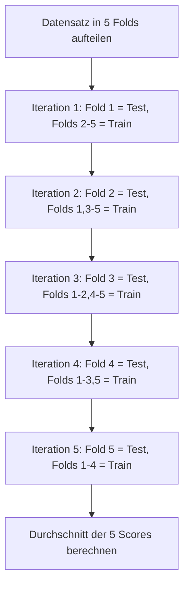
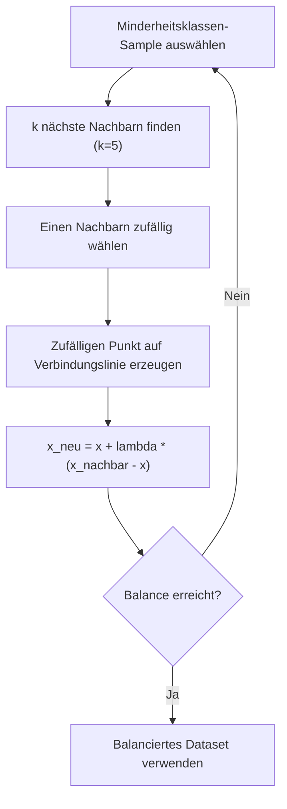
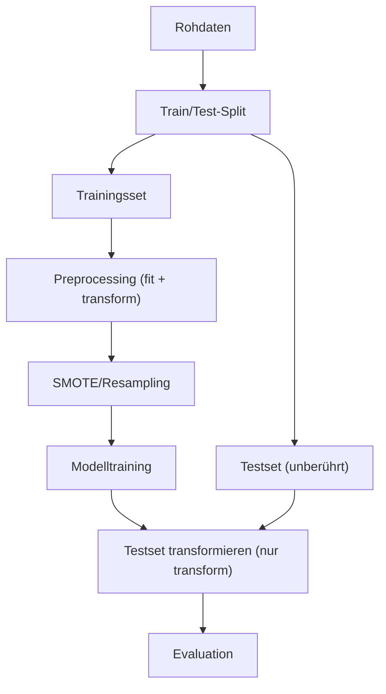

## Stichprobenbildung (Sampling)

*Kontext: Stichprobenbildung beschreibt, wie Teilmengen aus einem Datensatz gezogen werden, um Modelle zu trainieren und zu evaluieren.*

In Machine Learning wird selten der gesamte Datensatz direkt für Training und Evaluation verwendet. Stattdessen werden Stichproben gezogen, um:

- Die Generalisierungsfähigkeit des Modells zu schätzen (Train/Test-Split, Cross-Validation)
- Die Variabilität der Leistungsschätzung zu quantifizieren
- Speicher- und Rechenzeitbeschränkungen einzuhalten

### Wichtige Sampling-Strategien

- **Zufälliges Sampling (Random Sampling):** Jeder Datenpunkt hat die gleiche Wahrscheinlichkeit, in die Stichprobe aufgenommen zu werden. Standardverfahren bei `train_test_split`.
- **Stratifiziertes Sampling (Stratified Sampling):** Stellt sicher, dass die Verteilung einer Zielvariable (oder anderer wichtiger Merkmale) in der Stichprobe der Gesamtverteilung entspricht. Essentiell bei unbalancierten Klassen.
- **Systematisches Sampling:** Jeder n-te Datenpunkt wird ausgewählt. Selten in ML verwendet, da es Muster in geordneten Daten nicht berücksichtigt.
- **Zeitbasiertes Sampling:** Bei Zeitreihen wird chronologisch aufgeteilt – Trainingsdaten liegen zeitlich vor Testdaten, um Data Leakage zu vermeiden.

---

## Resampling: k-Fold Cross-Validation

*Kontext: k-Fold Cross-Validation ist die Standardmethode zur robusten Schätzung der Modellleistung, bei der jeder Datenpunkt genau einmal als Testdatenpunkt dient.*

Bei k-Fold Cross-Validation wird der Datensatz in k gleich große Partitionen (Folds) aufgeteilt. In jeder der k Iterationen wird ein anderer Fold als Testset verwendet und die restlichen k−1 Folds bilden das Trainingsset.

### Ablauf

Das folgende Diagramm veranschaulicht den Ablauf einer 5-Fold Cross-Validation:

*Kontext: k-Fold Cross-Validation – jeder Fold dient einmal als Testset, die restlichen als Trainingsset.*



1. Datensatz in k Folds aufteilen
2. Für i = 1 bis k:
   - Fold i als Testset, restliche Folds als Trainingsset
   - Modell auf Trainingsset fitten
   - Metrik auf Testset berechnen
3. Durchschnitt und Standardabweichung der k Metriken berechnen

### Empfohlene Werte für k

- **k = 5:** Guter Kompromiss zwischen Bias und Varianz der Schätzung; Standard in scikit-learn.
- **k = 10:** Leicht geringerer Bias, aber höherer Rechenaufwand und tendenziell höhere Varianz.
- **k = n (Leave-One-Out):** Minimaler Bias, aber hohe Varianz und hoher Rechenaufwand. Nur bei sehr kleinen Datensätzen sinnvoll.

```python
from sklearn.model_selection import KFold, cross_val_score
from sklearn.ensemble import GradientBoostingClassifier

kf = KFold(n_splits=5, shuffle=True, random_state=42)
model = GradientBoostingClassifier(n_estimators=100, random_state=42)
scores = cross_val_score(model, X, y, cv=kf, scoring='accuracy')
print(f"5-Fold CV Accuracy: {scores.mean():.3f} ± {scores.std():.3f}")
# Quelle: https://scikit-learn.org/stable/modules/cross_validation.html
```

---

## Resampling: Stratified Cross-Validation

*Kontext: Stratified Cross-Validation bewahrt die Klassenverteilung in jedem Fold und verhindert, dass seltene Klassen in einzelnen Folds fehlen.*

Bei unbalancierten Datensätzen kann gewöhnliches k-Fold dazu führen, dass einzelne Folds keine Samples der Minderheitsklasse enthalten. `StratifiedKFold` löst dieses Problem, indem jeder Fold annähernd die gleiche Klassenverteilung wie der Gesamtdatensatz aufweist.

### Wann Stratified Cross-Validation verwenden?

- Bei Klassifikationsaufgaben mit unbalancierten Klassen (z. B. Betrugserkennung: 1 % Fraud)
- Bei kleinen Datensätzen, wo zufällige Schwankungen die Evaluation verfälschen können
- In scikit-learn wird `StratifiedKFold` automatisch für Classifier verwendet, wenn `cv=int` an `cross_val_score` übergeben wird

```python
from sklearn.model_selection import StratifiedKFold

skf = StratifiedKFold(n_splits=5, shuffle=True, random_state=42)
scores = cross_val_score(model, X, y, cv=skf, scoring='f1')
print(f"Stratified 5-Fold F1: {scores.mean():.3f} ± {scores.std():.3f}")
# Quelle: https://scikit-learn.org/stable/modules/cross_validation.html
```

### Weitere stratifizierte Varianten

- **RepeatedStratifiedKFold:** Wiederholt StratifiedKFold n-mal mit unterschiedlicher Randomisierung für stabilere Schätzungen.
- **StratifiedShuffleSplit:** Erzeugt zufällige stratifizierte Splits – nützlich, wenn die Fold-Größe flexibel sein soll.
- **StratifiedGroupKFold:** Kombiniert Stratifizierung mit Gruppenberücksichtigung (z. B. Patient-ID darf nicht in Train und Test gleichzeitig sein).

---

## Resampling: Bootstrap

*Kontext: Bootstrap ist ein statistisches Resampling-Verfahren, bei dem durch wiederholtes Ziehen mit Zurücklegen die Verteilung einer Schätzgröße approximiert wird.*

Beim Bootstrap werden aus einem Datensatz mit n Samples wiederholt Stichproben der Größe n gezogen – mit Zurücklegen. Dadurch enthält jede Bootstrap-Stichprobe im Durchschnitt ~63,2 % der ursprünglichen Datenpunkte (manche mehrfach), während ~36,8 % nicht gezogen werden (Out-of-Bag-Samples).

### Anwendungen in Machine Learning

- **Konfidenzintervalle für Metriken:** Durch wiederholtes Training und Evaluation auf Bootstrap-Stichproben lässt sich die Unsicherheit einer Metrik quantifizieren.
- **Bagging (Bootstrap Aggregating):** Ensemble-Methoden wie Random Forest trainieren mehrere Modelle auf verschiedenen Bootstrap-Samples und mitteln die Vorhersagen.
- **Out-of-Bag (OOB) Estimation:** Bei Random Forest können die nicht gezogenen Samples (~36,8 %) als internes Validierungsset dienen, ohne separaten Test-Split.

### Unterschied zu Cross-Validation

- **Bootstrap:** Stichproben überlappen sich; theoretisch unendlich viele Wiederholungen möglich; tendenziell pessimistischer Bias.
- **Cross-Validation:** Disjunkte Folds; jeder Datenpunkt genau einmal im Testset; allgemein empfohlen für Modellselektion.

```python
import numpy as np
from sklearn.utils import resample
from sklearn.metrics import accuracy_score

n_iterations = 1000
scores = []
for i in range(n_iterations):
    X_boot, y_boot = resample(X_train, y_train, random_state=i)
    model.fit(X_boot, y_boot)
    scores.append(accuracy_score(y_test, model.predict(X_test)))

ci_lower = np.percentile(scores, 2.5)
ci_upper = np.percentile(scores, 97.5)
print(f"95%-Konfidenzintervall: [{ci_lower:.3f}, {ci_upper:.3f}]")
# Quelle: Efron, B. & Tibshirani, R. (1993). An Introduction to the Bootstrap.
```

---

## Umgang mit unbalancierten Daten: Überblick

*Kontext: Unbalancierte Datensätze liegen vor, wenn eine Klasse deutlich häufiger vorkommt als andere, was Classifier dazu verleitet, die Mehrheitsklasse zu bevorzugen.*

Ein Datensatz gilt als unbalanciert, wenn das Verhältnis zwischen Mehrheits- und Minderheitsklasse stark asymmetrisch ist (z. B. 99:1 bei Betrugserkennung, medizinischer Diagnostik oder Anomalieerkennung).

### Problemauswirkungen

- Standard-Classifier maximieren die Gesamtgenauigkeit und lernen, die Minderheitsklasse zu ignorieren.
- Accuracy ist keine sinnvolle Metrik (99 % Accuracy bei 99 % Negativrate bedeutet nichts).
- Recall der Minderheitsklasse ist oft nahe 0.

### Lösungsansätze (Überblick)

1. **Datenebene:** Oversampling der Minderheitsklasse, Undersampling der Mehrheitsklasse
2. **Algorithmusebene:** Gewichtung von Klassen (`class_weight='balanced'`), kostenempfindliches Lernen
3. **Metrikebene:** F1, ROC-AUC, Precision-Recall-AUC statt Accuracy verwenden
4. **Ensemble-Methoden:** BalancedBaggingClassifier, EasyEnsembleClassifier aus `imbalanced-learn`

---

## Oversampling und SMOTE

*Kontext: Oversampling erhöht die Anzahl der Minderheitsklassen-Samples, wobei SMOTE synthetische Datenpunkte durch Interpolation erzeugt statt einfach zu duplizieren.*

### Random Oversampling

Einfachste Methode: Zufällige Duplikation von Samples der Minderheitsklasse bis zur gewünschten Balance. Nachteil: Kann zu Overfitting führen, da identische Datenpunkte mehrfach im Training vorkommen.

### SMOTE (Synthetic Minority Over-sampling Technique)

SMOTE erzeugt neue synthetische Samples durch Interpolation zwischen bestehenden Minderheitsklassen-Samples:

Das folgende Diagramm zeigt den SMOTE-Algorithmus als Ablauf:

*Kontext: SMOTE-Verfahren – synthetische Samples werden durch Interpolation zwischen Minderheitsklassen-Nachbarn erzeugt.*



1. Für jeden Minderheitsklassen-Sample die k nächsten Nachbarn (derselben Klasse) finden (Standard: k=5)
2. Einen Nachbarn zufällig auswählen
3. Neuen Punkt auf der Verbindungslinie zwischen Original und Nachbar generieren: x_neu = x_original + λ × (x_nachbar − x_original), mit λ ∈ [0, 1]

```python
from imblearn.over_sampling import SMOTE
from imblearn.pipeline import Pipeline as ImbPipeline
from sklearn.ensemble import RandomForestClassifier

smote = SMOTE(sampling_strategy='auto', k_neighbors=5, random_state=42)
pipeline = ImbPipeline([
    ('smote', smote),
    ('clf', RandomForestClassifier(n_estimators=100, random_state=42))
])
# Quelle: Chawla et al. (2002), JAIR – SMOTE Paper
```

### SMOTE-Varianten

- **Borderline-SMOTE:** Erzeugt synthetische Punkte nur für Minderheitsklassen-Samples nahe der Entscheidungsgrenze.
- **SMOTE-ENN:** Kombiniert SMOTE mit Edited Nearest Neighbours (entfernt fehlklassifizierte Punkte nach Oversampling).
- **ADASYN (Adaptive Synthetic Sampling):** Erzeugt mehr synthetische Punkte für schwer zu lernende Regionen.

---

## Undersampling

*Kontext: Undersampling reduziert die Mehrheitsklasse, um ein balanciertes Trainingsset zu erhalten, geht aber mit Informationsverlust einher.*

### Random Undersampling

Zufälliges Entfernen von Samples der Mehrheitsklasse bis zur gewünschten Balance. Einfach und schnell, aber kann informative Samples verlieren.

### Informierte Undersampling-Methoden

- **Tomek Links:** Entfernt Mehrheitsklassen-Samples, die Tomek Links mit Minderheitsklassen-Samples bilden (nächste Nachbarn verschiedener Klassen). Bereinigt die Entscheidungsgrenze.
- **Edited Nearest Neighbours (ENN):** Entfernt Samples, deren Klasse sich von der Mehrheit ihrer k Nachbarn unterscheidet.
- **NearMiss:** Wählt Mehrheitsklassen-Samples basierend auf deren Abstand zu Minderheitsklassen-Samples aus.

### Kombination Oversampling + Undersampling

In der Praxis werden oft beide Methoden kombiniert:

```python
from imblearn.combine import SMOTETomek

smt = SMOTETomek(random_state=42)
X_resampled, y_resampled = smt.fit_resample(X_train, y_train)
# Quelle: https://imbalanced-learn.org/stable/combine.html
```

---

## Datenleckage (Data Leakage)

*Kontext: Datenleckage tritt auf, wenn dem Modell während des Trainings Informationen zur Verfügung stehen, die zur Inferenzzeit nicht verfügbar wären, was zu unrealistisch guten Evaluationsergebnissen führt.*

Datenleckage ist einer der häufigsten und gefährlichsten Fehler in ML-Projekten, weil sie während der Entwicklung unbemerkt bleibt und erst in Produktion zu schlechter Performance führt.

### Typen von Datenleckage

#### Target Leakage (Zielvariablen-Leckage)

Ein Feature enthält direkte oder indirekte Information über das Ziel, die zur Inferenzzeit nicht verfügbar wäre.

Beispiel: Vorhersage „Wird der Kunde kündigen?" mit dem Feature „Datum der Kündigung" – offensichtlich zirkulär, aber subtilere Varianten sind häufig (z. B. aggregierte Features, die zukünftige Daten einschließen).

#### Train-Test Contamination (Datenvermischung)

Testdaten beeinflussen das Training oder die Vorverarbeitung.

Typische Fehler:
- Feature-Scaling auf dem Gesamtdatensatz vor dem Split (Mittelwert/Standardabweichung enthalten Testdaten-Information)
- SMOTE/Oversampling vor dem Split (synthetische Punkte basieren auf Testdaten-Nachbarn)
- Feature-Selection basierend auf dem Gesamtdatensatz

### Vermeidung von Datenleckage

Das folgende Diagramm zeigt den korrekten Ablauf zur Vermeidung von Data Leakage:

*Kontext: Korrekte Reihenfolge – zuerst splitten, dann innerhalb der Folds transformieren und resamplen.*



- **Immer zuerst splitten, dann transformieren:** `train_test_split` vor jeglicher Vorverarbeitung.
- **Pipelines verwenden:** scikit-learn `Pipeline` stellt sicher, dass `.fit()` nur auf Trainingsdaten erfolgt.
- **SMOTE nur innerhalb der CV-Folds:** Oversampling darf nur auf den jeweiligen Trainings-Fold angewendet werden.
- **Temporale Validierung:** Bei Zeitreihen niemals zukünftige Daten im Training verwenden.
- **Feature-Audit:** Prüfen, ob Features zum Zeitpunkt der Vorhersage tatsächlich verfügbar wären.

```python
# FALSCH: Leakage durch Scaling vor Split
scaler.fit(X)  # sieht Testdaten!
X_scaled = scaler.transform(X)
X_train, X_test = train_test_split(X_scaled, ...)

# RICHTIG: Pipeline verhindert Leakage
from sklearn.pipeline import Pipeline
pipe = Pipeline([
    ('scaler', StandardScaler()),
    ('clf', RandomForestClassifier())
])
cross_val_score(pipe, X, y, cv=5)  # Scaling nur auf Trainings-Fold
# Quelle: https://scikit-learn.org/stable/modules/cross_validation.html
```

> ⚠️ Unsicher: Die genaue Größenordnung des Bias durch Datenleckage variiert stark nach Anwendungsfall. Studien berichten von Überschätzungen der AUC um 0.05 bis 0.30 Punkte, wenn SMOTE vor Cross-Validation angewendet wird (Vabalas et al., 2019).
