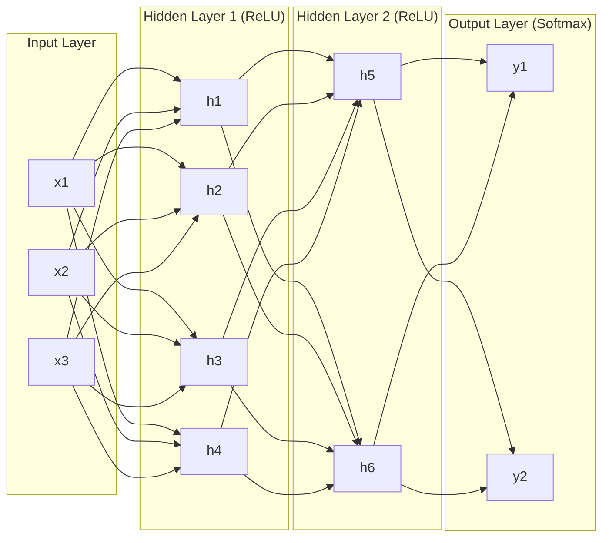
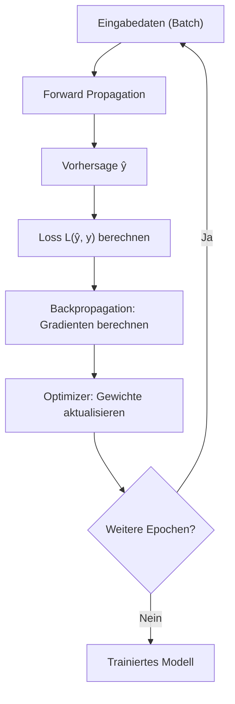
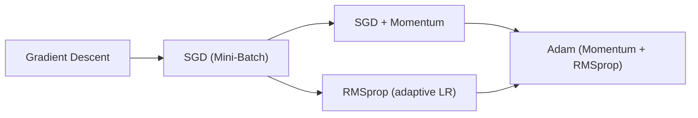

## Neuron und Perzeptron

*Kontext: Das künstliche Neuron (Perzeptron) ist die kleinste Recheneinheit eines neuronalen Netzes und bildet die Grundlage für alle tieferen Architekturen.*

### Das biologische Vorbild

Ein künstliches Neuron (Artificial Neuron) modelliert vereinfacht die Funktionsweise biologischer Nervenzellen. Es empfängt mehrere Eingangssignale, verrechnet diese gewichtet und erzeugt ein Ausgangssignal. Das Perzeptron (Perceptron), 1957 von Frank Rosenblatt vorgestellt, war die erste formale Implementierung dieses Prinzips.

### Mathematische Formulierung

Ein Neuron berechnet eine gewichtete Summe seiner Eingaben und wendet anschließend eine Aktivierungsfunktion an:

$$z = \sum_{i=1}^{n} w_i \cdot x_i + b$$
$$a = f(z)$$

Dabei sind $x_i$ die Eingabewerte, $w_i$ die zugehörigen Gewichte (Weights), $b$ der Bias-Term und $f$ die Aktivierungsfunktion. Der Bias verschiebt die Entscheidungsgrenze des Neurons unabhängig von den Eingabewerten und ermöglicht dem Modell, auch bei Null-Eingaben eine Nicht-Null-Ausgabe zu erzeugen.

Ein einzelnes Perzeptron kann nur linear separierbare Probleme lösen. Erst die Kombination mehrerer Neuronen in Schichten (Layers) ermöglicht die Approximation beliebig komplexer nicht-linearer Funktionen (Universal Approximation Theorem).

Keras-Implementierung eines einzelnen Dense-Neurons:

```python
import keras
from keras import layers

# Ein einzelnes Neuron mit ReLU-Aktivierung
# Quelle: https://keras.io/api/layers/core_layers/dense
model = keras.Sequential([
    layers.Dense(1, activation='relu', input_shape=(4,))
])
```

---

## Gewichte und Bias

*Kontext: Gewichte und Bias sind die lernbaren Parameter eines neuronalen Netzes, die während des Trainings iterativ angepasst werden.*

### Gewichte (Weights)

Gewichte bestimmen die Stärke der Verbindung zwischen Neuronen. Ein hohes Gewicht bedeutet, dass der entsprechende Eingabewert einen starken Einfluss auf die Ausgabe hat. Während des Trainings werden Gewichte durch Gradientenabstieg (Gradient Descent) optimiert, um den Fehler zwischen Vorhersage und Zielwert zu minimieren.

Die Initialisierung der Gewichte ist entscheidend für die Konvergenz. Gängige Strategien sind Glorot-Uniform (Xavier), He-Initialisierung für ReLU-Netze und zufällige Normalverteilung. Schlechte Initialisierung kann zu Vanishing oder Exploding Gradients führen.

### Bias

Der Bias ist ein zusätzlicher lernbarer Parameter pro Neuron, der unabhängig von den Eingaben addiert wird. Er verschiebt die Aktivierungsfunktion entlang der x-Achse. Ohne Bias müsste jede lineare Entscheidungsgrenze durch den Ursprung verlaufen, was die Ausdrucksfähigkeit des Modells stark einschränkt.

In Keras wird der Bias standardmäßig aktiviert (`use_bias=True`). Das Dense-Layer berechnet intern: `output = activation(dot(input, kernel) + bias)`, wobei `kernel` die Gewichtsmatrix und `bias` der Bias-Vektor ist.

```python
import keras
from keras import layers

# Dense-Layer: kernel = Gewichtsmatrix, bias = Bias-Vektor
# Quelle: https://keras.io/api/layers/core_layers/dense
layer = layers.Dense(64, use_bias=True, kernel_initializer='glorot_uniform')
```

---

## Aktivierungsfunktionen

*Kontext: Aktivierungsfunktionen führen Nicht-Linearität in das Netzwerk ein und bestimmen, ob und wie stark ein Neuron „feuert".*

### ReLU (Rectified Linear Unit)

ReLU ist die am häufigsten verwendete Aktivierungsfunktion in Hidden Layers moderner neuronaler Netze. Sie gibt den Eingabewert unverändert zurück, wenn er positiv ist, und setzt negative Werte auf Null: $f(x) = \max(0, x)$. Vorteile: schnelle Berechnung, mildert das Vanishing-Gradient-Problem. Nachteil: „Dying ReLU" – Neuronen können permanent inaktiv werden.

### Sigmoid

Die Sigmoid-Funktion komprimiert Eingabewerte in den Bereich $(0, 1)$: $\sigma(x) = \frac{1}{1 + e^{-x}}$. Sie wird typischerweise im Output Layer für binäre Klassifikation verwendet, da die Ausgabe als Wahrscheinlichkeit interpretierbar ist. Nachteil: Vanishing Gradients bei sehr großen oder kleinen Eingabewerten, Ausgabe nicht nullzentriert.

### Tanh (Hyperbolischer Tangens)

Tanh komprimiert Werte in den Bereich $(-1, 1)$: $\tanh(x) = \frac{e^x - e^{-x}}{e^x + e^{-x}}$. Vorteil gegenüber Sigmoid: Ausgabe ist nullzentriert, was die Konvergenz in nachfolgenden Schichten beschleunigt. Leidet ebenfalls unter Vanishing Gradients bei extremen Werten.

### Softmax

Softmax normalisiert einen Vektor reeller Zahlen zu einer Wahrscheinlichkeitsverteilung: $\text{softmax}(x_i) = \frac{e^{x_i}}{\sum_j e^{x_j}}$. Wird ausschließlich im Output Layer für Multi-Class-Klassifikation eingesetzt. Alle Ausgabewerte summieren sich zu 1.

```python
import keras
from keras import layers

# Netzwerk mit verschiedenen Aktivierungsfunktionen
# Quelle: https://keras.io/api/layers/activations
model = keras.Sequential([
    layers.Dense(128, activation='relu', input_shape=(784,)),
    layers.Dense(64, activation='tanh'),
    layers.Dense(10, activation='softmax')  # Multi-Class Output
])
```

---

## Schichten (Layers)

*Kontext: Schichten organisieren Neuronen in funktionalen Gruppen und bestimmen den Informationsfluss durch das Netzwerk.*

### Input Layer

Der Input Layer definiert die Form der Eingabedaten und enthält keine lernbaren Parameter. Er leitet die rohen Eingabedaten an die nachfolgenden Schichten weiter. Die Dimensionalität muss der Struktur der Eingabedaten entsprechen (z. B. 784 Pixel für ein 28×28-Bild).

### Hidden Layers

Hidden Layers sind die verborgenen Zwischenschichten zwischen Ein- und Ausgabe. Hier findet die eigentliche Merkmals-Extraktion statt. Tiefere Netzwerke (mehr Hidden Layers) können hierarchische Merkmale lernen – von einfachen Kanten in frühen Schichten bis zu komplexen Objektteilen in späteren Schichten.

### Output Layer

Der Output Layer erzeugt die finale Vorhersage. Seine Konfiguration hängt von der Aufgabe ab: ein Neuron mit Sigmoid für binäre Klassifikation, $n$ Neuronen mit Softmax für $n$ Klassen, ein Neuron ohne Aktivierung (linear) für Regression.

### Dense Layer (Fully Connected)

Ein Dense Layer verbindet jedes Neuron mit allen Neuronen der vorherigen Schicht. Keras beschreibt die Operation als: `output = activation(dot(input, kernel) + bias)`. Dense Layers sind die Standardbausteine für Feedforward-Netze und haben die meisten lernbaren Parameter.

Das folgende Diagramm zeigt die typische Schichtarchitektur eines Feedforward-Netzes mit Datenfluss von links nach rechts.

*Kontext: Netzarchitektur mit Input Layer, Hidden Layers und Output Layer als gerichteter Graph.*



```python
import keras
from keras import layers

# Vollständiges Feedforward-Netzwerk mit Dense Layers
# Quelle: https://keras.io/api/layers/core_layers/dense
model = keras.Sequential([
    layers.Input(shape=(20,)),           # Input Layer
    layers.Dense(128, activation='relu'), # Hidden Layer 1
    layers.Dense(64, activation='relu'),  # Hidden Layer 2
    layers.Dense(3, activation='softmax') # Output Layer (3 Klassen)
])
model.summary()
```

---

## Forward Propagation

*Kontext: Forward Propagation beschreibt den gerichteten Informationsfluss von den Eingaben durch alle Schichten bis zur Ausgabe des Netzwerks.*

Bei der Forward Propagation (Vorwärtsdurchlauf) fließen die Eingabedaten sequenziell durch alle Schichten des Netzwerks. Jede Schicht berechnet ihre gewichtete Summe und wendet die Aktivierungsfunktion an. Das Ergebnis wird als Eingabe an die nächste Schicht weitergereicht.

Der Prozess für eine Schicht $l$:

1. Berechnung der gewichteten Summe: $z^{[l]} = W^{[l]} \cdot a^{[l-1]} + b^{[l]}$
2. Anwendung der Aktivierungsfunktion: $a^{[l]} = f(z^{[l]})$

Dieser Vorgang wird für jede Schicht wiederholt, bis die Ausgabeschicht erreicht ist. Die finale Ausgabe $\hat{y} = a^{[L]}$ (wobei $L$ die letzte Schicht ist) wird dann mit dem tatsächlichen Zielwert verglichen, um den Loss zu berechnen. Forward Propagation ist sowohl während des Trainings als auch bei der Inferenz (Vorhersage) aktiv, Backpropagation nur beim Training.

---

## Backpropagation

*Kontext: Backpropagation ist der Algorithmus zur Berechnung der Gradienten, die für die Optimierung der Netzwerkgewichte benötigt werden.*

Backpropagation (Rückwärtspropagation) berechnet die partiellen Ableitungen der Loss-Funktion bezüglich aller Gewichte im Netzwerk mittels der Kettenregel der Differentialrechnung. Der Algorithmus propagiert den Fehler rückwärts von der Ausgabeschicht durch alle Hidden Layers zurück.

### Ablauf

1. **Forward Pass**: Berechnung der Ausgabe $\hat{y}$ und des Loss $L(\hat{y}, y)$
2. **Berechnung des Output-Gradienten**: $\frac{\partial L}{\partial a^{[L]}}$
3. **Rückwärts durch jede Schicht**: Für Schicht $l$ werden berechnet:
   - $\frac{\partial L}{\partial z^{[l]}}$ (Gradient vor der Aktivierung)
   - $\frac{\partial L}{\partial W^{[l]}}$ (Gradient der Gewichte)
   - $\frac{\partial L}{\partial b^{[l]}}$ (Gradient des Bias)
   - $\frac{\partial L}{\partial a^{[l-1]}}$ (Gradient für vorherige Schicht)
4. **Update**: Gewichte werden mit dem Optimizer angepasst

Backpropagation ist effizient, weil jeder Gradient nur einmal berechnet und wiederverwendet wird (Dynamic Programming). Probleme wie Vanishing Gradients (Sigmoid/Tanh) und Exploding Gradients werden durch Architekturwahl (ReLU, Residual Connections) und Gradient Clipping adressiert.

Das folgende Diagramm zeigt den zyklischen Trainingsprozess mit Forward Pass, Loss-Berechnung, Backpropagation und Gewichts-Update.

*Kontext: Trainingszyklus eines neuronalen Netzes – Forward Propagation und Backpropagation als Schleife bis zur Konvergenz.*



---

## Loss-Funktionen

*Kontext: Die Loss-Funktion quantifiziert den Fehler zwischen Modellvorhersage und tatsächlichem Zielwert und steuert damit die Optimierungsrichtung.*

### Mean Squared Error (MSE)

MSE ist die Standard-Loss-Funktion für Regressionsaufgaben: $\text{MSE} = \frac{1}{n} \sum_{i=1}^{n} (y_i - \hat{y}_i)^2$. Sie bestraft große Fehler überproportional (quadratisch) und ist differenzierbar, was sie für Gradientenabstieg geeignet macht. Nachteil: empfindlich gegenüber Ausreißern.

### Binary Cross-Entropy

Für binäre Klassifikation: $L = -[y \cdot \log(\hat{y}) + (1-y) \cdot \log(1-\hat{y})]$. Bestraft falsch-konfidente Vorhersagen extrem stark (logarithmisch). Wird mit Sigmoid im Output Layer kombiniert.

### Categorical Cross-Entropy

Für Multi-Class-Klassifikation: $L = -\sum_{c=1}^{C} y_c \cdot \log(\hat{y}_c)$. Wird mit Softmax im Output Layer verwendet. Sparse Categorical Cross-Entropy ist die Variante für ganzzahlige Labels (statt One-Hot-Encoding).

```python
import keras

# Kompilierung mit verschiedenen Loss-Funktionen
# Quelle: https://keras.io/api/losses/
model.compile(
    loss='sparse_categorical_crossentropy',  # Multi-Class, Integer-Labels
    optimizer='adam',
    metrics=['accuracy']
)
# Regression: loss='mse'
# Binäre Klassifikation: loss='binary_crossentropy'
```

---

## Optimizer: SGD und Adam

*Kontext: Optimizer bestimmen, wie die Gewichte basierend auf den berechneten Gradienten aktualisiert werden, und beeinflussen Konvergenzgeschwindigkeit und -stabilität.*

### Stochastic Gradient Descent (SGD)

SGD aktualisiert die Gewichte nach jedem Mini-Batch: $W = W - \eta \cdot \nabla L$. Im Gegensatz zum klassischen Gradient Descent, der den gesamten Datensatz benötigt, verwendet SGD nur eine Teilmenge (Mini-Batch), was bei großen Datensätzen effizienter ist. Optionale Erweiterung mit Momentum: $v_t = \gamma \cdot v_{t-1} + \eta \cdot \nabla L$, $W = W - v_t$. Momentum beschleunigt die Konvergenz in Richtung konsistenter Gradienten. Keras-Default-Lernrate: 0.01.

### Adam (Adaptive Moment Estimation)

Adam kombiniert die Vorteile von Momentum und RMSprop. Er berechnet adaptive Lernraten pro Parameter basierend auf dem ersten Moment (Mittelwert der Gradienten) und dem zweiten Moment (Mittelwert der quadrierten Gradienten). Adam konvergiert in der Praxis häufig schneller als SGD und erfordert weniger Hyperparameter-Tuning. Keras-Default-Lernrate: 0.001. Adam ist der am häufigsten empfohlene Optimizer für den Einstieg.

Das folgende Diagramm zeigt den Zusammenhang zwischen den Optimizer-Varianten und ihren Erweiterungen.

*Kontext: Überblick der Optimizer-Hierarchie von einfachem Gradient Descent bis Adam.*



```python
import keras
from keras import optimizers

# SGD mit Momentum
# Quelle: https://keras.io/api/optimizers/sgd/
sgd = optimizers.SGD(learning_rate=0.01, momentum=0.9)

# Adam mit Default-Parametern
# Quelle: https://keras.io/api/optimizers/adam/
adam = optimizers.Adam(learning_rate=0.001)

model.compile(optimizer=adam, loss='mse')
```

---

## Lernrate, Epochen und Batch Size

*Kontext: Lernrate, Epochen und Batch Size sind zentrale Hyperparameter, die das Trainingsverhalten und die Konvergenz des Modells steuern.*

### Lernrate (Learning Rate)

Die Lernrate $\eta$ bestimmt die Schrittgröße bei der Gewichtsaktualisierung. Zu hohe Lernrate: Oszillation, Divergenz. Zu niedrige Lernrate: langsame Konvergenz, Steckenbleiben in lokalen Minima. Typische Startwerte: 0.001 (Adam), 0.01 (SGD). Learning Rate Scheduling (z. B. Reduktion bei Plateau) kann die Konvergenz verbessern.

### Epochen (Epochs)

Eine Epoche bezeichnet einen vollständigen Durchlauf durch den gesamten Trainingsdatensatz. Mehr Epochen ermöglichen besseres Lernen, erhöhen aber das Risiko von Overfitting. Early Stopping (Training-Abbruch bei Stagnation der Validierungs-Metrik) ist eine bewährte Regularisierungsstrategie.

### Batch Size

Die Batch Size definiert die Anzahl der Trainingsbeispiele, die gleichzeitig verarbeitet werden, bevor eine Gewichtsaktualisierung stattfindet. Kleine Batches (32, 64) erzeugen verrauschte Gradienten mit Regularisierungseffekt. Große Batches (256, 512) liefern stabilere Gradienten, benötigen aber mehr Speicher. Die Batch Size beeinflusst direkt die Anzahl der Gewichtsupdates pro Epoche: Updates = Datensatzgröße / Batch Size.

```python
import keras

# Training mit expliziten Hyperparametern
# Quelle: https://keras.io/api/optimizers/adam/
model.compile(optimizer=keras.optimizers.Adam(learning_rate=0.001), loss='mse')
history = model.fit(
    x_train, y_train,
    epochs=100,           # Max. 100 Durchläufe
    batch_size=32,        # 32 Samples pro Update
    validation_split=0.2, # 20% für Validierung
    callbacks=[keras.callbacks.EarlyStopping(patience=10)]
)
```

---

## Convolutional Neural Networks (CNN)

*Kontext: CNNs sind spezialisierte Architekturen für räumliche Daten (Bilder, Signale), die lokale Muster durch lernbare Filter erkennen.*

Ein Convolutional Neural Network (CNN) ist ein Feedforward-Netzwerk, das lernbare Filter (Kernel) über die Eingabedaten schiebt, um lokale Merkmale zu extrahieren. CNNs nutzen drei Schlüsselprinzipien: lokale Konnektivität (jedes Neuron sieht nur einen kleinen Bereich), geteilte Gewichte (derselbe Filter wird überall angewendet) und Translation-Invarianz (ein Merkmal wird unabhängig von seiner Position erkannt).

Typische CNN-Architektur: Eingabe → [Convolutional Layer → Aktivierung → Pooling Layer] × n → Flatten → Dense Layer → Output. Pooling (Max-Pooling, Average-Pooling) reduziert die räumliche Dimension und erhöht die Robustheit gegenüber kleinen Verschiebungen.

Hauptanwendungen: Bildklassifikation, Objekterkennung, Segmentierung, medizinische Bildgebung. Bekannte Architekturen: LeNet, AlexNet, VGG, ResNet, Inception.

```python
import keras
from keras import layers

# Einfaches CNN für Bildklassifikation
# Quelle: https://en.wikipedia.org/wiki/Convolutional_neural_network
model = keras.Sequential([
    layers.Conv2D(32, (3, 3), activation='relu', input_shape=(28, 28, 1)),
    layers.MaxPooling2D((2, 2)),
    layers.Conv2D(64, (3, 3), activation='relu'),
    layers.MaxPooling2D((2, 2)),
    layers.Flatten(),
    layers.Dense(64, activation='relu'),
    layers.Dense(10, activation='softmax')
])
```

---

## Recurrent Neural Networks (RNN)

*Kontext: RNNs sind für sequentielle Daten konzipiert und können durch interne Zustände zeitliche Abhängigkeiten modellieren.*

Ein Recurrent Neural Network (RNN) verarbeitet Sequenzen, indem es einen verborgenen Zustand (Hidden State) von einem Zeitschritt zum nächsten weitergibt. Im Gegensatz zu Feedforward-Netzen haben RNNs rekurrente Verbindungen: die Ausgabe eines Neurons zum Zeitpunkt $t$ fließt als Eingabe zum Zeitpunkt $t+1$ zurück. Dies ermöglicht die Modellierung zeitlicher Abhängigkeiten.

Standard-RNNs leiden unter dem Vanishing-Gradient-Problem bei langen Sequenzen. Long Short-Term Memory (LSTM) Netzwerke lösen dieses Problem durch ein Gate-Mechanismus (Forget Gate, Input Gate, Output Gate), der den Informationsfluss kontrolliert und langfristige Abhängigkeiten bewahrt. Gated Recurrent Units (GRU) sind eine vereinfachte LSTM-Variante mit weniger Parametern.

Hauptanwendungen: Sprachmodellierung, maschinelle Übersetzung, Zeitreihenvorhersage, Spracherkennung. In vielen NLP-Aufgaben wurden RNNs inzwischen durch Transformer-Architekturen abgelöst.

```python
import keras
from keras import layers

# LSTM für Zeitreihenvorhersage
# Quelle: https://en.wikipedia.org/wiki/Long_short-term_memory
model = keras.Sequential([
    layers.LSTM(64, input_shape=(50, 1), return_sequences=True),
    layers.LSTM(32),
    layers.Dense(1)  # Regression: nächster Zeitschritt
])
```
