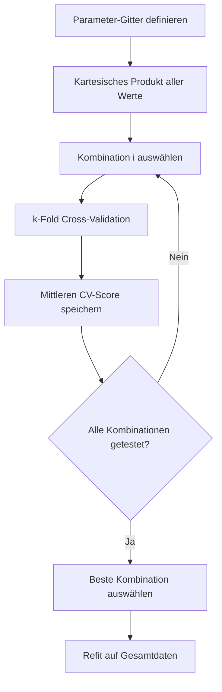
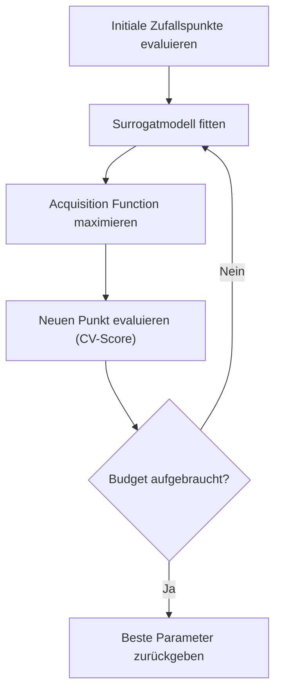
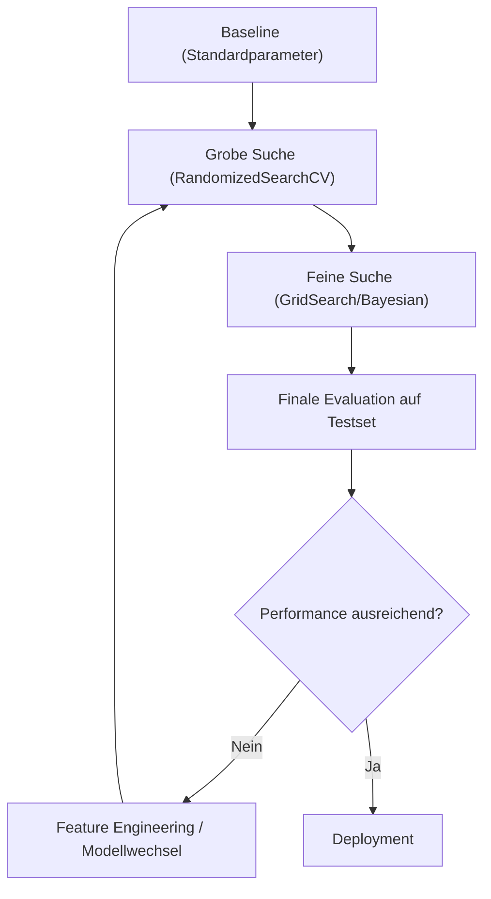

## Was sind Hyperparameter?

*Kontext: Hyperparameter sind Konfigurationswerte eines ML-Algorithmus, die vor dem Training festgelegt werden und nicht aus den Daten gelernt werden.*

Hyperparameter unterscheiden sich von Modellparametern (Gewichte, Koeffizienten), die während des Trainings optimiert werden. Hyperparameter steuern den Lernprozess selbst und müssen extern festgelegt werden.

### Beispiele für Hyperparameter

- **Random Forest:** `n_estimators`, `max_depth`, `min_samples_split`, `max_features`
- **Support Vector Machine:** `C` (Regularisierungsstärke), `kernel`, `gamma`
- **Gradient Boosting:** `learning_rate`, `n_estimators`, `max_depth`, `subsample`
- **Neuronale Netze:** Lernrate, Batch-Größe, Anzahl Layer, Anzahl Neuronen, Dropout-Rate
- **Regularisierte Regression:** `alpha` (Ridge/Lasso), `l1_ratio` (Elastic Net)

Die Wahl der Hyperparameter hat erheblichen Einfluss auf die Modellleistung. Standardwerte sind selten optimal für einen spezifischen Datensatz.

---

## GridSearchCV: Exhaustive Suche

*Kontext: GridSearchCV testet systematisch alle Kombinationen vordefinierter Hyperparameter-Werte und bewertet jede Kombination mittels Cross-Validation.*

`GridSearchCV` aus scikit-learn generiert das kartesische Produkt aller angegebenen Parameterwerte und evaluiert jede Kombination mit Cross-Validation.

### Funktionsweise

Das folgende Diagramm zeigt den Ablauf von GridSearchCV:

*Kontext: GridSearchCV-Ablauf – alle Parameterkombinationen werden systematisch mit Cross-Validation evaluiert.*



1. Parameter-Gitter definieren (alle zu testenden Werte pro Hyperparameter)
2. Alle Kombinationen berechnen (kartesisches Produkt)
3. Für jede Kombination: k-Fold Cross-Validation durchführen
4. Beste Kombination anhand des mittleren CV-Scores auswählen
5. Finales Modell mit bester Kombination auf Gesamtdaten refitten

### Beispiel

```python
from sklearn.model_selection import GridSearchCV
from sklearn.ensemble import RandomForestClassifier

param_grid = {
    'n_estimators': [100, 200, 500],
    'max_depth': [5, 10, 20, None],
    'min_samples_split': [2, 5, 10]
}

grid_search = GridSearchCV(
    estimator=RandomForestClassifier(random_state=42),
    param_grid=param_grid,
    cv=5,
    scoring='f1',
    n_jobs=-1,
    verbose=1
)
grid_search.fit(X_train, y_train)

print(f"Beste Parameter: {grid_search.best_params_}")
print(f"Bester CV-Score: {grid_search.best_score_:.3f}")
# Quelle: https://scikit-learn.org/stable/modules/grid_search.html
```

### Vor- und Nachteile

- **Vorteil:** Garantiert das Optimum innerhalb des definierten Gitters zu finden.
- **Nachteil:** Rechenaufwand wächst exponentiell mit der Anzahl der Parameter und deren Werte. Bei 4 Parametern mit je 5 Werten = 625 Kombinationen × k Folds.
- **Empfehlung:** Geeignet für wenige Parameter (2–3) mit überschaubarem Wertebereich.

---

## RandomizedSearchCV: Zufällige Suche

*Kontext: RandomizedSearchCV sampelt zufällig eine festgelegte Anzahl an Parameterkombinationen aus definierten Verteilungen und ist deutlich effizienter als Grid Search bei vielen Hyperparametern.*

`RandomizedSearchCV` zieht eine feste Anzahl an Parameterkombinationen aus dem Suchraum, anstatt alle zu testen. Die Verteilungen werden pro Parameter angegeben.

### Vorteile gegenüber GridSearchCV

- **Budgetkontrolle:** Die Anzahl der Iterationen (`n_iter`) ist unabhängig von der Parameterzahl.
- **Kontinuierliche Verteilungen:** Kann von Wahrscheinlichkeitsverteilungen sampeln (z. B. `loguniform`, `uniform`, `randint`).
- **Effiziente Exploration:** Bei vielen Parametern findet RandomizedSearch mit weniger Evaluationen oft vergleichbar gute Ergebnisse wie Grid Search.
- **Irrelevante Parameter:** Parameter ohne Einfluss reduzieren die Effizienz nicht.

### Beispiel

```python
from sklearn.model_selection import RandomizedSearchCV
from sklearn.ensemble import GradientBoostingClassifier
from scipy.stats import randint, uniform
from sklearn.utils.fixes import loguniform

param_distributions = {
    'n_estimators': randint(50, 500),
    'max_depth': randint(3, 20),
    'learning_rate': loguniform(1e-3, 1e0),
    'subsample': uniform(0.5, 0.5),
    'min_samples_split': randint(2, 20)
}

random_search = RandomizedSearchCV(
    estimator=GradientBoostingClassifier(random_state=42),
    param_distributions=param_distributions,
    n_iter=100,
    cv=5,
    scoring='roc_auc',
    n_jobs=-1,
    random_state=42
)
random_search.fit(X_train, y_train)

print(f"Beste Parameter: {random_search.best_params_}")
print(f"Bester CV-Score: {random_search.best_score_:.3f}")
# Quelle: https://scikit-learn.org/stable/modules/grid_search.html
```

### Empfehlung zur Wahl von n_iter

- Bergstra & Bengio (2012) zeigen, dass 60 zufällige Iterationen mit 95 % Wahrscheinlichkeit einen Punkt im besten 5 %-Bereich des Suchraums finden.
- In der Praxis sind 50–200 Iterationen ein guter Startpunkt, abhängig von Rechenbudget und Parameterzahl.

---

## Bayesian Optimization

*Kontext: Bayesian Optimization modelliert die Zielfunktion (z. B. CV-Score) mit einem probabilistischen Surrogatmodell und wählt gezielt vielversprechende Parameterkombinationen für die nächste Evaluation.*

Im Gegensatz zu Grid und Random Search nutzt Bayesian Optimization die Ergebnisse vorheriger Evaluationen, um intelligent zu entscheiden, welche Kombination als nächstes getestet wird.

### Funktionsprinzip

Das folgende Diagramm zeigt den iterativen Ablauf der Bayesian Optimization:

*Kontext: Bayesian Optimization – ein Surrogatmodell lenkt die Suche gezielt zu vielversprechenden Parameterbereichen.*



1. **Surrogatmodell (Gaussian Process oder Tree-structured Parzen Estimator):** Approximiert die unbekannte Zielfunktion (Score als Funktion der Hyperparameter).
2. **Acquisition Function (z. B. Expected Improvement, EI):** Bestimmt basierend auf dem Surrogatmodell, welcher Punkt den höchsten erwarteten Informationsgewinn bietet.
3. **Iterativer Prozess:** Punkt auswählen → evaluieren → Surrogatmodell aktualisieren → wiederholen.

### Populäre Bibliotheken

- **Optuna:** Modernes Framework mit Tree-structured Parzen Estimator (TPE). Unterstützt Pruning (Early Stopping schlecht performender Trials).
- **scikit-optimize (BayesSearchCV):** Drop-in-Replacement für GridSearchCV mit Gaussian-Process-basierter Optimierung.
- **Hyperopt:** Älteres Framework mit TPE-Algorithmus.

### Beispiel mit Optuna

```python
import optuna
from sklearn.ensemble import GradientBoostingClassifier
from sklearn.model_selection import cross_val_score

def objective(trial):
    params = {
        'n_estimators': trial.suggest_int('n_estimators', 50, 500),
        'max_depth': trial.suggest_int('max_depth', 3, 15),
        'learning_rate': trial.suggest_float('learning_rate', 1e-3, 0.3, log=True),
        'subsample': trial.suggest_float('subsample', 0.5, 1.0),
        'min_samples_split': trial.suggest_int('min_samples_split', 2, 20)
    }
    clf = GradientBoostingClassifier(**params, random_state=42)
    score = cross_val_score(clf, X_train, y_train, cv=5, scoring='roc_auc')
    return score.mean()

study = optuna.create_study(direction='maximize')
study.optimize(objective, n_trials=100)

print(f"Beste Parameter: {study.best_params}")
print(f"Bester Score: {study.best_value:.3f}")
# Quelle: https://optuna.readthedocs.io/en/stable/
```

### Wann Bayesian Optimization verwenden?

- Bei teuren Evaluationen (z. B. tiefe neuronale Netze, große Datensätze)
- Wenn der Suchraum hochdimensional ist und Grid Search nicht praktikabel ist
- Wenn wenige Evaluationen zum Optimum führen sollen (z. B. ≤ 50–100 Trials statt Tausende)

---

## Lernrate (Learning Rate)

*Kontext: Die Lernrate steuert die Schrittgröße bei iterativen Optimierungsverfahren und ist einer der wichtigsten Hyperparameter für Gradient-basierte Algorithmen.*

Die Lernrate (Learning Rate, oft als `learning_rate` oder `eta`) bestimmt, wie stark die Modellparameter in jedem Optimierungsschritt angepasst werden.

### Auswirkungen der Lernrate

- **Zu hohe Lernrate:** Optimierung „springt" über das Minimum hinweg, konvergiert nicht oder divergiert.
- **Zu niedrige Lernrate:** Konvergenz extrem langsam, Training bleibt möglicherweise in lokalen Minima stecken.
- **Optimale Lernrate:** Schnelle Konvergenz zu einem guten Minimum.

### Typische Wertebereiche

- Gradient Boosting: 0.01–0.3 (Standard oft 0.1)
- Neuronale Netze (SGD): 0.001–0.1
- Adam-Optimizer: 0.0001–0.003 (Standard: 0.001)

### Learning Rate Schedules

Bei neuronalen Netzen wird die Lernrate oft während des Trainings reduziert:

- **Step Decay:** Lernrate wird alle n Epochen um einen Faktor reduziert.
- **Exponential Decay:** Lernrate sinkt exponentiell mit der Epochenzahl.
- **Cosine Annealing:** Lernrate folgt einer Kosinusfunktion.
- **Warm-Up + Decay:** Lernrate steigt zunächst an und sinkt dann (wichtig für Transformer-Modelle).

---

## Regularisierung

*Kontext: Regularisierung beschränkt die Modellkomplexität durch einen Strafterm in der Verlustfunktion und ist das wichtigste Mittel gegen Overfitting.*

Regularisierung fügt der Verlustfunktion einen Term hinzu, der große Parameterwerte bestraft:

**Regularisierte Verlustfunktion = Verlust(Daten) + λ × Strafe(Parameter)**

### L1-Regularisierung (Lasso)

- Strafterm: λ × Σ|wᵢ|
- Erzeugt Sparsity: Viele Gewichte werden exakt 0 → automatische Feature-Selection
- Parameter in scikit-learn: `alpha` bei `Lasso`, `C` (invers) bei `LogisticRegression(penalty='l1')`

### L2-Regularisierung (Ridge)

- Strafterm: λ × Σwᵢ²
- Schrumpft alle Gewichte gleichmäßig gegen 0, ohne sie auf exakt 0 zu setzen
- Parameter in scikit-learn: `alpha` bei `Ridge`, `C` (invers) bei `LogisticRegression(penalty='l2')`

### Elastic Net

- Kombination: λ₁ × Σ|wᵢ| + λ₂ × Σwᵢ²
- Parameter: `alpha` (Gesamtstärke) und `l1_ratio` (Anteil L1 vs. L2)
- Nützlich wenn viele korrelierte Features vorliegen

### Regularisierung bei Entscheidungsbäumen

- `max_depth`: Maximale Baumtiefe begrenzen
- `min_samples_split`: Mindestanzahl Samples für einen Split
- `min_samples_leaf`: Mindestanzahl Samples in einem Blatt
- `max_features`: Anzahl betrachteter Features pro Split

---

## Early Stopping

*Kontext: Early Stopping beendet das Training, sobald die Validierungsmetrik nicht mehr besser wird, und verhindert dadurch Overfitting bei iterativen Verfahren.*

Early Stopping ist eine Form der Regularisierung, die keinen expliziten Strafterm benötigt. Stattdessen wird das Training gestoppt, wenn die Performance auf einem Validierungsset nicht mehr verbessert wird.

### Funktionsweise

1. In jeder Iteration/Epoche die Metrik auf dem Validierungsset berechnen
2. Bestes Ergebnis und zugehöriges Modell merken
3. Wenn nach `n_iter_no_change` aufeinanderfolgenden Iterationen keine Verbesserung (größer als `tol`) eintritt → Training stoppen
4. Modell vom besten Checkpoint zurückgeben

### Beispiel mit Gradient Boosting

```python
from sklearn.ensemble import GradientBoostingClassifier

model = GradientBoostingClassifier(
    n_estimators=1000,
    learning_rate=0.1,
    max_depth=5,
    validation_fraction=0.2,
    n_iter_no_change=10,
    tol=1e-4,
    random_state=42
)
model.fit(X_train, y_train)
print(f"Tatsächlich verwendete Iterationen: {model.n_estimators_}")
# Quelle: https://scikit-learn.org/stable/modules/ensemble.html
```

### Beispiel mit XGBoost

```python
import xgboost as xgb

model = xgb.XGBClassifier(
    n_estimators=1000,
    learning_rate=0.1,
    max_depth=6,
    early_stopping_rounds=20,
    eval_metric='logloss'
)
model.fit(
    X_train, y_train,
    eval_set=[(X_val, y_val)],
    verbose=False
)
print(f"Bester Iterationsschritt: {model.best_iteration}")
# Quelle: https://xgboost.readthedocs.io/
```

### Best Practices für Early Stopping

- Patience (`n_iter_no_change` / `early_stopping_rounds`) nicht zu niedrig setzen (10–50 je nach Szenario).
- Mit niedrigerer Lernrate und höherem `n_estimators` kombinieren: Das Modell hat mehr Spielraum für feinere Optimierung.
- Immer ein separates Validierungsset verwenden (nicht das finale Testset!).

---

## Pipelines: Reproduzierbare ML-Workflows

*Kontext: scikit-learn Pipelines verbinden Vorverarbeitungs- und Modellierungsschritte zu einem einzigen Objekt, das sicher mit Cross-Validation und Grid Search verwendet werden kann.*

Eine `Pipeline` in scikit-learn verkettet mehrere Transformationsschritte und einen finalen Estimator. Beim `.fit()` werden alle Transformer sequenziell gefitted und transformiert; beim `.predict()` werden die Transformer nur transformiert.

### Warum Pipelines verwenden?

- **Keine Datenleckage:** Transformer werden nur auf Trainingsdaten gefittet.
- **Reproduzierbarkeit:** Gesamter Workflow in einem Objekt.
- **Hyperparameter-Tuning über alle Schritte:** Grid Search kann Parameter von Transformern und Estimator gleichzeitig optimieren.
- **Einfaches Deployment:** Gesamte Pipeline serialisieren und in Produktion einsetzen.

### Beispiel: Komplette Pipeline mit Grid Search

```python
from sklearn.pipeline import Pipeline
from sklearn.preprocessing import StandardScaler
from sklearn.decomposition import PCA
from sklearn.svm import SVC
from sklearn.model_selection import GridSearchCV

pipe = Pipeline([
    ('scaler', StandardScaler()),
    ('pca', PCA()),
    ('svc', SVC())
])

param_grid = {
    'pca__n_components': [5, 10, 20],
    'svc__C': [0.1, 1, 10, 100],
    'svc__kernel': ['rbf', 'linear'],
    'svc__gamma': ['scale', 'auto']
}

grid = GridSearchCV(pipe, param_grid, cv=5, scoring='accuracy', n_jobs=-1)
grid.fit(X_train, y_train)

print(f"Beste Pipeline-Parameter: {grid.best_params_}")
print(f"Test-Score: {grid.score(X_test, y_test):.3f}")
# Quelle: https://scikit-learn.org/stable/modules/compose.html
```

### Benennung der Pipeline-Parameter

Die Syntax für verschachtelte Parameter ist `<step_name>__<parameter_name>`. Bei mehrfach verschachtelten Pipelines werden weitere `__` angehängt:

- `svc__C` → Parameter `C` des Steps `svc`
- `clf__estimator__max_depth` → `max_depth` eines verschachtelten Estimators im Step `clf`

---

## Zusammenfassung: Wahl der Tuning-Strategie

*Kontext: Die optimale Tuning-Strategie hängt von der Anzahl der Hyperparameter, dem Rechenbudget und der Evaluationskosten pro Kombination ab.*

| Strategie | Wann geeignet | Typische Anzahl Evaluationen |
|-----------|--------------|------------------------------|
| GridSearchCV | Wenige Parameter (2–3), kleiner Suchraum | 10–100 |
| RandomizedSearchCV | Viele Parameter, großer Suchraum, moderates Budget | 50–200 |
| Bayesian Optimization | Teure Evaluationen, hochdimensionaler Raum | 20–100 |
| HalvingGridSearchCV | Viele Kombinationen, begrenztes Rechenbudget | Automatisch durch Successive Halving |

### Empfohlener Workflow

Das folgende Diagramm zeigt den empfohlenen Tuning-Workflow von der Baseline bis zur finalen Evaluation:

*Kontext: Empfohlener Hyperparameter-Tuning-Workflow – von grober zu feiner Suche mit finaler Evaluation.*



1. **Baseline etablieren:** Modell mit Standardparametern trainieren und evaluieren.
2. **Grobe Suche (RandomizedSearch):** Breiten Suchraum mit ~50–100 Iterationen erkunden.
3. **Feine Suche (GridSearch oder Bayesian):** Engen Suchraum um die besten Werte der groben Suche legen.
4. **Finale Evaluation:** Bestes Modell auf dem zurückgehaltenen Testset bewerten.
5. **Nested Cross-Validation:** Für unverzerrte Leistungsschätzung: äußere CV für Evaluation, innere CV für Tuning.

```python
# Nested Cross-Validation für unverzerrte Evaluation
from sklearn.model_selection import cross_val_score, GridSearchCV

inner_cv = StratifiedKFold(n_splits=5, shuffle=True, random_state=42)
outer_cv = StratifiedKFold(n_splits=5, shuffle=True, random_state=0)

grid = GridSearchCV(estimator=model, param_grid=param_grid, cv=inner_cv, scoring='f1')
nested_scores = cross_val_score(grid, X, y, cv=outer_cv, scoring='f1')
print(f"Nested CV F1: {nested_scores.mean():.3f} ± {nested_scores.std():.3f}")
# Quelle: https://scikit-learn.org/stable/auto_examples/model_selection/plot_nested_cross_validation_iris.html
```
