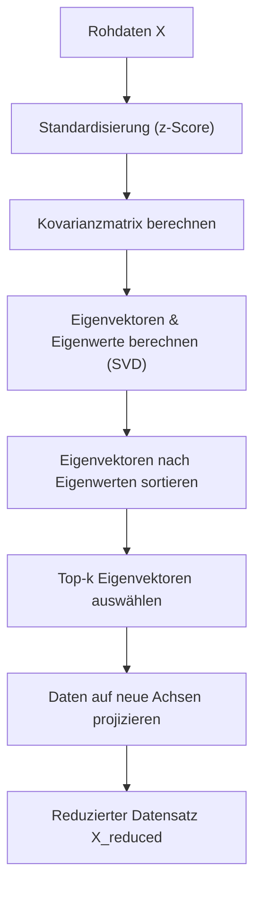
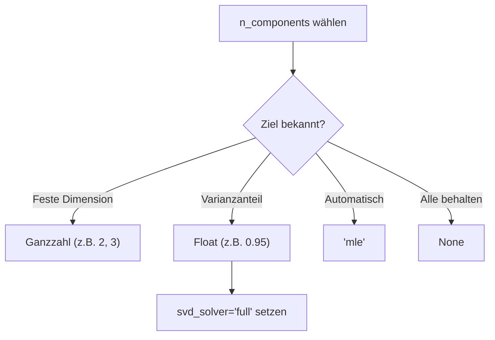

## Grundprinzip der PCA

*Kontext: PCA ist ein lineares Verfahren zur Dimensionsreduktion, das hochdimensionale Daten auf wenige Hauptkomponenten projiziert.*

Principal Component Analysis (PCA) ist eine lineare Dimensionsreduktionstechnik, die mittels Singular Value Decomposition (SVD) die Daten in einen niedrigdimensionalen Raum projiziert und dabei möglichst viel Varianz erhält. Die Eingabedaten werden vor der SVD zentriert (Mittelwert je Feature subtrahiert), aber nicht skaliert. PCA identifiziert die Richtungen maximaler Varianz in den Daten – die sogenannten Hauptkomponenten (Principal Components). Jede Hauptkomponente ist eine Linearkombination der Originalfeatures und steht orthogonal zu allen anderen Komponenten.

### Varianzmaximierung

*Kontext: Die erste Hauptkomponente erfasst die Richtung mit der größten Varianz, jede weitere maximiert die Restvarianz unter Orthogonalitätsbedingung.*

PCA sucht iterativ die Richtung, in der die Projektion der Daten die maximale Varianz aufweist. Die erste Hauptkomponente (PC1) erklärt den größten Anteil der Gesamtvarianz. Die zweite Hauptkomponente (PC2) erklärt die größte verbleibende Varianz unter der Bedingung, dass sie senkrecht (orthogonal) auf PC1 steht. Dieses Prinzip setzt sich für alle weiteren Komponenten fort. Die Varianz jeder Komponente entspricht dem zugehörigen Eigenwert der Kovarianzmatrix.

Das folgende Diagramm zeigt den vollständigen PCA-Ablauf von der Datenvorverarbeitung bis zur reduzierten Darstellung.

*Kontext: Schrittweiser Ablauf der PCA – Standardisierung, Kovarianzmatrix, Eigendekomposition und Projektion.*



### Eigenvektoren und Eigenwerte

*Kontext: Eigenvektoren definieren die Richtungen der Hauptkomponenten, Eigenwerte quantifizieren die erklärte Varianz je Richtung.*

Die Kovarianzmatrix der zentrierten Daten wird in ihre Eigenvektoren und Eigenwerte zerlegt. Die Eigenvektoren geben die Richtungen der Hauptkomponenten an (`components_` in scikit-learn), sortiert nach absteigender erklärter Varianz. Die Eigenwerte quantifizieren, wie viel Varianz jede Komponente erklärt (`explained_variance_`). In der Praxis berechnet scikit-learn die Zerlegung über SVD statt direkt über Eigendekomposition der Kovarianzmatrix, da dies numerisch stabiler ist.

## Erklärte Varianz (explained_variance_ratio_)

*Kontext: Das Attribut explained_variance_ratio_ gibt den prozentualen Varianzanteil jeder Hauptkomponente an der Gesamtvarianz an.*

Das Attribut `explained_variance_ratio_` liefert für jede Komponente den Anteil der Gesamtvarianz, den sie erklärt. Es berechnet sich als Verhältnis des Eigenwerts einer Komponente zur Summe aller Eigenwerte. Ein Wert von 0.95 für die erste Komponente bedeutet, dass 95 % der Gesamtvarianz durch diese eine Komponente erfasst werden. Die kumulative Summe dient als Entscheidungskriterium für die Wahl der Komponentenzahl.

Beispiel zur Berechnung der erklärten Varianz:

```python
import numpy as np
from sklearn.decomposition import PCA
from sklearn.preprocessing import StandardScaler

X = np.array([[-1, -1], [-2, -1], [-3, -2], [1, 1], [2, 1], [3, 2]])
X_scaled = StandardScaler().fit_transform(X)

pca = PCA(n_components=2)
pca.fit(X_scaled)
print(pca.explained_variance_ratio_)  # z.B. [0.9924, 0.0076]
print(np.cumsum(pca.explained_variance_ratio_))  # Kumulative Varianz
# Quelle: https://scikit-learn.org/1.5/modules/generated/sklearn.decomposition.PCA.html
```

## Standardisierung vor PCA

*Kontext: PCA ist varianzbasiert und erfordert bei Features unterschiedlicher Skalen eine vorherige Standardisierung.*

Da PCA die Richtungen maximaler Varianz sucht, dominieren Features mit großen Wertebereichen die Analyse, wenn keine Skalierung erfolgt. Vor der PCA sollten die Daten mit `StandardScaler` (Mittelwert 0, Standardabweichung 1) standardisiert werden. scikit-learn's PCA-Klasse zentriert die Daten intern (subtrahiert den Mittelwert), führt aber keine Skalierung auf Einheitsvarianz durch – diese muss explizit vorgeschaltet werden.

## Der Parameter n_components

*Kontext: n_components steuert die Zahl der beibehaltenen Hauptkomponenten und akzeptiert verschiedene Eingabeformate.*

Der Parameter `n_components` bestimmt die Anzahl der beibehaltenen Komponenten:

- **Ganzzahl** (z. B. `n_components=3`): Behält exakt 3 Komponenten bei.
- **Float zwischen 0 und 1** (z. B. `n_components=0.95`): Wählt automatisch die minimale Anzahl Komponenten, die mindestens 95 % der Gesamtvarianz erklären (nur mit `svd_solver='full'`).
- **`'mle'`**: Nutzt Minka's Maximum Likelihood Estimation zur automatischen Dimensionsbestimmung.
- **`None`** (Standard): Behält alle Komponenten bei.

Das folgende Diagramm veranschaulicht die Entscheidungslogik zur Wahl von n_components.

*Kontext: Entscheidungsbaum für die Wahl des Parameters n_components je nach Anwendungsfall.*



Beispiel mit automatischer Komponentenwahl:

```python
from sklearn.decomposition import PCA
from sklearn.preprocessing import StandardScaler
from sklearn.datasets import load_iris

X = load_iris().data
X_scaled = StandardScaler().fit_transform(X)

pca = PCA(n_components=0.95, svd_solver='full')
X_reduced = pca.fit_transform(X_scaled)
print(f"Gewählte Komponenten: {pca.n_components_}")
# Quelle: https://scikit-learn.org/1.5/modules/generated/sklearn.decomposition.PCA.html
```

## Anwendungsfälle

*Kontext: PCA wird zur Datenvisualisierung, Feature-Reduktion, Rauschunterdrückung und als Vorverarbeitungsschritt eingesetzt.*

- **Visualisierung**: Projektion hochdimensionaler Daten auf 2D/3D zur explorativen Analyse.
- **Feature-Reduktion**: Reduktion der Featureanzahl vor rechenintensiven Algorithmen (z. B. k-NN, SVM).
- **Rauschunterdrückung**: Entfernung von Komponenten mit geringer Varianz, die häufig Rauschen repräsentieren.
- **Dekorrelation**: Erzeugung unkorrelierter Features als Eingabe für Modelle, die Unabhängigkeit voraussetzen.
- **Kompression**: Reduktion des Speicherbedarfs bei minimalem Informationsverlust.

## Einschränkungen

*Kontext: PCA hat fundamentale Limitierungen, die bei der Anwendung berücksichtigt werden müssen.*

- **Linearität**: PCA erfasst nur lineare Zusammenhänge. Nichtlineare Strukturen werden nicht erkannt (Alternative: Kernel PCA, t-SNE, UMAP).
- **Interpretierbarkeit**: Hauptkomponenten sind Linearkombinationen aller Originalfeatures und schwer inhaltlich zu interpretieren.
- **Varianz ≠ Relevanz**: Richtungen hoher Varianz korrelieren nicht zwangsläufig mit prädiktiver Relevanz für eine Zielvariable.
- **Ausreißerempfindlichkeit**: Ausreißer können die Kovarianzmatrix und damit die Hauptkomponenten stark verzerren.
- **Skalierungsabhängigkeit**: Ohne vorherige Standardisierung dominieren Features mit großer Varianz.
