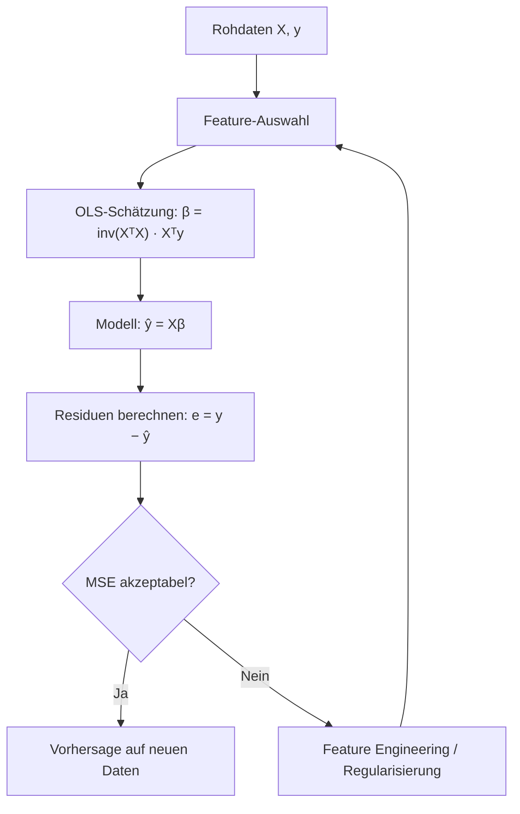
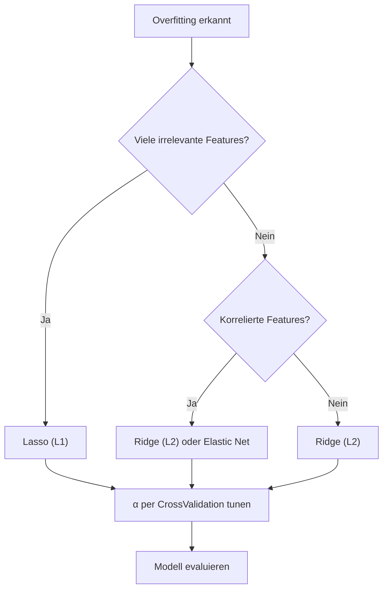

## Lineare Regression

*Kontext: Funktionsweise, mathematische Grundlage und Annahmen der einfachen und multiplen linearen Regression.*

Die lineare Regression modelliert die Beziehung zwischen einer abhängigen Variable y und einer oder mehreren unabhängigen Variablen X durch eine lineare Funktion. Das Modell nimmt die Form an:

ŷ = β₀ + β₁x₁ + β₂x₂ + … + βₚxₚ

Die Koeffizienten β werden durch Minimierung der Kostenfunktion (Mean Squared Error) bestimmt:

MSE = (1/n) Σᵢ (yᵢ − ŷᵢ)²

Das folgende Diagramm zeigt den typischen Ablauf einer linearen Regression von den Rohdaten bis zur Vorhersage.

*Kontext: Workflow der linearen Regression – von Features über Koeffizientenberechnung zur Vorhersage.*



### Annahmen

- Linearität zwischen Features und Zielvariable
- Unabhängigkeit der Residuen (keine Autokorrelation)
- Homoskedastizität (konstante Varianz der Residuen)
- Normalverteilung der Residuen (für statistische Tests)
- Keine perfekte Multikollinearität zwischen Features

### Anwendungsfälle

- Vorhersage von Immobilienpreisen, Umsätzen, Temperaturverläufen
- Analyse von Einflussfaktoren (welche Features treiben die Zielvariable?)

### Einschränkungen

- Erfasst nur lineare Zusammenhänge
- Sensitiv gegenüber Ausreißern
- Problematisch bei Multikollinearität (instabile Koeffizienten)

```python
# Quelle: scikit-learn.org/stable/modules/linear_model.html
from sklearn.linear_model import LinearRegression

model = LinearRegression()
model.fit(X_train, y_train)
predictions = model.predict(X_test)
print(f"Koeffizienten: {model.coef_}")
print(f"Intercept: {model.intercept_}")
```

---

## Logistische Regression

*Kontext: Funktionsweise der logistischen Regression als Klassifikationsverfahren trotz des Namens „Regression".*

Trotz ihres Namens ist die logistische Regression ein Klassifikationsalgorithmus. Sie modelliert die Wahrscheinlichkeit P(y=1|X), dass eine Beobachtung zur positiven Klasse gehört, mittels der Sigmoid-Funktion (logistische Funktion):

P(y=1|X) = 1 / (1 + e^(−(β₀ + β₁x₁ + … + βₚxₚ)))

### Kostenfunktion (Log Loss / Binary Cross-Entropy)

Die Kostenfunktion der logistischen Regression ist die Log Loss:

L = −(1/n) Σᵢ [yᵢ · log(ŷᵢ) + (1−yᵢ) · log(1−ŷᵢ)]

Diese Funktion bestraft falsche Vorhersagen exponentiell stärker als die MSE und ist konvex, wodurch ein globales Minimum garantiert ist.

### Annahmen

- Lineare Beziehung zwischen Features und dem Log-Odds der Zielvariable
- Unabhängigkeit der Beobachtungen
- Keine starke Multikollinearität
- Ausreichend große Stichprobe pro Klasse

### Anwendungsfälle

- Binäre Klassifikation: Spam-Erkennung, Kreditrisiko (ja/nein), medizinische Diagnose
- Multiclass-Klassifikation über One-vs-Rest oder Softmax-Erweiterung (Multinomiale logistische Regression)

### Einschränkungen

- Erfordert lineare Trennbarkeit im Feature-Raum (oder Feature Engineering)
- Nicht geeignet für komplexe, nicht-lineare Entscheidungsgrenzen ohne Transformation

```python
# Quelle: scikit-learn.org/stable/modules/linear_model.html
from sklearn.linear_model import LogisticRegression

clf = LogisticRegression(max_iter=1000)
clf.fit(X_train, y_train)
probabilities = clf.predict_proba(X_test)
```

---

## Polynomiale Regression

*Kontext: Erweiterung der linearen Regression durch polynomiale Feature-Transformation zur Modellierung nicht-linearer Zusammenhänge.*

Die polynomiale Regression erweitert die lineare Regression, indem polynomiale Terme (x², x³, x₁·x₂ etc.) als zusätzliche Features hinzugefügt werden. Das Modell bleibt in den Parametern linear, kann aber nicht-lineare Kurven und Flächen abbilden:

ŷ = β₀ + β₁x + β₂x² + … + βₙxⁿ

### Funktionsweise in scikit-learn

In scikit-learn wird die polynomiale Regression durch eine Pipeline aus `PolynomialFeatures` (Feature-Transformation) und `LinearRegression` (Modell) realisiert:

```python
# Quelle: scikit-learn.org/stable/modules/preprocessing.html
from sklearn.preprocessing import PolynomialFeatures
from sklearn.linear_model import LinearRegression
from sklearn.pipeline import make_pipeline

model = make_pipeline(PolynomialFeatures(degree=3), LinearRegression())
model.fit(X_train, y_train)
```

### Anwendungsfälle

- Modellierung von Wachstumskurven, physikalischen Zusammenhängen
- Situationen, in denen lineare Regression zu stark vereinfacht

### Einschränkungen und Risiken

- Höhergradige Polynome neigen stark zu Overfitting (insbesondere an den Rändern der Daten)
- Exponentielles Wachstum der Feature-Anzahl bei vielen Eingabevariablen und hohem Grad
- Extrapolation ist extrem unzuverlässig
- Regularisierung (Ridge/Lasso) ist bei polynomialer Regression besonders wichtig

---

## Regularisierung: Ridge (L2) und Lasso (L1)

*Kontext: Techniken zur Vermeidung von Overfitting durch Bestrafung großer Koeffizienten in Regressionsmodellen.*

Regularisierung fügt der Kostenfunktion einen Strafterm hinzu, der große Koeffizienten bestraft. Dies reduziert Overfitting und verbessert die Generalisierung, besonders bei hochdimensionalen Daten oder Multikollinearität.

### Ridge Regression (L2-Regularisierung)

Ridge fügt die Summe der quadrierten Koeffizienten als Strafterm hinzu:

Kostenfunktion = MSE + α · Σⱼ βⱼ²

- Schrumpft alle Koeffizienten gleichmäßig Richtung Null, setzt aber keinen auf exakt Null
- Stabilisiert die Lösung bei Multikollinearität
- Der Hyperparameter α (in scikit-learn: `alpha`) steuert die Stärke der Regularisierung
- Geschlossene Lösung: β = (XᵀX + αI)⁻¹Xᵀy

### Lasso Regression (L1-Regularisierung)

Lasso verwendet die Summe der Absolutbeträge der Koeffizienten:

Kostenfunktion = MSE + α · Σⱼ |βⱼ|

- Kann Koeffizienten exakt auf Null setzen → automatische Feature-Selektion
- Besonders nützlich bei vielen irrelevanten Features
- Erzeugt sparse Modelle (nur relevante Features behalten Gewicht)
- Nachteil: Bei korrelierten Features wird willkürlich eines ausgewählt

### Elastic Net

Kombiniert L1 und L2: Kostenfunktion = MSE + α₁ · Σ|βⱼ| + α₂ · Σβⱼ². Vereint die Vorteile beider Methoden – Feature-Selektion und Stabilität bei korrelierten Features.

```python
# Quelle: scikit-learn.org/stable/modules/linear_model.html
from sklearn.linear_model import Ridge, Lasso, ElasticNet

ridge = Ridge(alpha=1.0)
lasso = Lasso(alpha=0.1)
elastic = ElasticNet(alpha=0.1, l1_ratio=0.5)

ridge.fit(X_train, y_train)
lasso.fit(X_train, y_train)
```

### Wahl des Hyperparameters α

- Zu kleines α: Kaum Regularisierung → Overfitting möglich
- Zu großes α: Underfitting, Modell zu stark eingeschränkt
- Optimale Wahl über Kreuzvalidierung (`RidgeCV`, `LassoCV` in scikit-learn)

### Vergleich Ridge vs. Lasso

| Eigenschaft | Ridge (L2) | Lasso (L1) |
|-------------|-----------|-----------|
| Strafterm | Σ βⱼ² | Σ \|βⱼ\| |
| Feature-Selektion | Nein | Ja |
| Korrelierte Features | Verteilt Gewicht | Wählt eines aus |
| Sparse Modelle | Nein | Ja |
| Stabilität | Hoch | Geringer bei Korrelation |

Das folgende Diagramm zeigt, wie die Wahl der Regularisierungsmethode den Modellierungsablauf beeinflusst.

*Kontext: Entscheidungslogik zur Auswahl der passenden Regularisierung (Ridge, Lasso, Elastic Net).*


