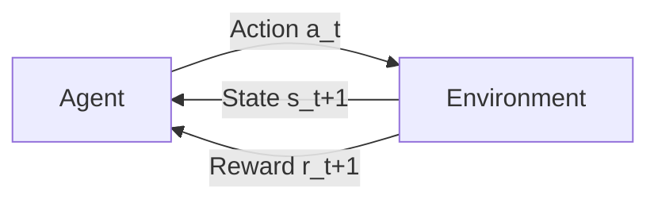
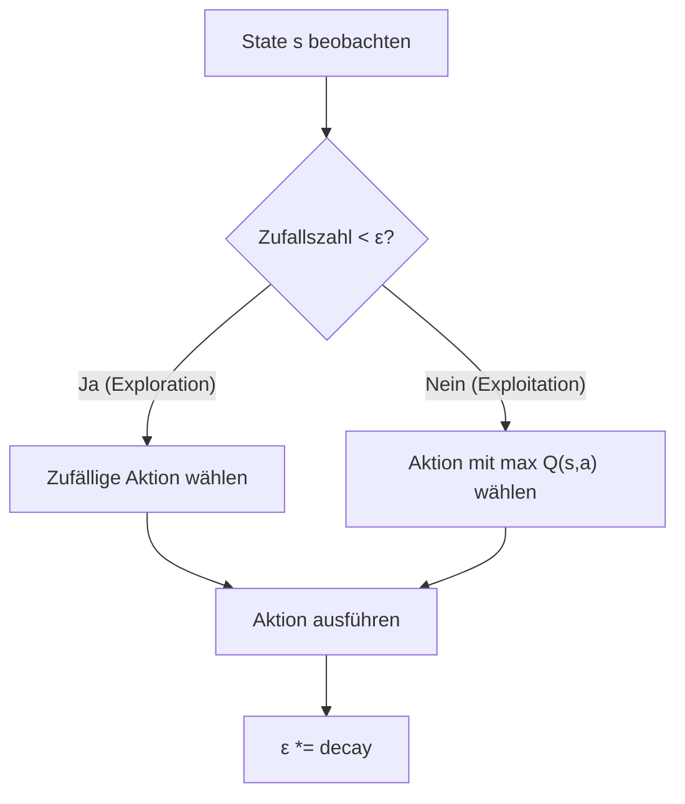
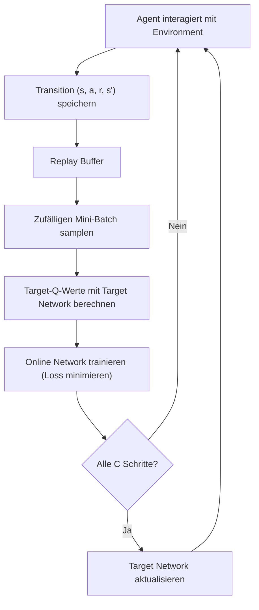

## Agent, Environment, State, Action und Reward

*Kontext: Die fünf Grundkomponenten Agent, Environment, State, Action und Reward bilden das formale Framework, in dem alle Reinforcement-Learning-Probleme formuliert werden.*

### Agent

Der Agent ist die lernende Entität, die Entscheidungen trifft. Er beobachtet den aktuellen Zustand der Umgebung, wählt eine Aktion aus und erhält Feedback in Form eines Rewards. Sein Ziel ist es, eine Policy zu erlernen, die den kumulierten Reward über die Zeit maximiert. Der Agent verfügt über kein vorheriges Wissen über die Umgebungsdynamik und muss diese durch Interaktion erschließen (Model-Free Learning).

### Environment

Das Environment (Umgebung) repräsentiert das Problem, das gelöst werden soll. Es empfängt Aktionen des Agenten, berechnet den resultierenden Zustandsübergang und gibt den neuen Zustand sowie den zugehörigen Reward zurück. Die Umgebung wird formal als Markov Decision Process (MDP) modelliert, definiert durch das Tupel $(S, A, P, R, \gamma)$ mit States, Actions, Übergangswahrscheinlichkeiten, Reward-Funktion und Discount-Faktor.

### State

Der State (Zustand) $s \in S$ beschreibt die vollständige relevante Information der Umgebung zu einem Zeitpunkt $t$. Die Markov-Eigenschaft besagt, dass der nächste Zustand nur vom aktuellen Zustand und der gewählten Aktion abhängt, nicht von der Historie. In der Praxis können States kontinuierlich (z. B. Sensorwerte) oder diskret (z. B. Spielbrettkonfigurationen) sein.

### Action

Eine Action (Aktion) $a \in A$ ist eine Handlung, die der Agent in einem gegebenen Zustand ausführen kann. Der Action Space kann diskret (endliche Menge möglicher Aktionen, z. B. links/rechts/hoch/runter) oder kontinuierlich (reellwertige Steuerungssignale) sein. DQN arbeitet mit diskreten Action Spaces.

### Reward

Der Reward (Belohnung) $r$ ist ein skalares Feedback-Signal, das die Umgebung nach einer Aktion zurückgibt. Er ist positiv für erwünschtes und negativ für unerwünschtes Verhalten. Das langfristige Ziel des Agenten ist die Maximierung des kumulierten diskontierten Rewards: $G_t = \sum_{k=0}^{\infty} \gamma^k \cdot r_{t+k+1}$, wobei $\gamma \in [0,1]$ der Discount-Faktor ist.

Das folgende Diagramm zeigt den zentralen Interaktionszyklus zwischen Agent und Environment.

*Kontext: Der Reinforcement-Learning-Loop – Agent beobachtet State, wählt Action, erhält Reward und neuen State.*



```python
import gymnasium as gym

# Reinforcement Learning Loop: Agent interagiert mit Environment
# Quelle: https://www.tensorflow.org/agents/tutorials/0_intro_rl
env = gym.make('CartPole-v1')
state, info = env.reset()

for step in range(1000):
    action = env.action_space.sample()  # Zufällige Aktion (Platzhalter für Policy)
    next_state, reward, terminated, truncated, info = env.step(action)
    # Agent lernt aus (state, action, reward, next_state)
    state = next_state
    if terminated or truncated:
        state, info = env.reset()
```

---

## Policy und Value-Funktion

*Kontext: Policy und Value-Funktion sind die zwei zentralen Konzepte, die das Verhalten und die Bewertung eines Reinforcement-Learning-Agenten mathematisch beschreiben.*

### Policy (Strategie)

Die Policy $\pi$ definiert das Verhalten des Agenten: Sie bildet Zustände auf Aktionen ab. Eine deterministische Policy ordnet jedem Zustand genau eine Aktion zu: $\pi(s) = a$. Eine stochastische Policy gibt eine Wahrscheinlichkeitsverteilung über Aktionen an: $\pi(a|s) = P(A_t = a | S_t = s)$. Die optimale Policy $\pi^*$ maximiert den erwarteten kumulierten Reward für alle Zustände.

Es gibt zwei Hauptansätze: Policy-basierte Methoden (lernen $\pi$ direkt, z. B. REINFORCE, PPO) und Value-basierte Methoden (lernen eine Wertfunktion, aus der die Policy abgeleitet wird, z. B. Q-Learning, DQN).

### State-Value-Funktion $V^\pi(s)$

Die State-Value-Funktion bewertet, wie gut es ist, in einem bestimmten Zustand zu sein, gegeben eine Policy $\pi$:

$$V^\pi(s) = \mathbb{E}_\pi \left[ \sum_{k=0}^{\infty} \gamma^k \cdot r_{t+k+1} \mid S_t = s \right]$$

Sie gibt den erwarteten kumulierten diskontierten Reward an, wenn der Agent im Zustand $s$ startet und danach der Policy $\pi$ folgt.

### Action-Value-Funktion $Q^\pi(s, a)$

Die Action-Value-Funktion (Q-Funktion) bewertet, wie gut es ist, in Zustand $s$ die Aktion $a$ auszuführen:

$$Q^\pi(s, a) = \mathbb{E}_\pi \left[ \sum_{k=0}^{\infty} \gamma^k \cdot r_{t+k+1} \mid S_t = s, A_t = a \right]$$

Q-Learning und DQN approximieren die optimale Q-Funktion $Q^*(s, a)$, aus der die optimale Policy direkt abgeleitet werden kann: $\pi^*(s) = \arg\max_a Q^*(s, a)$.

---

## Q-Learning und Bellman-Gleichung

*Kontext: Q-Learning ist ein Model-Free RL-Algorithmus, der die optimale Action-Value-Funktion iterativ durch die Bellman-Optimalitätsgleichung approximiert.*

### Bellman-Gleichung

Die Bellman-Optimalitätsgleichung definiert den rekursiven Zusammenhang zwischen dem Q-Wert eines Zustands-Aktions-Paares und den Q-Werten der Folgezustände:

$$Q^*(s, a) = \mathbb{E} \left[ r + \gamma \cdot \max_{a'} Q^*(s', a') \mid s, a \right]$$

Diese Gleichung besagt: Der optimale Q-Wert einer Aktion $a$ in Zustand $s$ ist der unmittelbare Reward plus dem diskontierten maximalen Q-Wert im Folgezustand $s'$. Sie bildet die mathematische Grundlage für alle Q-Learning-Varianten.

### Q-Learning-Algorithmus

Q-Learning aktualisiert die Q-Werte nach jeder Erfahrung $(s, a, r, s')$ mit der Update-Regel:

$$Q(s, a) \leftarrow Q(s, a) + \alpha \left[ r + \gamma \cdot \max_{a'} Q(s', a') - Q(s, a) \right]$$

Dabei ist $\alpha$ die Lernrate und der Term in eckigen Klammern der Temporal Difference (TD) Error. Q-Learning ist ein Off-Policy-Algorithmus: Er lernt die optimale Policy, unabhängig davon, welche Explorationsstrategie zur Datensammlung verwendet wird. Bei endlichem State-Action-Space und unendlicher Exploration konvergiert Q-Learning nachweislich zur optimalen Q-Funktion.

```python
import numpy as np

# Tabellarisches Q-Learning
# Quelle: https://en.wikipedia.org/wiki/Q-learning
n_states, n_actions = 16, 4
q_table = np.zeros((n_states, n_actions))
alpha = 0.1   # Lernrate
gamma = 0.99  # Discount-Faktor

def q_learning_update(state, action, reward, next_state):
    td_target = reward + gamma * np.max(q_table[next_state])
    td_error = td_target - q_table[state, action]
    q_table[state, action] += alpha * td_error
```

---

## Exploration vs. Exploitation und Epsilon-Greedy

*Kontext: Das Exploration-Exploitation-Dilemma ist das fundamentale Spannungsfeld im Reinforcement Learning zwischen der Nutzung bekannten Wissens und der Erkundung neuer Möglichkeiten.*

### Das Dilemma

Exploitation bedeutet, die aktuell beste bekannte Aktion zu wählen (gieriges Verhalten), um sofortigen Reward zu maximieren. Exploration bedeutet, neue, möglicherweise suboptimale Aktionen auszuprobieren, um bessere Strategien zu entdecken. Reine Exploitation kann in lokalen Optima steckenbleiben. Reine Exploration verschwendet Erfahrung und maximiert keinen Reward. Ein effektiver Agent muss beide Aspekte balancieren.

### Epsilon-Greedy-Strategie

Die $\varepsilon$-greedy-Strategie ist die einfachste und am häufigsten verwendete Lösung:

- Mit Wahrscheinlichkeit $1 - \varepsilon$: Wähle die Aktion mit dem höchsten Q-Wert (Exploitation)
- Mit Wahrscheinlichkeit $\varepsilon$: Wähle eine zufällige Aktion (Exploration)

Typischerweise wird $\varepsilon$ im Verlauf des Trainings reduziert (Epsilon Decay): Der Agent exploriert anfangs stark (z. B. $\varepsilon = 1.0$) und verlagert sich schrittweise auf Exploitation (z. B. $\varepsilon_{\min} = 0.01$). Dies entspricht der Intuition, dass früh im Training Wissen aufgebaut und später genutzt werden soll.

Das folgende Diagramm zeigt die Epsilon-Greedy-Entscheidungslogik bei der Aktionswahl.

*Kontext: Epsilon-Greedy-Strategie – zufällige Entscheidung zwischen Exploration und Exploitation mit abnehmendem ε.*



```python
import numpy as np

# Epsilon-Greedy Aktionswahl mit Decay
# Quelle: https://en.wikipedia.org/wiki/Exploration%E2%80%93exploitation_dilemma
epsilon = 1.0
epsilon_min = 0.01
epsilon_decay = 0.995

def select_action(state, q_table):
    global epsilon
    if np.random.random() < epsilon:
        action = np.random.randint(q_table.shape[1])  # Exploration
    else:
        action = np.argmax(q_table[state])             # Exploitation
    epsilon = max(epsilon_min, epsilon * epsilon_decay)
    return action
```

---

## Deep Q-Network (DQN)

*Kontext: DQN ersetzt die Q-Tabelle durch ein tiefes neuronales Netz und ermöglicht damit Q-Learning in hochdimensionalen, kontinuierlichen Zustandsräumen.*

### Motivation

Tabellarisches Q-Learning versagt bei großen oder kontinuierlichen State Spaces (z. B. Pixeleingaben von Atari-Spielen), da die Q-Tabelle nicht für jeden möglichen Zustand einen Eintrag speichern kann. Deep Q-Networks (DQN), 2015 von DeepMind veröffentlicht, lösen dieses Problem durch Funktionsapproximation: Ein neuronales Netz mit Parametern $\theta$ approximiert die Q-Funktion: $Q(s, a; \theta) \approx Q^*(s, a)$.

### Architektur

Das DQN-Netzwerk erhält den Zustand $s$ als Eingabe und gibt für jede mögliche Aktion einen Q-Wert aus. Die Aktion mit dem höchsten Q-Wert wird gewählt. Die Loss-Funktion minimiert den TD-Error:

$$L(\theta) = \mathbb{E} \left[ \left( r + \gamma \cdot \max_{a'} Q(s', a'; \theta^-) - Q(s, a; \theta) \right)^2 \right]$$

Dabei ist $\theta^-$ das Target Network (separate Kopie des Netzwerks, die seltener aktualisiert wird). Zwei Schlüsselinnovationen stabilisieren das Training: Experience Replay und Target Network.

```python
import keras
from keras import layers

# DQN-Netzwerk: State als Input, Q-Werte für alle Aktionen als Output
# Quelle: https://www.tensorflow.org/agents/tutorials/1_dqn_tutorial
def build_dqn(state_shape, n_actions):
    model = keras.Sequential([
        layers.Dense(64, activation='relu', input_shape=state_shape),
        layers.Dense(64, activation='relu'),
        layers.Dense(n_actions, activation='linear')  # Q-Werte, keine Aktivierung
    ])
    model.compile(optimizer=keras.optimizers.Adam(learning_rate=0.001), loss='mse')
    return model
```

---

## Experience Replay

*Kontext: Experience Replay speichert vergangene Erfahrungen in einem Puffer und trainiert das Netzwerk auf zufälligen Stichproben, um Korrelationen aufzubrechen und Dateneffizienz zu steigern.*

### Problem ohne Replay

Ohne Experience Replay trainiert das DQN auf aufeinanderfolgenden Erfahrungen, die stark korreliert sind (der nächste Zustand hängt vom vorherigen ab). Diese zeitliche Korrelation führt zu instabilem Training und katastrophalem Vergessen: Das Netzwerk überschreibt zuvor gelerntes Wissen, wenn es auf neuen, korrelierenden Daten trainiert.

### Funktionsweise

Experience Replay speichert Transitions $(s, a, r, s', \text{done})$ in einem Replay Buffer fester Größe. Beim Training wird ein zufälliger Mini-Batch aus dem Buffer gezogen. Vorteile:

1. **Dekorrelation**: Zufälliges Sampling bricht zeitliche Abhängigkeiten auf
2. **Dateneffizienz**: Jede Erfahrung wird mehrfach für Updates genutzt
3. **Stabilität**: Die Trainingsverteilung bleibt über die Zeit stabiler

Typische Buffer-Größe: 10.000–1.000.000 Transitions. Der älteste Eintrag wird bei vollem Buffer überschrieben (FIFO). Priorisiertes Experience Replay gewichtet Transitions mit hohem TD-Error stärker, um informativere Samples häufiger zu nutzen.

```python
import numpy as np
from collections import deque
import random

# Experience Replay Buffer
# Quelle: https://tensorflow.org/agents/tutorials/5_replay_buffers_tutorial
class ReplayBuffer:
    def __init__(self, capacity=100000):
        self.buffer = deque(maxlen=capacity)

    def store(self, state, action, reward, next_state, done):
        self.buffer.append((state, action, reward, next_state, done))

    def sample(self, batch_size=32):
        batch = random.sample(self.buffer, batch_size)
        states, actions, rewards, next_states, dones = zip(*batch)
        return (np.array(states), np.array(actions), np.array(rewards),
                np.array(next_states), np.array(dones))

    def __len__(self):
        return len(self.buffer)
```

---

## Target Network

*Kontext: Das Target Network ist eine zeitverzögerte Kopie des Q-Netzwerks, die das „Moving Target"-Problem stabilisiert, indem es die Zielwerte temporär fixiert.*

### Das Problem der sich bewegenden Ziele

Ohne Target Network werden die Q-Wert-Ziele (Targets) mit demselben Netzwerk berechnet, das gleichzeitig trainiert wird. Jedes Gewichts-Update verändert sowohl die Vorhersage als auch das Ziel gleichzeitig. Dies erzeugt Instabilität und Oszillation: Das Netzwerk „jagt" sich selbst, da sich der Zielwert mit jedem Update verschiebt.

### Lösung durch Target Network

DQN verwendet zwei Netzwerke mit identischer Architektur:

1. **Online Network** ($\theta$): Wird bei jedem Trainingsschritt aktualisiert. Wählt Aktionen und wird trainiert.
2. **Target Network** ($\theta^-$): Wird nur periodisch aktualisiert (alle $C$ Schritte kopiert oder mit Soft-Update: $\theta^- = \tau \cdot \theta + (1-\tau) \cdot \theta^-$). Berechnet die Ziel-Q-Werte.

Die Entkopplung von Aktions-Selektion und Zielbewertung reduziert die Varianz der Updates und stabilisiert das Training erheblich. Typische Update-Frequenz: alle 1.000–10.000 Schritte (Hard Update) oder $\tau = 0.001$ (Soft Update).

Das folgende Diagramm zeigt den vollständigen DQN-Trainingsablauf mit Experience Replay und Target Network.

*Kontext: DQN-Trainingsablauf – Erfahrungen werden im Replay Buffer gespeichert, zufällig gesampelt und mit stabilen Targets des Target Networks trainiert.*



```python
import keras
import numpy as np

# DQN Training mit Target Network
# Quelle: https://www.tensorflow.org/agents/tutorials/1_dqn_tutorial
class DQNAgent:
    def __init__(self, state_shape, n_actions):
        self.n_actions = n_actions
        self.gamma = 0.99
        self.online_network = self._build_network(state_shape, n_actions)
        self.target_network = self._build_network(state_shape, n_actions)
        self.update_target_network()  # Initiale Synchronisierung

    def _build_network(self, state_shape, n_actions):
        model = keras.Sequential([
            keras.layers.Dense(64, activation='relu', input_shape=state_shape),
            keras.layers.Dense(64, activation='relu'),
            keras.layers.Dense(n_actions, activation='linear')
        ])
        model.compile(optimizer=keras.optimizers.Adam(0.001), loss='mse')
        return model

    def update_target_network(self):
        """Kopiert Gewichte vom Online- zum Target-Network (Hard Update)."""
        self.target_network.set_weights(self.online_network.get_weights())

    def train_step(self, states, actions, rewards, next_states, dones):
        # Target-Q-Werte vom Target Network (stabil)
        target_qs = self.target_network.predict(next_states, verbose=0)
        targets = rewards + self.gamma * np.max(target_qs, axis=1) * (1 - dones)
        # Aktuelles Q für gewählte Aktionen
        current_qs = self.online_network.predict(states, verbose=0)
        for i, action in enumerate(actions):
            current_qs[i, action] = targets[i]
        self.online_network.fit(states, current_qs, epochs=1, verbose=0)
```

---

## Anwendung: Dynamic Pricing mit DQN

*Kontext: Dynamic Pricing ist eine praxisrelevante Anwendung von Deep Reinforcement Learning, bei der ein Agent Preise in Echtzeit anpasst, um den Umsatz unter sich verändernden Marktbedingungen zu maximieren.*

### Formulierung als RL-Problem

Dynamic Pricing lässt sich als Markov Decision Process modellieren:

- **State**: Aktuelle Marktsituation (Lagerbestand, Wochentag, Saison, Wettbewerberpreise, Nachfrage-Historie, verbleibende Verkaufszeit)
- **Action**: Diskrete Preisstufen (z. B. 10 Preislevel von -20% bis +20% Abweichung vom Basispreis)
- **Reward**: Erzielter Umsatz oder Gewinn der aktuellen Periode ($r = \text{Preis} \times \text{verkaufte\_Menge} - \text{Kosten}$)
- **Episode**: Ein Verkaufszyklus (z. B. eine Woche, ein Event, ein Produktlebenszyklus)

### Vorteile gegenüber regelbasierten Ansätzen

Klassische Pricing-Systeme in ERP-Software verwenden statische Regeln oder einfache Optimierung. DQN-basiertes Dynamic Pricing bietet: Anpassung an sich verändernde Nachfragemuster ohne manuelle Regelanpassung, Berücksichtigung langfristiger Effekte (ein niedriger Preis heute kann mehr Kunden für morgen gewinnen), automatische Entdeckung nicht-offensichtlicher Preisstrategien.

### Herausforderungen in der Praxis

- **Sparse Rewards**: Umsatzeffekte zeigen sich oft verzögert
- **Exploration-Kosten**: Suboptimale Preise verursachen reale finanzielle Verluste
- **Nicht-stationäre Umgebung**: Marktdynamik ändert sich (z. B. saisonale Schwankungen)
- **Simulation vs. Realität**: Training erfolgt typischerweise in simulierten Umgebungen; Transfer in die Realität erfordert sorgfältige Validierung

> ⚠️ Unsicher: Die konkrete Performance-Verbesserung von DQN gegenüber klassischen Pricing-Methoden variiert stark je nach Domäne und Datenverfügbarkeit. Veröffentlichte Studien zeigen Verbesserungen von 2–15%, diese sind jedoch nicht universell übertragbar.

```python
import numpy as np
import keras
from keras import layers

# Vereinfachtes Dynamic-Pricing-DQN
# Quelle: https://link.springer.com/article/10.1057/s41272-021-00285-3
class DynamicPricingDQN:
    def __init__(self, state_dim=5, n_price_levels=10):
        self.n_price_levels = n_price_levels
        self.epsilon = 1.0
        self.epsilon_min = 0.05
        self.epsilon_decay = 0.998
        self.gamma = 0.95
        self.model = self._build_model(state_dim, n_price_levels)

    def _build_model(self, state_dim, n_actions):
        model = keras.Sequential([
            layers.Dense(64, activation='relu', input_shape=(state_dim,)),
            layers.Dense(32, activation='relu'),
            layers.Dense(n_actions, activation='linear')
        ])
        model.compile(optimizer=keras.optimizers.Adam(0.001), loss='mse')
        return model

    def select_price(self, state):
        """Epsilon-Greedy Preisauswahl."""
        if np.random.random() < self.epsilon:
            return np.random.randint(self.n_price_levels)
        q_values = self.model.predict(state[np.newaxis], verbose=0)
        return np.argmax(q_values[0])

    def decay_epsilon(self):
        self.epsilon = max(self.epsilon_min, self.epsilon * self.epsilon_decay)

# Beispiel-State: [Lagerbestand, Wochentag, Saison, Nachfrage, Wettbewerberpreis]
# Beispiel-Actions: Preis-Level 0-9 (z.B. 80%, 85%, ..., 120% des Basispreises)
```
