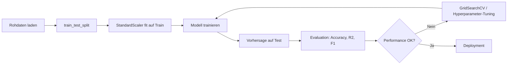
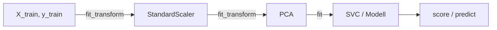

Das folgende Diagramm zeigt die typische scikit-learn ML-Pipeline von Rohdaten bis zur Evaluation.

*Kontext: Flowchart der Standard-ML-Pipeline: Daten → Split → Skalierung → Modell → Evaluation.*



---

## Daten aufteilen mit train_test_split

*Kontext: train_test_split teilt Datensätze in Trainings- und Testmengen auf, um eine unabhängige Evaluation der Modellperformance zu ermöglichen.*

Die Funktion `train_test_split` aus `sklearn.model_selection` trennt Features (X) und Zielvariable (y) zufällig in Trainings- und Testdaten. Der Parameter `test_size` bestimmt den Anteil der Testdaten (Standard: 25%). Mit `random_state` wird die Aufteilung reproduzierbar. Bei Klassifikationsaufgaben sorgt `stratify=y` dafür, dass die Klassenverteilung in beiden Mengen erhalten bleibt.

```python
# Daten aufteilen mit train_test_split
# Quelle: https://scikit-learn.org/stable/modules/generated/sklearn.model_selection.train_test_split.html
from sklearn.model_selection import train_test_split
from sklearn.datasets import load_iris

X, y = load_iris(return_X_y=True)

X_train, X_test, y_train, y_test = train_test_split(
    X, y, test_size=0.2, random_state=42, stratify=y
)

print(f"Trainingsset: {X_train.shape[0]} Samples")
print(f"Testset: {X_test.shape[0]} Samples")
```

---

## Feature-Skalierung mit StandardScaler

*Kontext: StandardScaler transformiert Features auf Mittelwert 0 und Standardabweichung 1 – essenziell für distanzbasierte Algorithmen wie KMeans, SVM oder PCA.*

Viele ML-Algorithmen sind sensitiv gegenüber unterschiedlichen Feature-Skalen. `StandardScaler` berechnet Mittelwert (μ) und Standardabweichung (σ) auf den Trainingsdaten und transformiert: z = (x − μ) / σ. Wichtig: Der Scaler wird nur auf Trainingsdaten gefittet und dann auf Test-/Produktionsdaten angewendet (kein Data Leakage).

```python
# Feature-Skalierung mit StandardScaler
# Quelle: https://scikit-learn.org/stable/modules/generated/sklearn.preprocessing.StandardScaler.html
from sklearn.preprocessing import StandardScaler
from sklearn.datasets import load_iris
from sklearn.model_selection import train_test_split

X, y = load_iris(return_X_y=True)
X_train, X_test, y_train, y_test = train_test_split(X, y, test_size=0.2, random_state=42)

scaler = StandardScaler()
X_train_scaled = scaler.fit_transform(X_train)  # fit + transform auf Trainingsdaten
X_test_scaled = scaler.transform(X_test)        # nur transform auf Testdaten

print(f"Mittelwert nach Skalierung (Train): {X_train_scaled.mean(axis=0).round(2)}")
print(f"Std nach Skalierung (Train): {X_train_scaled.std(axis=0).round(2)}")
```

---

## Lineare Regression mit LinearRegression

*Kontext: LinearRegression ist das Basismodell für Regressionsaufgaben und schätzt lineare Zusammenhänge zwischen Features und einer kontinuierlichen Zielvariable.*

`LinearRegression` minimiert die Summe der quadrierten Residuen (Ordinary Least Squares). Es ist schnell, interpretierbar und liefert Koeffizienten, die den Einfluss jedes Features quantifizieren. Für den Diabetes-Datensatz von scikit-learn wird der Krankheitsfortschritt vorhergesagt.

```python
# Lineare Regression mit LinearRegression
# Quelle: https://scikit-learn.org/stable/modules/generated/sklearn.linear_model.LinearRegression.html
from sklearn.linear_model import LinearRegression
from sklearn.datasets import load_diabetes
from sklearn.model_selection import train_test_split
from sklearn.metrics import mean_squared_error, r2_score

X, y = load_diabetes(return_X_y=True)
X_train, X_test, y_train, y_test = train_test_split(X, y, test_size=0.2, random_state=42)

model = LinearRegression()
model.fit(X_train, y_train)

y_pred = model.predict(X_test)

print(f"R²-Score: {r2_score(y_test, y_pred):.3f}")
print(f"RMSE: {mean_squared_error(y_test, y_pred, squared=False):.2f}")
print(f"Koeffizienten: {model.coef_.round(1)}")
```

---

## Klassifikation mit RandomForestClassifier

*Kontext: RandomForestClassifier ist ein Ensemble-Verfahren, das viele Entscheidungsbäume kombiniert und sich durch hohe Genauigkeit bei tabellarischen Daten und eingebaute Feature-Importance auszeichnet.*

Ein Random Forest trainiert mehrere Entscheidungsbäume auf zufälligen Teilmengen der Daten (Bagging) und Features (Feature Subsampling). Die finale Vorhersage entsteht durch Mehrheitsentscheid. Hyperparameter: `n_estimators` (Anzahl Bäume), `max_depth` (Baumtiefe), `min_samples_split`.

```python
# Klassifikation mit RandomForestClassifier
# Quelle: https://scikit-learn.org/stable/modules/generated/sklearn.ensemble.RandomForestClassifier.html
from sklearn.ensemble import RandomForestClassifier
from sklearn.datasets import load_wine
from sklearn.model_selection import train_test_split
from sklearn.metrics import classification_report

X, y = load_wine(return_X_y=True)
X_train, X_test, y_train, y_test = train_test_split(X, y, test_size=0.2, random_state=42)

clf = RandomForestClassifier(n_estimators=100, max_depth=5, random_state=42)
clf.fit(X_train, y_train)

y_pred = clf.predict(X_test)
print(classification_report(y_test, y_pred))

# Feature Importances
import pandas as pd
importances = pd.Series(clf.feature_importances_, index=load_wine().feature_names)
print("\nTop-5 wichtigste Features:")
print(importances.nlargest(5))
```

---

## Clustering mit KMeans

*Kontext: KMeans partitioniert Daten in k Cluster, indem es iterativ Clusterzentren verschiebt, bis die Intra-Cluster-Varianz minimal ist – typisch für Kundensegmentierung.*

KMeans erfordert die Angabe der Clusteranzahl k. Der Algorithmus initialisiert k Zentroide (default: k-means++), ordnet jeden Punkt dem nächsten Zentroid zu und aktualisiert die Zentroide. Die Elbow-Methode hilft, das optimale k zu finden.

```python
# Clustering mit KMeans
# Quelle: https://scikit-learn.org/stable/modules/generated/sklearn.cluster.KMeans.html
from sklearn.cluster import KMeans
from sklearn.preprocessing import StandardScaler
from sklearn.datasets import make_blobs
import matplotlib.pyplot as plt

# Synthetische Daten mit 4 Clustern
X, _ = make_blobs(n_samples=300, centers=4, cluster_std=0.8, random_state=42)
X_scaled = StandardScaler().fit_transform(X)

# Elbow-Methode
inertias = []
K_range = range(2, 10)
for k in K_range:
    km = KMeans(n_clusters=k, random_state=42, n_init=10)
    km.fit(X_scaled)
    inertias.append(km.inertia_)

# Finales Modell
kmeans = KMeans(n_clusters=4, random_state=42, n_init=10)
labels = kmeans.fit_predict(X_scaled)

print(f"Cluster-Größen: {[list(labels).count(i) for i in range(4)]}")
print(f"Inertia: {kmeans.inertia_:.2f}")
```

---

## Dimensionsreduktion mit PCA

*Kontext: PCA (Principal Component Analysis) reduziert die Dimensionalität von Daten, indem es die Achsen maximaler Varianz findet – nützlich für Visualisierung und als Vorverarbeitung.*

PCA transformiert korrelierte Features in unkorrelierte Hauptkomponenten. Die erste Komponente erklärt die meiste Varianz, die zweite die zweitmeiste (orthogonal zur ersten), usw. Mit `n_components` wird festgelegt, wie viele Komponenten behalten werden.

```python
# Dimensionsreduktion mit PCA
# Quelle: https://scikit-learn.org/stable/modules/generated/sklearn.decomposition.PCA.html
from sklearn.decomposition import PCA
from sklearn.preprocessing import StandardScaler
from sklearn.datasets import load_iris

X, y = load_iris(return_X_y=True)
X_scaled = StandardScaler().fit_transform(X)

pca = PCA(n_components=2)
X_pca = pca.fit_transform(X_scaled)

print(f"Erklärte Varianz pro Komponente: {pca.explained_variance_ratio_.round(3)}")
print(f"Kumulierte erklärte Varianz: {pca.explained_variance_ratio_.sum():.3f}")
print(f"Originalform: {X_scaled.shape} → Reduzierte Form: {X_pca.shape}")
```

---

## Pipeline: Preprocessing und Modell verketten

*Kontext: Eine Pipeline verkettet Preprocessing-Schritte und Modell in ein einziges Objekt – verhindert Data Leakage und vereinfacht Deployment und Hyperparameter-Tuning.*

`sklearn.pipeline.Pipeline` führt Schritte sequentiell aus: Alle Zwischenschritte müssen `fit` und `transform` implementieren, der letzte Schritt muss nur `fit` implementieren. Bei `pipeline.fit(X_train, y_train)` wird jeder Transformer gefittet und transformiert, bevor die Daten an den nächsten Schritt weitergegeben werden.

Das folgende Diagramm visualisiert den Datenfluss innerhalb einer sklearn Pipeline.

*Kontext: Flowchart des sequentiellen Datenflusses durch Pipeline-Schritte bei fit und predict.*



```python
# Pipeline: Preprocessing und Modell verketten
# Quelle: https://scikit-learn.org/stable/modules/generated/sklearn.pipeline.Pipeline.html
from sklearn.pipeline import Pipeline
from sklearn.preprocessing import StandardScaler
from sklearn.decomposition import PCA
from sklearn.svm import SVC
from sklearn.datasets import load_iris
from sklearn.model_selection import train_test_split

X, y = load_iris(return_X_y=True)
X_train, X_test, y_train, y_test = train_test_split(X, y, test_size=0.2, random_state=42)

pipe = Pipeline([
    ('scaler', StandardScaler()),
    ('pca', PCA(n_components=2)),
    ('svc', SVC(kernel='rbf', C=1.0))
])

pipe.fit(X_train, y_train)
score = pipe.score(X_test, y_test)
print(f"Pipeline Accuracy: {score:.3f}")
print(f"Schritte: {[name for name, _ in pipe.steps]}")
```

---

## Hyperparameter-Tuning mit GridSearchCV

*Kontext: GridSearchCV durchsucht systematisch ein Raster von Hyperparameter-Kombinationen mit Kreuzvalidierung und findet die optimale Konfiguration für ein Modell.*

`GridSearchCV` trainiert das Modell für jede Parameterkombination im definierten Grid und bewertet jede Kombination mit k-facher Kreuzvalidierung. Das Ergebnis ist die beste Parameterkombination (`best_params_`) und der zugehörige Score (`best_score_`). Kombiniert mit einer Pipeline wird sichergestellt, dass Preprocessing korrekt in jede Fold eingebettet ist.

```python
# Hyperparameter-Tuning mit GridSearchCV
# Quelle: https://scikit-learn.org/stable/modules/generated/sklearn.model_selection.GridSearchCV.html
from sklearn.model_selection import GridSearchCV
from sklearn.pipeline import Pipeline
from sklearn.preprocessing import StandardScaler
from sklearn.ensemble import RandomForestClassifier
from sklearn.datasets import load_wine
from sklearn.model_selection import train_test_split

X, y = load_wine(return_X_y=True)
X_train, X_test, y_train, y_test = train_test_split(X, y, test_size=0.2, random_state=42)

pipe = Pipeline([
    ('scaler', StandardScaler()),
    ('rf', RandomForestClassifier(random_state=42))
])

param_grid = {
    'rf__n_estimators': [50, 100, 200],
    'rf__max_depth': [3, 5, 10, None],
}

grid_search = GridSearchCV(pipe, param_grid, cv=5, scoring='accuracy', n_jobs=-1)
grid_search.fit(X_train, y_train)

print(f"Beste Parameter: {grid_search.best_params_}")
print(f"Bester CV-Score: {grid_search.best_score_:.3f}")
print(f"Test-Score: {grid_search.score(X_test, y_test):.3f}")
```

---

## Metriken: Modellbewertung für Klassifikation und Regression

*Kontext: Die Wahl der richtigen Metrik hängt vom Problem ab – Accuracy allein ist bei unbalancierten Klassen irreführend, R² allein bei Regression nicht ausreichend.*

### Klassifikationsmetriken

Dieses Beispiel zeigt die wichtigsten Metriken für binäre Klassifikation: Accuracy, Precision, Recall, F1-Score und AUC-ROC. Bei unbalancierten Daten (z.B. 95% Klasse 0, 5% Klasse 1) ist die AUC-ROC oder der F1-Score informativer als die Accuracy.

```python
# Klassifikationsmetriken
# Quelle: https://scikit-learn.org/stable/modules/model_evaluation.html
from sklearn.metrics import (
    accuracy_score, precision_score, recall_score,
    f1_score, roc_auc_score, confusion_matrix
)
from sklearn.datasets import make_classification
from sklearn.model_selection import train_test_split
from sklearn.ensemble import RandomForestClassifier

X, y = make_classification(n_samples=1000, n_classes=2, weights=[0.9, 0.1], random_state=42)
X_train, X_test, y_train, y_test = train_test_split(X, y, test_size=0.2, random_state=42)

clf = RandomForestClassifier(n_estimators=100, random_state=42)
clf.fit(X_train, y_train)
y_pred = clf.predict(X_test)
y_proba = clf.predict_proba(X_test)[:, 1]

print(f"Accuracy:  {accuracy_score(y_test, y_pred):.3f}")
print(f"Precision: {precision_score(y_test, y_pred):.3f}")
print(f"Recall:    {recall_score(y_test, y_pred):.3f}")
print(f"F1-Score:  {f1_score(y_test, y_pred):.3f}")
print(f"AUC-ROC:   {roc_auc_score(y_test, y_proba):.3f}")
print(f"\nConfusion Matrix:\n{confusion_matrix(y_test, y_pred)}")
```

### Regressionsmetriken

Für Regressionsmodelle sind MAE (Mean Absolute Error), RMSE (Root Mean Squared Error) und R² die wichtigsten Kennzahlen. R² gibt an, welcher Anteil der Varianz durch das Modell erklärt wird (1.0 = perfekt, 0.0 = so gut wie der Mittelwert).

```python
# Regressionsmetriken
# Quelle: https://scikit-learn.org/stable/modules/model_evaluation.html#regression-metrics
from sklearn.metrics import mean_absolute_error, mean_squared_error, r2_score
from sklearn.datasets import load_diabetes
from sklearn.model_selection import train_test_split
from sklearn.linear_model import Ridge

X, y = load_diabetes(return_X_y=True)
X_train, X_test, y_train, y_test = train_test_split(X, y, test_size=0.2, random_state=42)

model = Ridge(alpha=1.0)
model.fit(X_train, y_train)
y_pred = model.predict(X_test)

print(f"MAE:  {mean_absolute_error(y_test, y_pred):.2f}")
print(f"RMSE: {mean_squared_error(y_test, y_pred, squared=False):.2f}")
print(f"R²:   {r2_score(y_test, y_pred):.3f}")
```
