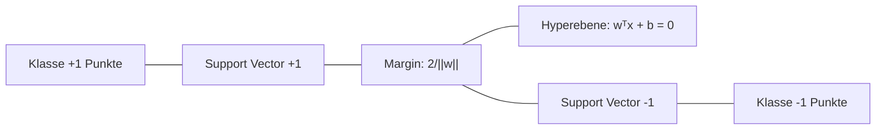
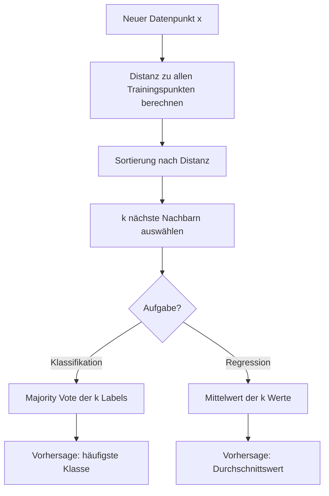

## Support Vector Machines: Grundprinzip

*Kontext: Funktionsweise von SVMs als Klassifikations- und Regressionsverfahren basierend auf der Maximum-Margin-Idee.*

Support Vector Machines (SVMs) sind überwachte Lernverfahren, die eine optimale Trennebene (Hyperebene) im Feature-Raum finden. Das zentrale Prinzip ist die Maximierung des Margins – des Abstands zwischen der Entscheidungsgrenze und den nächstgelegenen Datenpunkten jeder Klasse (den sogenannten Support Vectors).

### Hyperebene und Margin

Eine Hyperebene in einem p-dimensionalen Raum ist definiert durch:

w^T · x + b = 0

- **w**: Normalenvektor der Hyperebene (bestimmt die Orientierung)
- **b**: Bias-Term (Verschiebung vom Ursprung)
- **Margin**: 2 / ||w|| – der Abstand zwischen den beiden parallelen Hyperebenen w^T·x + b = ±1

Das Optimierungsproblem lautet: Minimiere ½ · ||w||² unter der Bedingung, dass alle Trainingspunkte korrekt klassifiziert werden (yᵢ(w^T·xᵢ + b) ≥ 1).

Das folgende Diagramm veranschaulicht das Konzept der Hyperebene mit Maximum Margin und den Support Vectors.

*Kontext: Schema der SVM-Entscheidungsgrenze mit Margin-Bereich und Support Vectors.*



### Support Vectors

Nur die Datenpunkte, die auf dem Margin liegen oder innerhalb davon, beeinflussen die Entscheidungsgrenze. Diese Punkte heißen Support Vectors. Alle anderen Trainingspunkte könnten entfernt werden, ohne das Modell zu ändern – das macht SVMs speichereffizient.

---

## SVM: Der Parameter C (Soft Margin)

*Kontext: Rolle des Regularisierungsparameters C bei der Balance zwischen Margin-Breite und Klassifikationsfehlern.*

In der Praxis sind Daten selten perfekt linear trennbar. Der Soft-Margin-Ansatz erlaubt Fehlklassifikationen durch Einführung von Slack-Variablen ξᵢ:

Minimiere: ½ · ||w||² + C · Σᵢ ξᵢ

### Einfluss von C

- **Großes C**: Geringe Toleranz für Fehler → schmaler Margin, weniger Fehlklassifikationen auf Trainingsdaten, aber Gefahr von Overfitting
- **Kleines C**: Mehr Regularisierung → breiter Margin, mehr Fehlklassifikationen erlaubt, bessere Generalisierung
- C wirkt als inverser Regularisierungsparameter (vergleichbar mit 1/α bei Ridge)

### Praktische Empfehlung

- Default in scikit-learn: `C=1.0`
- Optimale Wahl über `GridSearchCV` mit logarithmisch verteilten Werten (z. B. 0.01, 0.1, 1, 10, 100)
- Bei verrauschten Daten: kleineres C wählen

---

## SVM: Kernel-Trick

*Kontext: Wie der Kernel-Trick es SVMs ermöglicht, nicht-lineare Entscheidungsgrenzen zu lernen, ohne den hochdimensionalen Raum explizit zu berechnen.*

Viele reale Daten sind nicht linear trennbar. Der Kernel-Trick bildet die Daten implizit in einen höherdimensionalen Feature-Raum ab, in dem eine lineare Trennung möglich wird – ohne die Transformation explizit zu berechnen.

### Mathematisches Prinzip

Statt die Transformation φ(x) direkt zu berechnen, nutzt der Kernel-Trick eine Kernel-Funktion K(xᵢ, xⱼ) = φ(xᵢ)^T · φ(xⱼ), die das Skalarprodukt im höherdimensionalen Raum berechnet, ohne φ jemals explizit auszuführen.

Das folgende Diagramm veranschaulicht, wie der Kernel-Trick Daten implizit in einen höherdimensionalen Raum transformiert.

*Kontext: Ablauf des Kernel-Tricks – von nicht-linear trennbaren Daten zur linearen Trennung im Feature-Raum.*


### Verfügbare Kernel in scikit-learn

| Kernel | Formel | Parameter |
|--------|--------|-----------|
| Linear | ⟨x, x'⟩ | – |
| Polynomial | (γ⟨x, x'⟩ + r)^d | `degree`, `coef0`, `gamma` |
| RBF (Gaussian) | exp(−γ \|\|x−x'\|\|²) | `gamma` |
| Sigmoid | tanh(γ⟨x, x'⟩ + r) | `gamma`, `coef0` |

### RBF-Kernel und der Parameter gamma

Der RBF-Kernel (Radial Basis Function) ist der am häufigsten verwendete nicht-lineare Kernel:

K(x, x') = exp(−γ · ||x − x'||²)

- **Großes gamma**: Jeder Trainingspunkt hat nur lokalen Einfluss → komplexe Entscheidungsgrenze, Overfitting-Gefahr
- **Kleines gamma**: Weiter Einflussbereich jedes Punktes → glattere Entscheidungsgrenze, Underfitting-Gefahr
- gamma und C müssen gemeinsam optimiert werden (`GridSearchCV` mit exponentiell verteilten Werten)

```python
# Quelle: scikit-learn.org/stable/modules/svm.html
from sklearn.svm import SVC
from sklearn.preprocessing import StandardScaler
from sklearn.pipeline import make_pipeline

# Skalierung ist bei SVMs essentiell!
clf = make_pipeline(
    StandardScaler(),
    SVC(kernel='rbf', C=1.0, gamma='scale')
)
clf.fit(X_train, y_train)
```

---

## SVM: Anwendungsfälle und Einschränkungen

*Kontext: Praktische Stärken und Limitierungen von SVMs bezüglich Skalierbarkeit, Interpretierbarkeit und Datentypen.*

### Vorteile

- Effektiv in hochdimensionalen Räumen (auch wenn n_features > n_samples)
- Speichereffizient: Nur Support Vectors werden gespeichert
- Vielseitig durch verschiedene Kernel-Funktionen
- Theoretisch fundiert durch statistische Lerntheorie (VC-Dimension)
- Gute Generalisierung durch Maximum-Margin-Prinzip

### Einschränkungen

- **Skalierbarkeit**: Trainingszeit O(n_features × n_samples²) bis O(n_features × n_samples³) – ungeeignet für sehr große Datensätze (>100.000 Samples)
- **Feature-Skalierung zwingend erforderlich**: SVMs sind nicht skaleninvariant
- **Keine direkte Wahrscheinlichkeitsausgabe**: `predict_proba` erfordert aufwändige Platt-Skalierung via 5-Fold-CV
- **Schwierige Hyperparameter-Optimierung**: C und gamma müssen sorgfältig getuned werden
- **Kein nativer Umgang mit fehlenden Werten**
- **Black-Box bei nicht-linearen Kernels**: Schwer zu interpretieren

### Typische Anwendungsfälle

- Textklassifikation (hochdimensional, wenige Samples pro Feature)
- Bildklassifikation (mit Feature-Extraktion)
- Bioinformatik (Genomdaten mit vielen Features)
- Anomalieerkennung (`OneClassSVM`)

---

## K-Nearest Neighbors: Grundprinzip

*Kontext: Funktionsweise von KNN als instanzbasiertes, nicht-parametrisches Lernverfahren für Klassifikation und Regression.*

K-Nearest Neighbors (KNN) ist ein nicht-parametrischer, instanzbasierter Algorithmus. Er speichert alle Trainingsdaten und trifft Vorhersagen basierend auf der Nachbarschaft eines neuen Datenpunktes – es wird kein explizites Modell gelernt.

### Funktionsweise

1. Berechne die Distanz vom neuen Punkt zu allen Trainingspunkten
2. Wähle die k nächsten Nachbarn
3. **Klassifikation**: Mehrheitsvotum der k Nachbarn
4. **Regression**: Durchschnitt (oder gewichteter Durchschnitt) der k Nachbar-Werte

Das folgende Diagramm zeigt den schrittweisen Ablauf einer KNN-Klassifikation.

*Kontext: Workflow der KNN-Vorhersage – von Distanzberechnung über Nachbarauswahl bis zum Votum.*



### Distanzmetriken

| Metrik | Formel | Anwendung |
|--------|--------|-----------|
| Euklidisch (L2) | √(Σ(xᵢ − yᵢ)²) | Standard, stetige Features |
| Manhattan (L1) | Σ\|xᵢ − yᵢ\| | Robuster bei Ausreißern |
| Minkowski (Lp) | (Σ\|xᵢ − yᵢ\|^p)^(1/p) | Generalisierung (p=2: Euklidisch, p=1: Manhattan) |
| Chebyshev (L∞) | max(\|xᵢ − yᵢ\|) | Maximum-Differenz |
| Cosine | 1 − (x·y)/(||x||·||y||) | Textdaten, normierte Vektoren |

```python
# Quelle: scikit-learn.org/stable/modules/neighbors.html
from sklearn.neighbors import KNeighborsClassifier

knn = KNeighborsClassifier(
    n_neighbors=5,
    weights='distance',  # nähere Nachbarn zählen stärker
    metric='minkowski',
    p=2  # Euklidische Distanz
)
knn.fit(X_train, y_train)
```

---

## KNN: Wahl von k

*Kontext: Einfluss des Hyperparameters k auf Bias, Varianz und Modellkomplexität bei KNN.*

Der Parameter k (Anzahl der Nachbarn) ist der zentrale Hyperparameter von KNN und steuert die Balance zwischen Bias und Varianz:

### Kleines k (z. B. k=1)

- Sehr flexible Entscheidungsgrenze
- Hohe Varianz, niedriger Bias
- Anfällig für Rauschen und Ausreißer (ein einzelner verrauschter Punkt bestimmt die Vorhersage)
- Overfitting-Gefahr

### Großes k (z. B. k=50)

- Glattere Entscheidungsgrenze
- Niedriger Varianz, aber höherer Bias
- Unterdrückt Rauschen, verwischt aber auch feine Klassenstrukturen
- Underfitting-Gefahr bei zu großem k

### Praktische Empfehlungen

- Häufiger Startwert: k = √n_samples (gerundet auf ungerade Zahl)
- Ungerade k bei binärer Klassifikation vermeidet Stimmengleichheit
- Optimales k über Kreuzvalidierung bestimmen
- `weights='distance'` kann die Sensitivität gegenüber großem k reduzieren (nahe Nachbarn zählen stärker)

---

## KNN: Curse of Dimensionality

*Kontext: Warum KNN in hochdimensionalen Feature-Räumen versagt und welche Gegenmaßnahmen möglich sind.*

Die Curse of Dimensionality (Fluch der Dimensionalität) ist das zentrale Problem von KNN und allen distanzbasierten Methoden in hochdimensionalen Räumen.

### Das Problem

Mit steigender Dimensionszahl D geschieht Folgendes:

- Alle Datenpunkte werden nahezu gleich weit voneinander entfernt
- Die Unterschiede zwischen nächstem und entferntestem Nachbar verschwinden
- Der Informationsgehalt der „nächsten Nachbarn" sinkt drastisch
- Das benötigte Datenvolumen wächst exponentiell mit der Dimension

### Konkretes Beispiel

In einem D-dimensionalen Einheitswürfel muss man einen Anteil von (k/n)^(1/D) der Seitenlänge abdecken, um k Nachbarn zu finden. Bei D=100 und k/n=0.01 bedeutet das 0.01^(1/100) ≈ 0.955 – man braucht 95.5% der Seitenlänge in jeder Dimension, d. h. der „lokale" Nachbar ist fast global.

### Gegenmaßnahmen

- **Dimensionsreduktion** vor KNN: PCA, Feature Selection, UMAP
- **Feature-Skalierung** ist zwingend (gleiche Skalen für alle Features)
- scikit-learn wechselt automatisch zu Brute-Force bei D > 15, da KD-Trees ineffizient werden
- Alternative Algorithmen (SVM, Random Forest) sind oft besser für hochdimensionale Daten

---

## KNN: Anwendungsfälle und Einschränkungen

*Kontext: Wann KNN gut geeignet ist und wo seine praktischen Grenzen liegen.*

### Vorteile

- Extrem einfacher Algorithmus, leicht zu verstehen und zu implementieren
- Keine Trainingsphase nötig (Lazy Learning) – neue Daten können sofort integriert werden
- Kann beliebig komplexe Entscheidungsgrenzen abbilden
- Natürlich für Multi-Class-Probleme geeignet
- Gut als Baseline-Modell

### Einschränkungen

- **Vorhersagezeit**: O(D · N) für Brute-Force – langsam bei großen Datensätzen
- **Speicherbedarf**: Alle Trainingsdaten müssen gespeichert werden
- **Curse of Dimensionality**: Funktioniert schlecht bei vielen Features (D > 20 problematisch)
- **Feature-Skalierung zwingend**: Ohne Normalisierung dominieren Features mit großen Wertebereichen
- **Kein echtes Modell**: Keine Einsichten in Zusammenhänge, keine Feature Importance
- **Sensitiv gegenüber irrelevanten Features**: Jedes Feature beeinflusst die Distanz gleichermaßen

### Typische Anwendungsfälle

- Empfehlungssysteme (ähnliche Nutzer/Produkte finden)
- Imputation fehlender Werte (`KNNImputer` in scikit-learn)
- Anomalieerkennung über Distanz zum k-ten Nachbarn
- Niedrigdimensionale Klassifikationsprobleme mit unregelmäßigen Entscheidungsgrenzen

### Beschleunigung durch Datenstrukturen

scikit-learn bietet drei Algorithmen zur Nachbarsuche:

- **KD-Tree**: Effizient für D < 20, O(D · log(N)) Query-Zeit
- **Ball Tree**: Besser für höhere Dimensionen und strukturierte Daten
- **Brute Force**: Optimal für kleine N oder hohe D

```python
# Quelle: scikit-learn.org/stable/modules/neighbors.html
from sklearn.neighbors import KNeighborsClassifier

# Automatische Algorithmus-Wahl
knn = KNeighborsClassifier(n_neighbors=5, algorithm='auto')
knn.fit(X_train, y_train)
print(f"Accuracy: {knn.score(X_test, y_test):.3f}")
```
