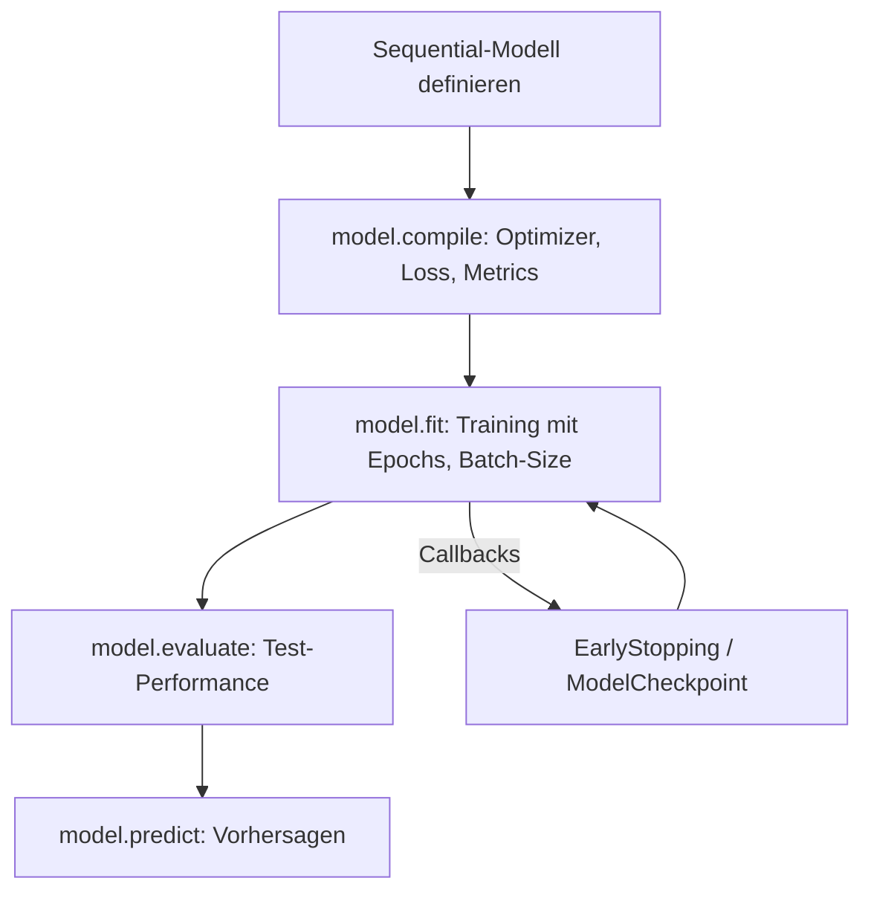
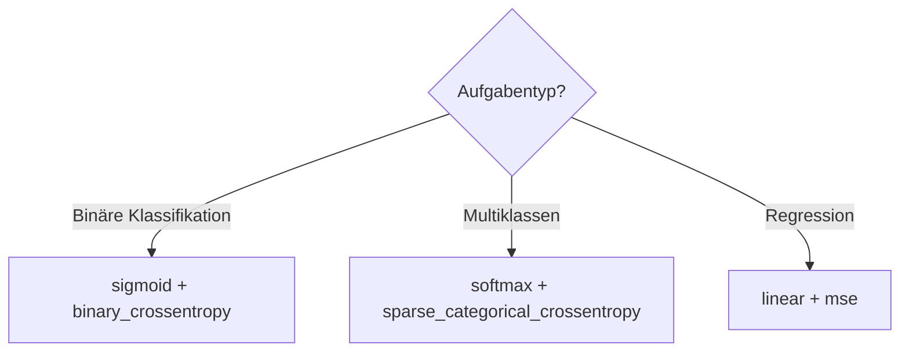

Das folgende Diagramm zeigt den typischen Keras-Workflow von der Modelldefinition bis zur Vorhersage.

*Kontext: Flowchart des Keras-Workflows: Sequential bauen → compile → fit → evaluate → predict.*



---

## Sequential-Modell erstellen und verstehen

*Kontext: Das Sequential-Modell ist der einfachste Weg, ein neuronales Netz in Keras aufzubauen – es stapelt Layer linear übereinander und eignet sich für die meisten Standard-Architekturen.*

Ein `Sequential`-Modell ist eine lineare Abfolge von Layern, wobei jeder Layer genau einen Input und einen Output hat. Layer werden mit einer Liste im Konstruktor oder nacheinander via `model.add()` hinzugefügt. Das Modell wird erst „gebaut", wenn es zum ersten Mal Daten sieht oder ein `Input`-Layer angegeben wird.

```python
# Sequential-Modell erstellen
# Quelle: https://keras.io/guides/sequential_model/
import tensorflow as tf
from tensorflow import keras
from tensorflow.keras import layers

# Variante 1: Layer als Liste übergeben
model = keras.Sequential([
    keras.Input(shape=(784,)),
    layers.Dense(128, activation='relu', name='hidden_1'),
    layers.Dense(64, activation='relu', name='hidden_2'),
    layers.Dense(10, activation='softmax', name='output')
])

model.summary()

# Variante 2: Inkrementell mit add()
model2 = keras.Sequential(name="mein_modell")
model2.add(keras.Input(shape=(784,)))
model2.add(layers.Dense(128, activation='relu'))
model2.add(layers.Dense(10, activation='softmax'))

print(f"Anzahl Layer: {len(model.layers)}")
print(f"Output-Shape: {model.output_shape}")
```

---

## Dense-Layer und Aktivierungsfunktionen

*Kontext: Der Dense-Layer (vollständig verbundene Schicht) ist der Standard-Baustein neuronaler Netze – die Wahl der Aktivierungsfunktion bestimmt, welche Nichtlinearitäten das Netz lernen kann.*

Ein `Dense`-Layer berechnet: output = activation(dot(input, kernel) + bias). Die Aktivierungsfunktion entscheidet über das Verhalten der Neuronen:

| Aktivierung | Verwendung | Wertebereich |
|---|---|---|
| `relu` | Hidden Layers (Standard) | [0, ∞) |
| `sigmoid` | Binäre Klassifikation (Output) | (0, 1) |
| `softmax` | Multiklassen-Klassifikation (Output) | (0, 1), Summe = 1 |
| `linear` | Regression (Output) | (-∞, +∞) |
| `tanh` | Hidden Layers (Alternative) | (-1, 1) |

```python
# Dense-Layer mit verschiedenen Aktivierungsfunktionen
# Quelle: https://keras.io/api/layers/core_layers/dense/
import tensorflow as tf
from tensorflow import keras
from tensorflow.keras import layers
import numpy as np

# Modell für binäre Klassifikation
model_binary = keras.Sequential([
    keras.Input(shape=(20,)),
    layers.Dense(64, activation='relu'),
    layers.Dense(32, activation='relu'),
    layers.Dense(1, activation='sigmoid')  # Output: Wahrscheinlichkeit [0,1]
])

# Modell für Multiklassen-Klassifikation (10 Klassen)
model_multi = keras.Sequential([
    keras.Input(shape=(20,)),
    layers.Dense(64, activation='relu'),
    layers.Dense(10, activation='softmax')  # Output: Wahrscheinlichkeitsverteilung
])

# Modell für Regression
model_regression = keras.Sequential([
    keras.Input(shape=(20,)),
    layers.Dense(64, activation='relu'),
    layers.Dense(1, activation='linear')  # Output: beliebiger reeller Wert
])

# Test-Vorhersage
test_input = np.random.random((1, 20))
print(f"Binär-Output: {model_binary.predict(test_input, verbose=0)[0][0]:.4f}")
print(f"Multi-Output: {model_multi.predict(test_input, verbose=0)[0].round(3)}")
print(f"Regression-Output: {model_regression.predict(test_input, verbose=0)[0][0]:.4f}")
```

---

## Compile: Loss-Funktion, Optimizer und Metriken konfigurieren

*Kontext: model.compile() konfiguriert den Trainingsprozess – die Wahl von Loss-Funktion und Optimizer ist entscheidend für Konvergenz und Modellqualität.*

Die `compile()`-Methode legt fest:
- **optimizer**: Wie die Gewichte aktualisiert werden (SGD, Adam, RMSprop).
- **loss**: Welche Fehlerfunktion minimiert wird.
- **metrics**: Welche Kennzahlen während des Trainings protokolliert werden.

| Aufgabe | Loss-Funktion | Output-Aktivierung |
|---|---|---|
| Binäre Klassifikation | `binary_crossentropy` | `sigmoid` |
| Multiklassen (Integer-Labels) | `sparse_categorical_crossentropy` | `softmax` |
| Multiklassen (One-Hot-Labels) | `categorical_crossentropy` | `softmax` |
| Regression | `mse` oder `mae` | `linear` |

Das folgende Diagramm zeigt die Zuordnung von Aufgabentyp zu passender Loss-Funktion und Output-Aktivierung.

*Kontext: Flowchart zur Auswahl der richtigen Loss-Funktion und Aktivierung je nach Aufgabentyp.*



```python
# Compile-Konfiguration für verschiedene Aufgaben
# Quelle: https://www.tensorflow.org/guide/keras/training_with_built_in_methods
import tensorflow as tf
from tensorflow import keras
from tensorflow.keras import layers

# Multiklassen-Klassifikation mit Integer-Labels
model = keras.Sequential([
    keras.Input(shape=(784,)),
    layers.Dense(128, activation='relu'),
    layers.Dense(10, activation='softmax')
])

model.compile(
    optimizer=keras.optimizers.Adam(learning_rate=0.001),
    loss='sparse_categorical_crossentropy',
    metrics=['accuracy']
)

# Regression
model_reg = keras.Sequential([
    keras.Input(shape=(13,)),
    layers.Dense(64, activation='relu'),
    layers.Dense(1)
])

model_reg.compile(
    optimizer='adam',
    loss='mse',
    metrics=['mae']
)

print("Klassifikation - Loss:", model.loss)
print("Regression - Loss:", model_reg.loss)
```

---

## MNIST-Klassifikation: Komplettes Trainingsbeispiel

*Kontext: Das MNIST-Dataset (handgeschriebene Ziffern 0–9) ist das klassische Einsteigerprojekt für Deep Learning – dieses Beispiel zeigt den vollständigen Workflow von Datenladung bis Evaluation.*

MNIST enthält 60.000 Trainings- und 10.000 Testbilder (28×28 Pixel, Graustufen). Die Bilder werden zu Vektoren der Länge 784 geflacht und auf [0, 1] normalisiert. Ein einfaches Netz mit zwei Hidden Layern erreicht bereits >97% Accuracy.

```python
# MNIST-Klassifikation: Vollständiges Beispiel
# Quelle: https://www.tensorflow.org/guide/keras/training_with_built_in_methods
import tensorflow as tf
from tensorflow import keras
from tensorflow.keras import layers

# 1. Daten laden und vorbereiten
(x_train, y_train), (x_test, y_test) = keras.datasets.mnist.load_data()

# Bilder flatten (28x28 -> 784) und normalisieren (0-255 -> 0-1)
x_train = x_train.reshape(60000, 784).astype('float32') / 255.0
x_test = x_test.reshape(10000, 784).astype('float32') / 255.0

# Validierungsdaten abspalten
x_val = x_train[-10000:]
y_val = y_train[-10000:]
x_train = x_train[:-10000]
y_train = y_train[:-10000]

# 2. Modell definieren
model = keras.Sequential([
    keras.Input(shape=(784,)),
    layers.Dense(128, activation='relu'),
    layers.Dropout(0.2),
    layers.Dense(64, activation='relu'),
    layers.Dropout(0.2),
    layers.Dense(10, activation='softmax')
])

# 3. Compile
model.compile(
    optimizer='adam',
    loss='sparse_categorical_crossentropy',
    metrics=['accuracy']
)

# 4. Training mit Validierung
history = model.fit(
    x_train, y_train,
    batch_size=64,
    epochs=5,
    validation_data=(x_val, y_val)
)

# 5. Evaluation auf Testdaten
test_loss, test_acc = model.evaluate(x_test, y_test, verbose=0)
print(f"\nTest-Accuracy: {test_acc:.4f}")
print(f"Test-Loss: {test_loss:.4f}")

# 6. Vorhersage für einzelne Samples
predictions = model.predict(x_test[:5], verbose=0)
import numpy as np
print(f"Vorhergesagte Klassen: {np.argmax(predictions, axis=1)}")
print(f"Tatsächliche Klassen:  {y_test[:5]}")
```

---

## Einfache Regression mit Keras

*Kontext: Neuronale Netze können auch Regressionsprobleme lösen – hier wird die Boston-Housing-äquivalente California-Housing-Aufgabe als Beispiel genutzt.*

Bei Regression ist der Output-Layer ein einzelnes Neuron ohne Aktivierung (linear). Als Loss-Funktion wird MSE (Mean Squared Error) oder MAE (Mean Absolute Error) verwendet. Die Features sollten normalisiert werden, damit das Training stabil konvergiert.

```python
# Regression mit Keras: California Housing
# Quelle: https://www.tensorflow.org/guide/keras/training_with_built_in_methods
import tensorflow as tf
from tensorflow import keras
from tensorflow.keras import layers
import numpy as np
from sklearn.datasets import fetch_california_housing
from sklearn.model_selection import train_test_split
from sklearn.preprocessing import StandardScaler

# 1. Daten laden und vorbereiten
data = fetch_california_housing()
X, y = data.data, data.target

X_train, X_test, y_train, y_test = train_test_split(X, y, test_size=0.2, random_state=42)

# Feature-Normalisierung
scaler = StandardScaler()
X_train = scaler.fit_transform(X_train)
X_test = scaler.transform(X_test)

# 2. Modell definieren
model = keras.Sequential([
    keras.Input(shape=(X_train.shape[1],)),
    layers.Dense(64, activation='relu'),
    layers.Dense(32, activation='relu'),
    layers.Dense(1)  # Linearer Output für Regression
])

# 3. Compile mit MSE-Loss
model.compile(
    optimizer=keras.optimizers.Adam(learning_rate=0.001),
    loss='mse',
    metrics=['mae']
)

# 4. Training
history = model.fit(
    X_train, y_train,
    batch_size=32,
    epochs=50,
    validation_split=0.2,
    verbose=0
)

# 5. Evaluation
test_mse, test_mae = model.evaluate(X_test, y_test, verbose=0)
print(f"Test MSE: {test_mse:.4f}")
print(f"Test MAE: {test_mae:.4f} (in 100k USD)")

# 6. Vorhersage
y_pred = model.predict(X_test[:5], verbose=0).flatten()
print(f"\nVorhergesagt: {y_pred.round(2)}")
print(f"Tatsächlich:  {y_test[:5].round(2)}")
```

---

## Optimizer-Vergleich: SGD vs. Adam vs. RMSprop

*Kontext: Die Wahl des Optimizers beeinflusst Trainingsgeschwindigkeit und Konvergenz erheblich – Adam ist der robuste Standard, SGD mit Momentum kann bei richtigem Tuning bessere Generalisierung liefern.*

| Optimizer | Eigenschaften | Typische Lernrate |
|---|---|---|
| `SGD` | Einfach, braucht oft Learning-Rate-Scheduling | 0.01–0.1 |
| `SGD(momentum=0.9)` | Beschleunigt Konvergenz, glättet Updates | 0.01–0.1 |
| `Adam` | Adaptiv, robust, guter Standard | 0.001 |
| `RMSprop` | Adaptiv, gut für RNNs | 0.001 |

```python
# Optimizer-Vergleich auf MNIST
# Quelle: https://www.tensorflow.org/guide/keras/training_with_built_in_methods
import tensorflow as tf
from tensorflow import keras
from tensorflow.keras import layers
import numpy as np

(x_train, y_train), (x_test, y_test) = keras.datasets.mnist.load_data()
x_train = x_train.reshape(-1, 784).astype('float32') / 255.0
x_test = x_test.reshape(-1, 784).astype('float32') / 255.0

def build_model():
    return keras.Sequential([
        keras.Input(shape=(784,)),
        layers.Dense(64, activation='relu'),
        layers.Dense(10, activation='softmax')
    ])

optimizers = {
    'SGD': keras.optimizers.SGD(learning_rate=0.01),
    'SGD+Momentum': keras.optimizers.SGD(learning_rate=0.01, momentum=0.9),
    'Adam': keras.optimizers.Adam(learning_rate=0.001),
    'RMSprop': keras.optimizers.RMSprop(learning_rate=0.001),
}

results = {}
for name, opt in optimizers.items():
    model = build_model()
    model.compile(optimizer=opt, loss='sparse_categorical_crossentropy', metrics=['accuracy'])
    model.fit(x_train, y_train, epochs=3, batch_size=128, verbose=0)
    _, acc = model.evaluate(x_test, y_test, verbose=0)
    results[name] = acc
    print(f"{name:15s} → Test-Accuracy: {acc:.4f}")
```

---

## Callbacks: EarlyStopping und ModelCheckpoint

*Kontext: Callbacks steuern das Trainingsverhalten – EarlyStopping verhindert Overfitting durch frühzeitiges Stoppen, ModelCheckpoint sichert das beste Modell automatisch.*

Callbacks werden als Liste an `model.fit()` übergeben. `EarlyStopping` überwacht eine Metrik (z.B. `val_loss`) und stoppt das Training, wenn sich diese über eine bestimmte Anzahl Epochen (`patience`) nicht verbessert. `ModelCheckpoint` speichert das Modell nach jeder Verbesserung.

```python
# Callbacks: EarlyStopping und ModelCheckpoint
# Quelle: https://www.tensorflow.org/guide/keras/training_with_built_in_methods
import tensorflow as tf
from tensorflow import keras
from tensorflow.keras import layers
import tempfile
import os

(x_train, y_train), (x_test, y_test) = keras.datasets.mnist.load_data()
x_train = x_train.reshape(-1, 784).astype('float32') / 255.0
x_test = x_test.reshape(-1, 784).astype('float32') / 255.0

model = keras.Sequential([
    keras.Input(shape=(784,)),
    layers.Dense(128, activation='relu'),
    layers.Dropout(0.3),
    layers.Dense(10, activation='softmax')
])

model.compile(optimizer='adam', loss='sparse_categorical_crossentropy', metrics=['accuracy'])

# Callbacks definieren
checkpoint_path = os.path.join(tempfile.gettempdir(), "best_model.keras")

callbacks = [
    keras.callbacks.EarlyStopping(
        monitor='val_loss',
        patience=3,
        restore_best_weights=True,
        verbose=1
    ),
    keras.callbacks.ModelCheckpoint(
        filepath=checkpoint_path,
        monitor='val_loss',
        save_best_only=True,
        verbose=1
    )
]

history = model.fit(
    x_train, y_train,
    epochs=50,  # Wird durch EarlyStopping vorzeitig beendet
    batch_size=64,
    validation_split=0.2,
    callbacks=callbacks
)

print(f"\nTraining beendet nach Epoche: {len(history.history['loss'])}")
print(f"Beste val_loss: {min(history.history['val_loss']):.4f}")
```

---

## Trainingshistorie visualisieren

*Kontext: Die Trainingshistorie (Loss und Accuracy über Epochen) zeigt, ob ein Modell konvergiert, overfittet oder underfittet – essenziell für die Modelldiagnose.*

`model.fit()` gibt ein `History`-Objekt zurück, das alle Metriken pro Epoche enthält. Typische Muster: Wenn `val_loss` steigt während `train_loss` sinkt, liegt Overfitting vor. Wenn beide hoch bleiben, ist das Modell zu einfach (Underfitting).

```python
# Trainingshistorie visualisieren
# Quelle: https://www.tensorflow.org/guide/keras/training_with_built_in_methods
import tensorflow as tf
from tensorflow import keras
from tensorflow.keras import layers
import matplotlib.pyplot as plt

(x_train, y_train), (x_test, y_test) = keras.datasets.mnist.load_data()
x_train = x_train.reshape(-1, 784).astype('float32') / 255.0

model = keras.Sequential([
    keras.Input(shape=(784,)),
    layers.Dense(128, activation='relu'),
    layers.Dense(10, activation='softmax')
])

model.compile(optimizer='adam', loss='sparse_categorical_crossentropy', metrics=['accuracy'])

history = model.fit(x_train, y_train, epochs=10, batch_size=64, validation_split=0.2, verbose=0)

# Plotting
fig, (ax1, ax2) = plt.subplots(1, 2, figsize=(12, 4))

ax1.plot(history.history['loss'], label='Training Loss')
ax1.plot(history.history['val_loss'], label='Validation Loss')
ax1.set_xlabel('Epoche')
ax1.set_ylabel('Loss')
ax1.set_title('Loss-Verlauf')
ax1.legend()

ax2.plot(history.history['accuracy'], label='Training Accuracy')
ax2.plot(history.history['val_accuracy'], label='Validation Accuracy')
ax2.set_xlabel('Epoche')
ax2.set_ylabel('Accuracy')
ax2.set_title('Accuracy-Verlauf')
ax2.legend()

plt.tight_layout()
plt.savefig('training_history.png', dpi=100)
plt.show()

print(f"Finale Train-Accuracy: {history.history['accuracy'][-1]:.4f}")
print(f"Finale Val-Accuracy: {history.history['val_accuracy'][-1]:.4f}")
```
